Sistema de Gestión de Ventas en la Industria Floricultora

Estefania Herrera Agudelo

Juan David Pulido Agudelo

David Santiago Sánchez Buitrago

David Vargas Monroy

Servicio nacional de aprendizaje SENA

Notas del Autor

Estefania Herrera, Juan Pulido, David Sánchez, David Vargas

Este trabajo ha sido financiado por los propios alumnos

La correspondencia relacionada con este trabajo debe ser dirigida a
Uldarico Andrade Hernández

Centro de Gestión de Mercados, Logística y Tecnología de la Información,
Carrera 19A \#96c-40

Contacto: eherrera173@misena.edu.co, jdpulido61@misena.edu.co,
dssanchez752@misena.edu.co, dvargas896@misena.edu.co

**Tabla de Contenidos**

[**1.**](#_heading=h.gjdgxs) **Introducción e Información General** 1

> [**1.1.**](#_heading=h.30j0zll) **Descripción del Problema** 1
>
> [**1.2.**](#_heading=h.3znysh7) **Objetivos** 1
>
> [**1.2.1**](#_heading=h.2et92p0) **Objetivo General** 1
>
> [**1.2.2.**](#_heading=h.tyjcwt) **Objetivos Específicos** 1
>
> [**1.3.**](#_heading=h.3dy6vkm) **Justificación** 2
>
> [**1.4.**](#_heading=h.1t3h5sf) **Alcances y Delimitaciones** 2
>
> [**1.4.1**](#_heading=h.4d34og8) **Alcances** 3
>
> [**1.4.2**](#_heading=h.2s8eyo1) **Delimitaciones** 3
>
> [**1.5.**](#_heading=h.17dp8vu) **Cronograma de Actividades** 4

[**2.**](#_heading=h.3rdcrjn) **Análisis de la Situación Actual** 4

> [**2.1.**](#_heading=h.26in1rg) **Mapa de Procesos de la Empresa** 4
>
> [**2.2.**](#_heading=h.lnxbz9) **Diagrama de Flujo del Proceso** 5
>
> [**2.3.**](#_heading=h.35nkun2) **Análisis de los Stakeholders** 6
>
> [**2.3.1**](#_heading=h.1ksv4uv) **Diagrama De Caso De Uso General** 8
>
> [**2.4.**](#_heading=h.44sinio) **Requisitos Funcionales** 9
>
> [**2.5.**](#_heading=h.2jxsxqh) **Requisitos no Funcionales** 32
>
> [**2.5.1**](#_heading=h.z337ya) **Requerimientos de Hardware y
> Software** 32
>
> [**2.5.2**](#_heading=h.3j2qqm3) **Requerimientos de Interfaz de
> Usuario** 34
>
> [**2.5.3**](#_heading=h.1y810tw) **Requerimientos de Desarrollo y
> Seguridad** 35

[**3.**](#_heading=h.4i7ojhp) **Diseño del Sistema** 37

[**3.1**](#_heading=h.2xcytpi) **Diagramas y Documentación de Casos de
Uso.** 37

> [**3.2**](#_heading=h.3as4poj) **Diseño Físico de la Base de Datos**
> 84
>
> [**3.2.1.**](#modelo-entidad-relación) **Modelo Entidad Relación** 85
>
> [**3.2.2.**](#modelo-relacional) **Modelo Relacional** 86
>
> [**3.2.3.**](#diccionario-de-la-base-de-datos) **Diccionario de la
> Base de Datos** 86
>
> [**3.2.4.**](#_heading=h.147n2zr) **Diagrama de Clases** 86
>
> [**3.3.**](#_heading=h.3o7alnk) **Diseño Interfaz y Navegación** 87
>
> [**3.3.1.**](#_heading=h.23ckvvd) **Mockups – Wireframes** 87

1.  **Introducción e
    Información General**

    1.  **Descripción del Problema**

Las actividades de levantamiento de información del grupo con respecto
al Departamento Administrativo Nacional de Estadística - DANE, dan como
resultado falencias en la cantidad de empresas dirigidas al desarrollo
de sistemas de información para ventas en el sector agrario y más
específicamente en el sector floricultor.

Así mismo, también se descubrieron problemas en el proceso de ventas y
de distribución de flores, debido a la gran cantidad de intermediarios
que hay para llegar al cliente final, donde se evidencio que el
productor agrario floricultor obtiene una mínima parte con respecto al
precio final de venta del producto.

Por otra parte, se encontró que a nivel internacional Colombia afronta
grandes problemas entorno a productividad y emprendimiento en donde
“Colombia está 10 pociones por debajo del promedio regional en el
indicador de competencia del WEF y ocupa la posición 126 entre 141 en
países de distorsión de la regulación sobre la competencia” (WEF, 2019).

2.  **Objetivos**

    1.  **Objetivo
        General**

Desarrollar un sistema de información orientado a la web para la gestión
de ventas en la industria floricultora.

2.  **Objetivos
    Específicos**

<!-- -->

1.  Realizar el levantamiento de información para conocer el negocio e
    identificar los requisitos del proyecto, utilizando las herramientas
    de recolección necesarias.

2.  Analizar la información recolectada y proponer la solución adecuada
    al problema identificado.

3.  Diseñar el modelo de solución a partir de la arquitectura propuesta
    teniendo en cuenta cada uno de los elementos necesarios.

4.  Construir la arquitectura con las herramientas tecnológicas
    previstas.

5.  Implantar la solución informática de acuerdo con la configuración
    planeada.

    1.  **Justificación**

Con el trabajo se pretende realizar una revisión, análisis e
interpretación relacionada con la creación de un proceso de gestión de
ventas en la industria floricultora.

Además, se pretende crear un sistema de información que permita llevar a
cabo el proceso de ventas y por lo tanto justificarlo a partir de los
siguientes factores:

1.  En un contexto temporal como el actual, las personas en algunas
    ocasiones encuentran la necesidad de adquirir una flor o arreglo
    floral, en donde el individuo en cuestión no encuentra el medio de
    realizar dicho fin, es por ello que se propone realizar este
    proyecto en un contexto digital.

2.  Actualmente en este proyecto intentamos beneficiar a ambas partes,
    tanto a los floricultores ayudándoles a obtener mayores beneficios
    con el mismo trabajo como al consumidor final el cual no pagará un
    precio tan elevado como el habitual.

3.  El cliente final obtendrá su pedido realizándolo desde la comodidad
    de su casa a un precio ideal, esto gracias a la eliminación de una
    cadena de intermediarios los cuales adquirían este producto de la
    manera tradicional.

<!-- -->

2.  **Alcances y
    Delimitaciones**

    1.  
        **Alcances**

El proyecto se creará en un ciclo de innovación con el surgimiento de
esta nueva idea, específicamente en el área de gestión de ventas para la
industria floricultora, en dónde se realiza el levantamiento de
información necesario para identificar las necesidades de los
consumidores y cualquier persona que se encuentre involucrada en el
desarrollo del proyecto.

El tiempo de desarrollo inicial del proyecto no debe ser superior a
nueve (9) meses desde el momento de aceptación de la idea de proyecto.

El país de origen del proyecto (Colombia) será el único involucrado en
la fase de implementación en esta etapa inicial, y se dejaran las bases
para que este se pueda poner en funcionamiento en otros países a tiempo
futuro.

2.  **Delimitaciones**

El proyecto en desarrollo tiene como fin gestionar los procesos de
ventas en la industria floricultora tomando en cuenta el estudio y
análisis de la información referente a la problemática presentada con el
fin de brindar una compra segura y eficaz a los usuarios.

Las presentes delimitaciones reducen la investigación:

1.  La partida de un miembro del proyecto.

> Este proyecto está siendo construido por cuatro personas, lo cual hace
> necesario la presencia de todas las partes en la construcción del
> mismo.

2.  Anexar al sistema funciones adicionales.

> Anexar al sistema características adicionales solicitadas
> extemporáneamente por parte de los clientes.

3.  Realizar cambios mayores al sistema ya que esto requerirá repensar
    el proyecto inicial, lo que llevará a una mayor inversión de tiempo
    y costos.

<!-- -->

3.  **Cronograma de
    Actividades**

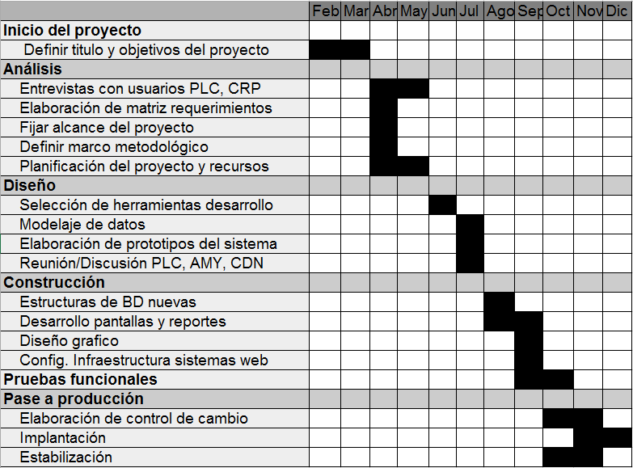

2.  **Análisis de la
    Situación Actual**

    1.  **Mapa de
        Procesos de la Empresa**

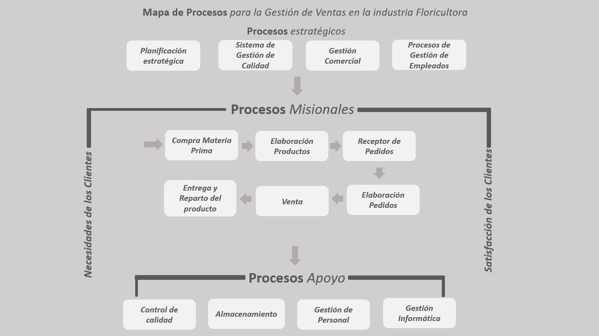

2.  **Diagrama de
    Flujo del Proceso**

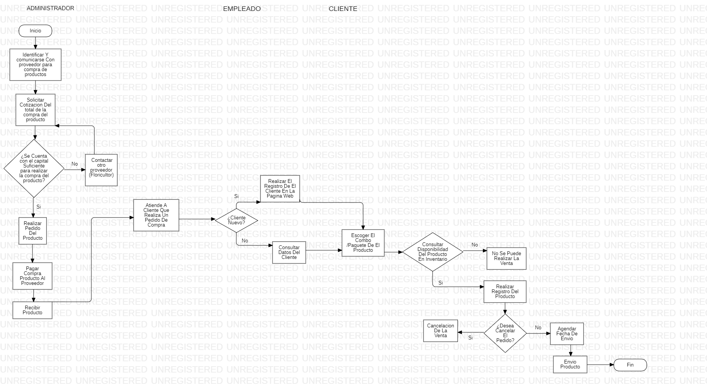

3.  **Análisis de
    los Stakeholders**

| PROYECTO DE GESTIÓN DE VENTAS PARA LA INDUSTRIA FLORICULTORA |               |                                                                                                                                                                                                                                                                                                                                                                     |        |                                                               |          |         |                                                                          |        |                                                               |
|--------------------------------------------------------------|---------------|---------------------------------------------------------------------------------------------------------------------------------------------------------------------------------------------------------------------------------------------------------------------------------------------------------------------------------------------------------------------|--------|---------------------------------------------------------------|----------|---------|--------------------------------------------------------------------------|--------|---------------------------------------------------------------|
| INTERNOS                                                     |               |                                                                                                                                                                                                                                                                                                                                                                     |        |                                                               | EXTERNOS |         |                                                                          |        |                                                               |
| ID                                                           | ROL           | DEFINICION                                                                                                                                                                                                                                                                                                                                                          | CODIGO | REQUERIMIENTOS FUNCIONALES O SERVICIOS QUE ESPERA DEL SISTEMA | ID       | ROL     | DEFINICION                                                               | CODIGO | REQUERIMIENTOS FUNCIONALES O SERVICIOS QUE ESPERA DEL SISTEMA |
| SHI1                                                         | Administrador | Responsable de establecer conexiones entre empleados y clientes; también de planificar, ejecutar y controlar todas las actividades relacionadas con la gestión de ventas de la industria floricultora, además es responsable del mantenimiento del sistema y la correcta operación, gestión, control y seguimiento de las capacidades de procesamiento del trabajo. | RQF001 | Validar usuarios                                              | SHI1     | Cliente | Responsable de obtener uno o más productos de la industria floricultora. | RQF001 | Validar usuarios                                              |
|                                                              |               |                                                                                                                                                                                                                                                                                                                                                                     | RQF002 | Registrar empleado.                                           |          |         |                                                                          | RQF003 | Registrar cliente.                                            |
|                                                              |               |                                                                                                                                                                                                                                                                                                                                                                     | RQF003 | Registrar cliente.                                            |          |         |                                                                          | RQF004 | Modificar datos personales.                                   |
|                                                              |               |                                                                                                                                                                                                                                                                                                                                                                     | RQF004 | Modificar datos personales.                                   |          |         |                                                                          | RQF005 | Consultar datos personales.                                   |
|                                                              |               |                                                                                                                                                                                                                                                                                                                                                                     | RQF005 | Consultar datos personales.                                   |          |         |                                                                          | RQF007 | Navegación de usuario.                                        |
|                                                              |               |                                                                                                                                                                                                                                                                                                                                                                     | RQF006 | Inhabilitar usuario.                                          |          |         |                                                                          | RQF011 | Consultar producto.                                           |
|                                                              |               |                                                                                                                                                                                                                                                                                                                                                                     | RQF008 | Registrar producto.                                           |          |         |                                                                          | RQF013 | Consultar productos agotados.                                 |
|                                                              |               |                                                                                                                                                                                                                                                                                                                                                                     | RQF009 | Registrar detalle del producto.                               |          |         |                                                                          | RQF017 | Registrar pedido.                                             |
|                                                              |               |                                                                                                                                                                                                                                                                                                                                                                     | RQF010 | Modificar producto.                                           |          |         |                                                                          | RQF018 | Modificar pedido.                                             |
|                                                              |               |                                                                                                                                                                                                                                                                                                                                                                     | RQF011 | Consultar producto.                                           |          |         |                                                                          | RQF019 | Consultar pedido.                                             |
|                                                              |               |                                                                                                                                                                                                                                                                                                                                                                     | RQF012 | Consultar previsiones de productos.                           |          |         |                                                                          | RQF021 | Cancelar pedido.                                              |
|                                                              |               |                                                                                                                                                                                                                                                                                                                                                                     | RQF013 | Consultar productos agotados.                                 |          |         |                                                                          |        |                                                               |
|                                                              |               |                                                                                                                                                                                                                                                                                                                                                                     | RQF014 | Inhabilitar producto.                                         |          |         |                                                                          |        |                                                               |
|                                                              |               |                                                                                                                                                                                                                                                                                                                                                                     | RQF015 | Calcular precio producto.                                     |          |         |                                                                          |        |                                                               |
|                                                              |               |                                                                                                                                                                                                                                                                                                                                                                     | RQF016 | Consultar stock de productos.                                 |          |         |                                                                          |        |                                                               |
|                                                              |               |                                                                                                                                                                                                                                                                                                                                                                     | RQF020 | Consultar pedidos en el sistema.                              |          |         |                                                                          |        |                                                               |
|                                                              |               |                                                                                                                                                                                                                                                                                                                                                                     | RQF022 | Consultar pagos.                                              |          |         |                                                                          |        |                                                               |
|                                                              |               |                                                                                                                                                                                                                                                                                                                                                                     | RQF023 | Registrar venta.                                              |          |         |                                                                          |        |                                                               |
|                                                              |               |                                                                                                                                                                                                                                                                                                                                                                     | RQF024 | Consultar venta.                                              |          |         |                                                                          |        |                                                               |
|                                                              |               |                                                                                                                                                                                                                                                                                                                                                                     | RQF025 | Generar domicilio.                                            |          |         |                                                                          |        |                                                               |
| SHI2                                                         | Empleado      | Responsable de establecer vender, ejecutar y controlar determinadas actividades relacionadas con la gestión de ventas de la industria floricultora.                                                                                                                                                                                                                 | RQF001 | Validar usuarios                                              |          |         |                                                                          |        |                                                               |
|                                                              |               |                                                                                                                                                                                                                                                                                                                                                                     | RQF003 | Registrar cliente.                                            |          |         |                                                                          |        |                                                               |
|                                                              |               |                                                                                                                                                                                                                                                                                                                                                                     | RQF004 | Modificar datos personales.                                   |          |         |                                                                          |        |                                                               |
|                                                              |               |                                                                                                                                                                                                                                                                                                                                                                     | RQF005 | Consultar datos personales.                                   |          |         |                                                                          |        |                                                               |
|                                                              |               |                                                                                                                                                                                                                                                                                                                                                                     | RQF008 | Registrar producto.                                           |          |         |                                                                          |        |                                                               |
|                                                              |               |                                                                                                                                                                                                                                                                                                                                                                     | RQF009 | Registrar detalle del producto.                               |          |         |                                                                          |        |                                                               |
|                                                              |               |                                                                                                                                                                                                                                                                                                                                                                     | RQF010 | Modificar producto.                                           |          |         |                                                                          |        |                                                               |
|                                                              |               |                                                                                                                                                                                                                                                                                                                                                                     | RQF011 | Consultar producto.                                           |          |         |                                                                          |        |                                                               |
|                                                              |               |                                                                                                                                                                                                                                                                                                                                                                     | RQF012 | Consultar previsiones de productos.                           |          |         |                                                                          |        |                                                               |
|                                                              |               |                                                                                                                                                                                                                                                                                                                                                                     | RQF013 | Consultar productos agotados.                                 |          |         |                                                                          |        |                                                               |
|                                                              |               |                                                                                                                                                                                                                                                                                                                                                                     | RQF015 | Calcular precio producto.                                     |          |         |                                                                          |        |                                                               |
|                                                              |               |                                                                                                                                                                                                                                                                                                                                                                     | RQF016 | Consultar stock de productos.                                 |          |         |                                                                          |        |                                                               |
|                                                              |               |                                                                                                                                                                                                                                                                                                                                                                     | RQF020 | Consultar pedidos en el sistema.                              |          |         |                                                                          |        |                                                               |
|                                                              |               |                                                                                                                                                                                                                                                                                                                                                                     | RQF022 | Consultar pagos.                                              |          |         |                                                                          |        |                                                               |
|                                                              |               |                                                                                                                                                                                                                                                                                                                                                                     | RQF023 | Registrar venta.                                              |          |         |                                                                          |        |                                                               |
|                                                              |               |                                                                                                                                                                                                                                                                                                                                                                     | RQF024 | Consultar venta.                                              |          |         |                                                                          |        |                                                               |
|                                                              |               |                                                                                                                                                                                                                                                                                                                                                                     | RQF025 | Generar domicilio.                                            |          |         |                                                                          |        |                                                               |

1.  **Diagrama De
    Caso De Uso General**

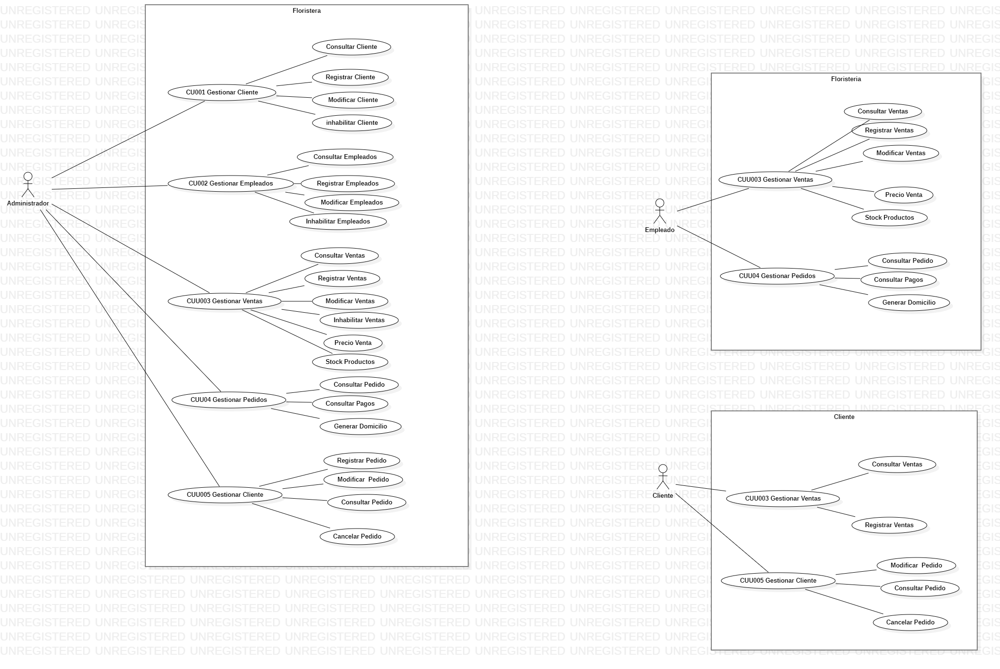

4.  **Requisitos
    Funcionales**

<table>
<colgroup>
<col style="width: 21%" />
<col style="width: 22%" />
<col style="width: 22%" />
<col style="width: 15%" />
<col style="width: 18%" />
</colgroup>
<thead>
<tr class="header">
<th colspan="5"><strong>Sistema de Gestión de Ventas en la Industria
Floricultora</strong></th>
</tr>
</thead>
<tbody>
<tr class="odd">
<td colspan="5"><strong>Requisitos Funcionales</strong></td>
</tr>
<tr class="even">
<td><strong>Código</strong></td>
<td colspan="2"><strong>Nombre</strong></td>
<td><strong>Fecha</strong></td>
<td><strong>Grado de necesidad</strong></td>
</tr>
<tr class="odd">
<td><strong>RF001</strong></td>
<td colspan="2">Validar usuarios.</td>
<td>04 de marzo del 2020.</td>
<td>Alto.</td>
</tr>
<tr class="even">
<td><strong>Descripción</strong></td>
<td colspan="4">El sistema permitirá validar las credenciales de
autenticación de cada usuario con el fin de permitirle iniciar
sesión.</td>
</tr>
<tr class="odd">
<td><strong>Usuarios</strong></td>
<td colspan="4">Empleado, cliente, administrador.</td>
</tr>
<tr class="even">
<td><strong>Entradas</strong></td>
<td><strong>Fuente</strong></td>
<td><strong>Salida</strong></td>
<td><strong>Destino</strong></td>
<td><strong>Regla de negocio</strong></td>
</tr>
<tr class="odd">
<td>
Usuario

Contraseña
</td>
<td>Formulario de inicio de sesión.</td>
<td>Inicio de sesión exitoso.</td>
<td>Inicio.</td>
<td></td>
</tr>
<tr class="even">
<td><strong>Proceso</strong></td>
<td colspan="4"><ol type="1">
<li>
El usuario ingresa al formulario de iniciar sesión.
</li>
<li>
El usuario diligencia el formulario de inicio de sesión.
</li>
</ol></td>
</tr>
<tr class="odd">
<td><strong>Efecto Colateral</strong></td>
<td colspan="4"></td>
</tr>
</tbody>
</table>

<table>
<colgroup>
<col style="width: 27%" />
<col style="width: 21%" />
<col style="width: 18%" />
<col style="width: 15%" />
<col style="width: 18%" />
</colgroup>
<thead>
<tr class="header">
<th colspan="5"><strong>Sistema de Gestión de Ventas en la Industria
Floricultora</strong></th>
</tr>
</thead>
<tbody>
<tr class="odd">
<td colspan="5"><strong>Requisitos Funcionales</strong></td>
</tr>
<tr class="even">
<td><strong>Código</strong></td>
<td colspan="2"><strong>Nombre</strong></td>
<td><strong>Fecha</strong></td>
<td><strong>Grado de necesidad</strong></td>
</tr>
<tr class="odd">
<td><strong>RF002</strong></td>
<td colspan="2">Registrar empleado.</td>
<td>04 de marzo del 2020</td>
<td>Alto</td>
</tr>
<tr class="even">
<td><strong>Descripción</strong></td>
<td colspan="4">El sistema permitirá al administrador registrar
empleados en el 
sistema.</td>
</tr>
<tr class="odd">
<td><strong>Usuarios</strong></td>
<td colspan="4">Administrador.</td>
</tr>
<tr class="even">
<td><strong>Entradas</strong></td>
<td><strong>Fuente</strong></td>
<td><strong>Salida</strong></td>
<td><strong>Destino</strong></td>
<td><strong>Regla de negocio</strong></td>
</tr>
<tr class="odd">
<td>
Tipo de empleado.

Nombre.

Tipo de documento.

Numero de documento.

Celular.

Usuario.

Contraseña.

Estado.
</td>
<td>Formulario de registro de empleado.</td>
<td>Registro exitoso.</td>
<td>Base de datos.</td>
<td></td>
</tr>
<tr class="even">
<td><strong>Proceso</strong></td>
<td colspan="4"><ol type="1">
<li><blockquote>

El administrador ingresa al formulario de registrar empleado.

</blockquote></li>
<li><blockquote>

El administrador diligencia el formulario de registrar empleado.

</blockquote></li>
</ol></td>
</tr>
<tr class="odd">
<td><strong>Efecto Colateral</strong></td>
<td colspan="4"></td>
</tr>
</tbody>
</table>

<table>
<colgroup>
<col style="width: 27%" />
<col style="width: 19%" />
<col style="width: 19%" />
<col style="width: 15%" />
<col style="width: 18%" />
</colgroup>
<thead>
<tr class="header">
<th colspan="5"><strong>Sistema de Gestión de Ventas en la Industria
Floricultora</strong></th>
</tr>
</thead>
<tbody>
<tr class="odd">
<td colspan="5"><strong>Requisitos Funcionales</strong></td>
</tr>
<tr class="even">
<td><strong>Código</strong></td>
<td colspan="2"><strong>Nombre</strong></td>
<td><strong>Fecha</strong></td>
<td><strong>Grado de necesidad</strong></td>
</tr>
<tr class="odd">
<td><strong>RF003</strong></td>
<td colspan="2">Registrar cliente.</td>
<td>04 de marzo del 2020</td>
<td>Alto</td>
</tr>
<tr class="even">
<td><strong>Descripción</strong></td>
<td colspan="4">El sistema permitirá al empleado, cliente y
administrador  registrar clientes en el sistema.</td>
</tr>
<tr class="odd">
<td><strong>Usuarios</strong></td>
<td colspan="4">Empleado, cliente, administrador.</td>
</tr>
<tr class="even">
<td><strong>Entradas</strong></td>
<td><strong>Fuente</strong></td>
<td><strong>Salida</strong></td>
<td><strong>Destino</strong></td>
<td><strong>Regla de negocio</strong></td>
</tr>
<tr class="odd">
<td>
Nombre.

Tipo de documento.

Numero de documento.

Celular.

Dirección.

Correo electrónico.

Usuario.

Contraseña.

Estado.
</td>
<td>Formulario de registro de cliente.</td>
<td>Registro exitoso.</td>
<td>Base de datos.</td>
<td></td>
</tr>
<tr class="even">
<td><strong>Proceso</strong></td>
<td colspan="4"><ol type="1">
<li>
El usuario ingresa al formulario de registrarse.
</li>
<li>
El usuario diligencia el formulario de registrar.
</li>
</ol></td>
</tr>
<tr class="odd">
<td><strong>Efecto Colateral</strong></td>
<td colspan="4"></td>
</tr>
</tbody>
</table>

<table>
<colgroup>
<col style="width: 21%" />
<col style="width: 24%" />
<col style="width: 21%" />
<col style="width: 15%" />
<col style="width: 18%" />
</colgroup>
<thead>
<tr class="header">
<th colspan="5"><strong>Sistema de Gestión de Ventas en la Industria
Floricultora</strong></th>
</tr>
</thead>
<tbody>
<tr class="odd">
<td colspan="5"><strong>Requisitos Funcionales</strong></td>
</tr>
<tr class="even">
<td><strong>Código</strong></td>
<td colspan="2"><strong>Nombre</strong></td>
<td><strong>Fecha</strong></td>
<td><strong>Grado de necesidad</strong></td>
</tr>
<tr class="odd">
<td><strong>RF004</strong></td>
<td colspan="2">Modificar datos personales.</td>
<td>04 de marzo del 2020.</td>
<td>Alto.</td>
</tr>
<tr class="even">
<td><strong>Descripción</strong></td>
<td colspan="4">El sistema permitirá al empleado, cliente y
administrador modificar su información personal.</td>
</tr>
<tr class="odd">
<td><strong>Usuarios</strong></td>
<td colspan="4">Empleado, cliente, administrador.</td>
</tr>
<tr class="even">
<td><strong>Entradas</strong></td>
<td><strong>Fuente</strong></td>
<td><strong>Salida</strong></td>
<td><strong>Destino</strong></td>
<td><strong>Regla de negocio</strong></td>
</tr>
<tr class="odd">
<td>Datos personales del usuario.</td>
<td>Formulario del usuario.</td>
<td>Modificación exitosa.</td>
<td>Base de datos.</td>
<td></td>
</tr>
<tr class="even">
<td><strong>Proceso</strong></td>
<td colspan="4">
1. El usuario ingresa a su perfil.

2. El usuario modifica su información personal.
</td>
</tr>
<tr class="odd">
<td><strong>Efecto Colateral</strong></td>
<td colspan="4"></td>
</tr>
</tbody>
</table>

<table>
<colgroup>
<col style="width: 21%" />
<col style="width: 22%" />
<col style="width: 22%" />
<col style="width: 15%" />
<col style="width: 18%" />
</colgroup>
<thead>
<tr class="header">
<th colspan="5"><strong>Sistema de Gestión de Ventas en la Industria
Floricultora</strong></th>
</tr>
</thead>
<tbody>
<tr class="odd">
<td colspan="5"><strong>Requisitos Funcionales</strong></td>
</tr>
<tr class="even">
<td><strong>Código</strong></td>
<td colspan="2"><strong>Nombre</strong></td>
<td><strong>Fecha</strong></td>
<td><strong>Grado de necesidad</strong></td>
</tr>
<tr class="odd">
<td><strong>RF005</strong></td>
<td colspan="2">Consultar datos personales.</td>
<td>04 de marzo del 2020.</td>
<td>Medio.</td>
</tr>
<tr class="even">
<td><strong>Descripción</strong></td>
<td colspan="4">El sistema permitirá al empleado, cliente y
administrador  consultar su información personal.</td>
</tr>
<tr class="odd">
<td><strong>Usuarios</strong></td>
<td colspan="4">Empleado, cliente, administrador.</td>
</tr>
<tr class="even">
<td><strong>Entradas</strong></td>
<td><strong>Fuente</strong></td>
<td><strong>Salida</strong></td>
<td><strong>Destino</strong></td>
<td><strong>Regla de negocio</strong></td>
</tr>
<tr class="odd">
<td>Datos personales del usuario.</td>
<td>Formulario del usuario.</td>
<td>Información personal del usuario (Perfil).</td>
<td>Formulario.</td>
<td></td>
</tr>
<tr class="even">
<td><strong>Proceso</strong></td>
<td colspan="4">
1. El usuario ingresa a su perfil.

2. El usuario consulta su información personal.
</td>
</tr>
<tr class="odd">
<td><strong>Efecto Colateral</strong></td>
<td colspan="4"></td>
</tr>
</tbody>
</table>

<table>
<colgroup>
<col style="width: 21%" />
<col style="width: 22%" />
<col style="width: 22%" />
<col style="width: 15%" />
<col style="width: 18%" />
</colgroup>
<thead>
<tr class="header">
<th colspan="5"><strong>Sistema de Gestión de Ventas en la Industria
Floricultora</strong></th>
</tr>
</thead>
<tbody>
<tr class="odd">
<td colspan="5"><strong>Requisitos Funcionales</strong></td>
</tr>
<tr class="even">
<td><strong>Código</strong></td>
<td colspan="2"><strong>Nombre</strong></td>
<td><strong>Fecha</strong></td>
<td><strong>Grado de necesidad</strong></td>
</tr>
<tr class="odd">
<td><strong>RF006</strong></td>
<td colspan="2">Inhabilitar usuario.</td>
<td>04 de marzo del 2020.</td>
<td>Alto.</td>
</tr>
<tr class="even">
<td><strong>Descripción</strong></td>
<td colspan="4">El sistema permitirá al administrador inhabilitar
empleados y 
clientes.</td>
</tr>
<tr class="odd">
<td><strong>Usuarios</strong></td>
<td colspan="4">Administrador.</td>
</tr>
<tr class="even">
<td><strong>Entradas</strong></td>
<td><strong>Fuente</strong></td>
<td><strong>Salida</strong></td>
<td><strong>Destino</strong></td>
<td><strong>Regla de negocio</strong></td>
</tr>
<tr class="odd">
<td>Usuario</td>
<td>Formulario del usuario.</td>
<td>Usuario inhabilitado exitosamente.</td>
<td>Base de datos.</td>
<td></td>
</tr>
<tr class="even">
<td><strong>Proceso</strong></td>
<td colspan="4">
1. El administrador busca al usuario en el
sistema.

2. El administrador inhabilita al usuario del sistema.
</td>
</tr>
</tbody>
</table>

<table>
<colgroup>
<col style="width: 21%" />
<col style="width: 24%" />
<col style="width: 21%" />
<col style="width: 15%" />
<col style="width: 18%" />
</colgroup>
<thead>
<tr class="header">
<th colspan="5"><strong>Sistema de Gestión de Ventas en la Industria
Floricultora</strong></th>
</tr>
</thead>
<tbody>
<tr class="odd">
<td colspan="5"><strong>Requisitos Funcionales</strong></td>
</tr>
<tr class="even">
<td><strong>Código</strong></td>
<td colspan="2"><strong>Nombre</strong></td>
<td><strong>Fecha</strong></td>
<td><strong>Grado de necesidad</strong></td>
</tr>
<tr class="odd">
<td><strong>RF007</strong></td>
<td colspan="2">Registrar producto.</td>
<td>04 de marzo del 2020</td>
<td>Alto.</td>
</tr>
<tr class="even">
<td><strong>Descripción</strong></td>
<td colspan="4">El sistema permitirá al empleado y administrador
registrar 
productos.</td>
</tr>
<tr class="odd">
<td><strong>Usuarios</strong></td>
<td colspan="4">Empleado, administrador.</td>
</tr>
<tr class="even">
<td><strong>Entradas</strong></td>
<td><strong>Fuente</strong></td>
<td><strong>Salida</strong></td>
<td><strong>Destino</strong></td>
<td><strong>Regla de negocio</strong></td>
</tr>
<tr class="odd">
<td>
Tipo de producto.

Nombre.

Cantidad.

Especificación.

Precio.

Estado.
</td>
<td>Formulario de registro de producto.</td>
<td>Registro exitoso.</td>
<td>Base de datos.</td>
<td></td>
</tr>
<tr class="even">
<td><strong>Proceso</strong></td>
<td colspan="4"><ol type="1">
<li>
El administrador y/o empleado ingresan al formulario de registrar
producto.
</li>
<li>
El administrador y/o empleado diligencian el formulario de
registrar producto.
</li>
</ol></td>
</tr>
<tr class="odd">
<td><strong>Efecto Colateral</strong></td>
<td colspan="4"></td>
</tr>
</tbody>
</table>

<table>
<colgroup>
<col style="width: 21%" />
<col style="width: 21%" />
<col style="width: 24%" />
<col style="width: 15%" />
<col style="width: 18%" />
</colgroup>
<thead>
<tr class="header">
<th colspan="5"><strong>Sistema de Gestión de Ventas en la Industria
Floricultora</strong></th>
</tr>
</thead>
<tbody>
<tr class="odd">
<td colspan="5"><strong>Requisitos Funcionales</strong></td>
</tr>
<tr class="even">
<td><strong>Código</strong></td>
<td colspan="2"><strong>Nombre</strong></td>
<td><strong>Fecha</strong></td>
<td><strong>Grado de necesidad</strong></td>
</tr>
<tr class="odd">
<td><strong>RF008</strong></td>
<td colspan="2">Registrar detalle del producto.</td>
<td>04 de marzo del 2020</td>
<td>Medio.</td>
</tr>
<tr class="even">
<td><strong>Descripción</strong></td>
<td colspan="4">El sistema permitirá al empleado y administrador
registrar detalles del producto como características especiales de
alguna planta, cuidados y consejos.</td>
</tr>
<tr class="odd">
<td><strong>Usuarios</strong></td>
<td colspan="4">Empleado,  administrador.</td>
</tr>
<tr class="even">
<td><strong>Entradas</strong></td>
<td><strong>Fuente</strong></td>
<td><strong>Salida</strong></td>
<td><strong>Destino</strong></td>
<td><strong>Regla de negocio</strong></td>
</tr>
<tr class="odd">
<td>
Nombre.

Características.

Cuidados.

Consejos.
</td>
<td>Formulario de registro del producto</td>
<td>Registro exitoso.</td>
<td>Base de datos.</td>
<td></td>
</tr>
<tr class="even">
<td><strong>Proceso</strong></td>
<td colspan="4"><ol type="1">
<li><blockquote>

El administrador y/o empleado ingresan al formulario de registrar
producto.

</blockquote></li>
<li><blockquote>

El administrador y/o empleado diligencian el formulario de registrar
detalle del producto.

</blockquote></li>
</ol></td>
</tr>
<tr class="odd">
<td><strong>Efecto Colateral</strong></td>
<td colspan="4"></td>
</tr>
</tbody>
</table>

<table>
<colgroup>
<col style="width: 21%" />
<col style="width: 22%" />
<col style="width: 22%" />
<col style="width: 15%" />
<col style="width: 18%" />
</colgroup>
<thead>
<tr class="header">
<th colspan="5"><strong>Sistema de Gestión de Ventas en la Industria
Floricultora</strong></th>
</tr>
</thead>
<tbody>
<tr class="odd">
<td colspan="5"><strong>Requisitos Funcionales</strong></td>
</tr>
<tr class="even">
<td><strong>Código</strong></td>
<td colspan="2"><strong>Nombre</strong></td>
<td><strong>Fecha</strong></td>
<td><strong>Grado de necesidad</strong></td>
</tr>
<tr class="odd">
<td><strong>RF009</strong></td>
<td colspan="2">Modificar producto.</td>
<td>04 de marzo del 2020.</td>
<td>Alto.</td>
</tr>
<tr class="even">
<td><strong>Descripción</strong></td>
<td colspan="4">El sistema permitirá al empleado y administrador
modificar 
productos que se encuentren previamente registrados.</td>
</tr>
<tr class="odd">
<td><strong>Usuarios</strong></td>
<td colspan="4">Empleado, administrador.</td>
</tr>
<tr class="even">
<td><strong>Entradas</strong></td>
<td><strong>Fuente</strong></td>
<td><strong>Salida</strong></td>
<td><strong>Destino</strong></td>
<td><strong>Regla de negocio</strong></td>
</tr>
<tr class="odd">
<td>Producto.</td>
<td>Formulario de producto.</td>
<td>Modificación exitosa.</td>
<td>Base de datos.</td>
<td></td>
</tr>
<tr class="even">
<td><strong>Proceso</strong></td>
<td colspan="4"><ol type="1">
<li><blockquote>

El administrador y/o empleado ingresan al producto.

</blockquote></li>
<li><blockquote>

El administrador y/o empleado modifican el producto.

</blockquote></li>
</ol></td>
</tr>
<tr class="odd">
<td><strong>Efecto Colateral</strong></td>
<td colspan="4"></td>
</tr>
</tbody>
</table>

<table>
<colgroup>
<col style="width: 21%" />
<col style="width: 22%" />
<col style="width: 22%" />
<col style="width: 15%" />
<col style="width: 18%" />
</colgroup>
<thead>
<tr class="header">
<th colspan="5"><strong>Sistema de Gestión de Ventas en la Industria
Floricultora</strong></th>
</tr>
</thead>
<tbody>
<tr class="odd">
<td colspan="5"><strong>Requisitos Funcionales</strong></td>
</tr>
<tr class="even">
<td><strong>Código</strong></td>
<td colspan="2"><strong>Nombre</strong></td>
<td><strong>Fecha</strong></td>
<td><strong>Grado de necesidad</strong></td>
</tr>
<tr class="odd">
<td><strong>RF010</strong></td>
<td colspan="2">Consultar producto.</td>
<td>04 de marzo del 2020</td>
<td>Medio.</td>
</tr>
<tr class="even">
<td><strong>Descripción</strong></td>
<td colspan="4">El sistema permitirá al empleado, cliente y
administrador consultar productos.</td>
</tr>
<tr class="odd">
<td><strong>Usuarios</strong></td>
<td colspan="4">Empleado, cliente, administrador.</td>
</tr>
<tr class="even">
<td><strong>Entradas</strong></td>
<td><strong>Fuente</strong></td>
<td><strong>Salida</strong></td>
<td><strong>Destino</strong></td>
<td><strong>Regla de negocio</strong></td>
</tr>
<tr class="odd">
<td>Producto.</td>
<td>Formulario de producto.</td>
<td>Información del producto.</td>
<td>Formulario</td>
<td>El sistema no mostrará el producto si este se encuentra
agotado.</td>
</tr>
<tr class="even">
<td><strong>Proceso</strong></td>
<td colspan="4">
1. El usuario ingresa al producto.

2. El usuario consulta el producto.
</td>
</tr>
<tr class="odd">
<td><strong>Efecto Colateral</strong></td>
<td colspan="4"></td>
</tr>
</tbody>
</table>

<table>
<colgroup>
<col style="width: 21%" />
<col style="width: 21%" />
<col style="width: 24%" />
<col style="width: 15%" />
<col style="width: 18%" />
</colgroup>
<thead>
<tr class="header">
<th colspan="5"><strong>Sistema de Gestión de Ventas en la Industria
Floricultora</strong></th>
</tr>
</thead>
<tbody>
<tr class="odd">
<td colspan="5"><strong>Requisitos Funcionales</strong></td>
</tr>
<tr class="even">
<td><strong>Código</strong></td>
<td colspan="2"><strong>Nombre</strong></td>
<td><strong>Fecha</strong></td>
<td><strong>Grado de necesidad</strong></td>
</tr>
<tr class="odd">
<td><strong>RF011</strong></td>
<td colspan="2">Inhabilitar producto.</td>
<td>04 de marzo del 2020.</td>
<td>Alto.</td>
</tr>
<tr class="even">
<td><strong>Descripción</strong></td>
<td colspan="4">El sistema permitirá al administrador inhabilitar
productos.</td>
</tr>
<tr class="odd">
<td><strong>Usuarios</strong></td>
<td colspan="4">Administrador.</td>
</tr>
<tr class="even">
<td><strong>Entradas</strong></td>
<td><strong>Fuente</strong></td>
<td><strong>Salida</strong></td>
<td><strong>Destino</strong></td>
<td><strong>Regla de negocio</strong></td>
</tr>
<tr class="odd">
<td>Producto.</td>
<td>Formulario de producto.</td>
<td>Producto inhabilitado exitosamente.</td>
<td>Base de datos.</td>
<td></td>
</tr>
<tr class="even">
<td><strong>Proceso</strong></td>
<td colspan="4">
1. El administrador ingresa al producto.

2. El administrador inhabilita el producto.
</td>
</tr>
<tr class="odd">
<td><strong>Efecto Colateral</strong></td>
<td colspan="4"></td>
</tr>
</tbody>
</table>

<table>
<colgroup>
<col style="width: 21%" />
<col style="width: 22%" />
<col style="width: 22%" />
<col style="width: 15%" />
<col style="width: 18%" />
</colgroup>
<thead>
<tr class="header">
<th colspan="5"><strong>Sistema de Gestión de Ventas en la Industria
Floricultora</strong></th>
</tr>
</thead>
<tbody>
<tr class="odd">
<td colspan="5"><strong>Requisitos Funcionales</strong></td>
</tr>
<tr class="even">
<td><strong>Código</strong></td>
<td colspan="2"><strong>Nombre</strong></td>
<td><strong>Fecha</strong></td>
<td><strong>Grado de necesidad</strong></td>
</tr>
<tr class="odd">
<td><strong>RF012</strong></td>
<td colspan="2">Calcular precio producto.</td>
<td>04 de marzo del 2020.</td>
<td>Alto.</td>
</tr>
<tr class="even">
<td><strong>Descripción</strong></td>
<td colspan="4">El sistema permitirá al empleado y administrador moderar
el cálculo del precio de algunos productos que están compuestos por
otros, por lo que su 
valor será su derivado. Por ese motivo su valor se calculará en base a
los artículos que compongan el producto final y el precio de valor
agregado. Durante la venta, después de elegir uno de estos productos, se
mostrarán sus especificaciones y se dará la posibilidad de modificarlo
para incluir y/o eliminar artículos del producto final.</td>
</tr>
<tr class="odd">
<td><strong>Usuarios</strong></td>
<td colspan="4">Empleado, administrador.</td>
</tr>
<tr class="even">
<td><strong>Entradas</strong></td>
<td><strong>Fuente</strong></td>
<td><strong>Salida</strong></td>
<td><strong>Destino</strong></td>
<td><strong>Regla de negocio</strong></td>
</tr>
<tr class="odd">
<td>Venta.</td>
<td>Formulario de venta.</td>
<td>Precio del producto final.</td>
<td>Formulario.</td>
<td></td>
</tr>
<tr class="even">
<td><strong>Proceso</strong></td>
<td colspan="4"><ol type="1">
<li><blockquote>

El administrador y/o empleado moderan el cálculo del producto
final.

</blockquote></li>
</ol></td>
</tr>
<tr class="odd">
<td><strong>Efecto Colateral</strong></td>
<td colspan="4"></td>
</tr>
</tbody>
</table>

<table>
<colgroup>
<col style="width: 21%" />
<col style="width: 22%" />
<col style="width: 22%" />
<col style="width: 15%" />
<col style="width: 18%" />
</colgroup>
<thead>
<tr class="header">
<th colspan="5"><strong>Sistema de Gestión de Ventas en la Industria
Floricultora</strong></th>
</tr>
</thead>
<tbody>
<tr class="odd">
<td colspan="5"><strong>Requisitos Funcionales</strong></td>
</tr>
<tr class="even">
<td><strong>Código</strong></td>
<td colspan="2"><strong>Nombre</strong></td>
<td><strong>Fecha</strong></td>
<td><strong>Grado de necesidad</strong></td>
</tr>
<tr class="odd">
<td><strong>RF013</strong></td>
<td colspan="2">Consultar stock de productos.</td>
<td>04 de marzo del 2020.</td>
<td>Alto.</td>
</tr>
<tr class="even">
<td><strong>Descripción</strong></td>
<td colspan="4">El sistema permitirá al empleado y administrador
consultar el 
número de unidades en stock que se registran por medio de los pedidos
realizados por el cliente.</td>
</tr>
<tr class="odd">
<td><strong>Usuarios</strong></td>
<td colspan="4">Empleado, administrador.</td>
</tr>
<tr class="even">
<td><strong>Entradas</strong></td>
<td><strong>Fuente</strong></td>
<td><strong>Salida</strong></td>
<td><strong>Destino</strong></td>
<td><strong>Regla de negocio</strong></td>
</tr>
<tr class="odd">
<td>Pedidos.</td>
<td>Formulario de pedidos.</td>
<td>Stock.</td>
<td>Formulario.</td>
<td></td>
</tr>
<tr class="even">
<td><strong>Proceso</strong></td>
<td colspan="4"><ol start="2" type="1">
<li><blockquote>

El administrador y/o empleado ingresan a pedido.

</blockquote></li>
<li><blockquote>

El administrador y/o empleado consultan la cantidad de productos en
stock.

</blockquote></li>
</ol></td>
</tr>
<tr class="odd">
<td><strong>Efecto Colateral</strong></td>
<td colspan="4"></td>
</tr>
</tbody>
</table>

<table>
<colgroup>
<col style="width: 21%" />
<col style="width: 24%" />
<col style="width: 21%" />
<col style="width: 15%" />
<col style="width: 18%" />
</colgroup>
<thead>
<tr class="header">
<th colspan="5"><strong>Sistema de Gestión de Ventas en la Industria
Floricultora</strong></th>
</tr>
</thead>
<tbody>
<tr class="odd">
<td colspan="5"><strong>Requisitos Funcionales</strong></td>
</tr>
<tr class="even">
<td><strong>Código</strong></td>
<td colspan="2"><strong>Nombre</strong></td>
<td><strong>Fecha</strong></td>
<td><strong>Grado de necesidad</strong></td>
</tr>
<tr class="odd">
<td><strong>RF014</strong></td>
<td colspan="2">Registrar pedido.</td>
<td>04 de marzo del 2020.</td>
<td>Alto.</td>
</tr>
<tr class="even">
<td><strong>Descripción</strong></td>
<td colspan="4">El sistema permitirá a los clientes realizar
pedidos.</td>
</tr>
<tr class="odd">
<td><strong>Usuarios</strong></td>
<td colspan="4">Cliente.</td>
</tr>
<tr class="even">
<td><strong>Entradas</strong></td>
<td><strong>Fuente</strong></td>
<td><strong>Salida</strong></td>
<td><strong>Destino</strong></td>
<td><strong>Regla de negocio</strong></td>
</tr>
<tr class="odd">
<td>
Fecha.

Especificación del pedido.

Cantidad.

Precio producto(s).

Total pedido.

Estado.
</td>
<td>Formulario de registro de pedidos.</td>
<td>Registro exitoso.</td>
<td>Base de datos.</td>
<td></td>
</tr>
<tr class="even">
<td><strong>Proceso</strong></td>
<td colspan="4"><ol type="1">
<li><blockquote>

El cliente ingresa al formulario de registrar pedido.

</blockquote></li>
<li><blockquote>

El cliente diligencia el formulario de registrar pedido.

</blockquote></li>
</ol></td>
</tr>
<tr class="odd">
<td><strong>Efecto Colateral</strong></td>
<td colspan="4"></td>
</tr>
</tbody>
</table>

<table>
<colgroup>
<col style="width: 21%" />
<col style="width: 22%" />
<col style="width: 22%" />
<col style="width: 15%" />
<col style="width: 18%" />
</colgroup>
<thead>
<tr class="header">
<th colspan="5"><strong>Sistema de Gestión de Ventas en la Industria
Floricultora</strong></th>
</tr>
</thead>
<tbody>
<tr class="odd">
<td colspan="5"><strong>Requisitos Funcionales</strong></td>
</tr>
<tr class="even">
<td><strong>Código</strong></td>
<td colspan="2"><strong>Nombre</strong></td>
<td><strong>Fecha</strong></td>
<td><strong>Grado de necesidad</strong></td>
</tr>
<tr class="odd">
<td><strong>RF015</strong></td>
<td colspan="2">Modificar pedido.</td>
<td>04 de marzo del 2020.</td>
<td>Alto.</td>
</tr>
<tr class="even">
<td><strong>Descripción</strong></td>
<td colspan="4">El sistema permitirá al cliente modificar los pedidos
realizados 
dentro de un tiempo razonable.</td>
</tr>
<tr class="odd">
<td><strong>Usuarios</strong></td>
<td colspan="4">Cliente.</td>
</tr>
<tr class="even">
<td><strong>Entradas</strong></td>
<td><strong>Fuente</strong></td>
<td><strong>Salida</strong></td>
<td><strong>Destino</strong></td>
<td><strong>Regla de negocio</strong></td>
</tr>
<tr class="odd">
<td>Pedido.</td>
<td>Formulario de pedido.</td>
<td>Modificación exitosa.</td>
<td>Base de datos.</td>
<td></td>
</tr>
<tr class="even">
<td><strong>Proceso</strong></td>
<td colspan="4"><ol type="1">
<li><blockquote>

El cliente ingresa al pedido.

</blockquote></li>
<li><blockquote>

El cliente modifica el pedido.

</blockquote></li>
</ol></td>
</tr>
<tr class="odd">
<td><strong>Efecto Colateral</strong></td>
<td colspan="4"></td>
</tr>
</tbody>
</table>

<table>
<colgroup>
<col style="width: 21%" />
<col style="width: 21%" />
<col style="width: 24%" />
<col style="width: 15%" />
<col style="width: 18%" />
</colgroup>
<thead>
<tr class="header">
<th colspan="5"><strong>Sistema de Gestión de Ventas en la Industria
Floricultora</strong></th>
</tr>
</thead>
<tbody>
<tr class="odd">
<td colspan="5"><strong>Requisitos Funcionales</strong></td>
</tr>
<tr class="even">
<td><strong>Código</strong></td>
<td colspan="2"><strong>Nombre</strong></td>
<td><strong>Fecha</strong></td>
<td><strong>Grado de necesidad</strong></td>
</tr>
<tr class="odd">
<td><strong>RF016</strong></td>
<td colspan="2">Consultar pedido.</td>
<td>04 de marzo del 2020.</td>
<td>Medio.</td>
</tr>
<tr class="even">
<td><strong>Descripción</strong></td>
<td colspan="4">El sistema permitirá al cliente consultar el estado del
pedido que realice los pedidos que realice.</td>
</tr>
<tr class="odd">
<td><strong>Usuarios</strong></td>
<td colspan="4">Cliente.</td>
</tr>
<tr class="even">
<td><strong>Entradas</strong></td>
<td><strong>Fuente</strong></td>
<td><strong>Salida</strong></td>
<td><strong>Destino</strong></td>
<td><strong>Regla de negocio</strong></td>
</tr>
<tr class="odd">
<td>Pedido.</td>
<td>Formulario de pedido.</td>
<td>Modificación exitosa.</td>
<td>Formulario.</td>
<td></td>
</tr>
<tr class="even">
<td><strong>Proceso</strong></td>
<td colspan="4"><ol type="1">
<li><blockquote>

El cliente ingresa al pedido.

</blockquote></li>
<li><blockquote>

El cliente consulta el pedido.

</blockquote></li>
</ol></td>
</tr>
<tr class="odd">
<td><strong>Efecto Colateral</strong></td>
<td colspan="4"></td>
</tr>
</tbody>
</table>

<table>
<colgroup>
<col style="width: 21%" />
<col style="width: 22%" />
<col style="width: 22%" />
<col style="width: 15%" />
<col style="width: 18%" />
</colgroup>
<thead>
<tr class="header">
<th colspan="5"><strong>Sistema de Gestión de Ventas en la Industria
Floricultora</strong></th>
</tr>
</thead>
<tbody>
<tr class="odd">
<td colspan="5"><strong>Requisitos Funcionales</strong></td>
</tr>
<tr class="even">
<td><strong>Código</strong></td>
<td colspan="2"><strong>Nombre</strong></td>
<td><strong>Fecha</strong></td>
<td><strong>Grado de necesidad</strong></td>
</tr>
<tr class="odd">
<td><strong>RF017</strong></td>
<td colspan="2">Consultar pedidos por entregar.</td>
<td>04 de marzo del 2020</td>
<td>Alto.</td>
</tr>
<tr class="even">
<td><strong>Descripción</strong></td>
<td colspan="4">El sistema permitirá al empleado y administrador
consultar los 
pedidos realizados por los clientes que estén próximos a entregar.</td>
</tr>
<tr class="odd">
<td><strong>Usuarios</strong></td>
<td colspan="4">Empleado, administrador.</td>
</tr>
<tr class="even">
<td><strong>Entradas</strong></td>
<td><strong>Fuente</strong></td>
<td><strong>Salida</strong></td>
<td><strong>Destino</strong></td>
<td><strong>Regla de negocio</strong></td>
</tr>
<tr class="odd">
<td>Pedido.</td>
<td>Formulario de pedido.</td>
<td>Pedidos próximos a entregar.</td>
<td>Formulario.</td>
<td></td>
</tr>
<tr class="even">
<td><strong>Proceso</strong></td>
<td colspan="4"><ol type="1">
<li><blockquote>

El administrador y/o empleado reciben una alerta del sistema de los
pedidos a entregar en un tiempo prudente.

</blockquote></li>
<li><blockquote>

El administrador y/o empleado consultan pedido(s).

</blockquote></li>
</ol></td>
</tr>
<tr class="odd">
<td><strong>Efecto Colateral</strong></td>
<td colspan="4"></td>
</tr>
</tbody>
</table>

<table>
<colgroup>
<col style="width: 21%" />
<col style="width: 19%" />
<col style="width: 21%" />
<col style="width: 15%" />
<col style="width: 22%" />
</colgroup>
<thead>
<tr class="header">
<th colspan="5"><strong>Sistema de Gestión de Ventas en la Industria
Floricultora</strong></th>
</tr>
</thead>
<tbody>
<tr class="odd">
<td colspan="5"><strong>Requisitos Funcionales</strong></td>
</tr>
<tr class="even">
<td><strong>Código</strong></td>
<td colspan="2"><strong>Nombre</strong></td>
<td><strong>Fecha</strong></td>
<td><strong>Grado de necesidad</strong></td>
</tr>
<tr class="odd">
<td><strong>RF018</strong></td>
<td colspan="2">Cancelar pedido.</td>
<td>04 de marzo del 2020</td>
<td>Alto.</td>
</tr>
<tr class="even">
<td><strong>Descripción</strong></td>
<td colspan="4">El sistema permitirá al cliente cancelar sus pedidos
realizados dentro de un tiempo razonable.</td>
</tr>
<tr class="odd">
<td><strong>Usuarios</strong></td>
<td colspan="4">Cliente.</td>
</tr>
<tr class="even">
<td><strong>Entradas</strong></td>
<td><strong>Fuente</strong></td>
<td><strong>Salida</strong></td>
<td><strong>Destino</strong></td>
<td><strong>Regla de negocio</strong></td>
</tr>
<tr class="odd">
<td>Pedido.</td>
<td>Formulario de pedido.</td>
<td>Pedido cancelado exitosamente.</td>
<td>Base de datos.</td>
<td>El sistema solo permite al cliente cancelar el pedido si aún se
encuentra dentro de un tiempo establecido.</td>
</tr>
<tr class="even">
<td><strong>Proceso</strong></td>
<td colspan="4"><ol type="1">
<li><blockquote>

El cliente ingresa al pedido.

</blockquote></li>
<li><blockquote>

El cliente cancela el pedido.

</blockquote></li>
</ol></td>
</tr>
<tr class="odd">
<td><strong>Efecto Colateral</strong></td>
<td colspan="4"></td>
</tr>
</tbody>
</table>

<table>
<colgroup>
<col style="width: 21%" />
<col style="width: 22%" />
<col style="width: 22%" />
<col style="width: 15%" />
<col style="width: 18%" />
</colgroup>
<thead>
<tr class="header">
<th colspan="5"><strong>Sistema de Gestión de Ventas en la Industria
Floricultora</strong></th>
</tr>
</thead>
<tbody>
<tr class="odd">
<td colspan="5"><strong>Requisitos Funcionales</strong></td>
</tr>
<tr class="even">
<td><strong>Código</strong></td>
<td colspan="2"><strong>Nombre</strong></td>
<td><strong>Fecha</strong></td>
<td><strong>Grado de necesidad</strong></td>
</tr>
<tr class="odd">
<td><strong>RF019</strong></td>
<td colspan="2">Consultar pagos.</td>
<td>04 de marzo del 2020.</td>
<td>Medio.</td>
</tr>
<tr class="even">
<td><strong>Descripción</strong></td>
<td colspan="4">El sistema permitirá al empleado y administrador
consultar la 
información de pagos realizados por el cliente.</td>
</tr>
<tr class="odd">
<td><strong>Usuarios</strong></td>
<td colspan="4">Empleado, administrador.</td>
</tr>
<tr class="even">
<td><strong>Entradas</strong></td>
<td><strong>Fuente</strong></td>
<td><strong>Salida</strong></td>
<td><strong>Destino</strong></td>
<td><strong>Regla de negocio</strong></td>
</tr>
<tr class="odd">
<td>
Cliente.

Pedido.
</td>
<td>Formulario de pedido.</td>
<td>Pagos.</td>
<td>Formulario</td>
<td></td>
</tr>
<tr class="even">
<td><strong>Proceso</strong></td>
<td colspan="4"><ol type="1">
<li><blockquote>

El administrador y/o empleado ingresan al pedido del cliente
específico.

</blockquote></li>
<li><blockquote>

El administrador y/o empleado consultan el pago.

</blockquote></li>
</ol></td>
</tr>
<tr class="odd">
<td><strong>Efecto Colateral</strong></td>
<td colspan="4"></td>
</tr>
</tbody>
</table>

<table>
<colgroup>
<col style="width: 21%" />
<col style="width: 24%" />
<col style="width: 21%" />
<col style="width: 15%" />
<col style="width: 18%" />
</colgroup>
<thead>
<tr class="header">
<th colspan="5"><strong>Sistema de Gestión de Ventas en la Industria
Floricultora</strong></th>
</tr>
</thead>
<tbody>
<tr class="odd">
<td colspan="5"><strong>Requisitos Funcionales</strong></td>
</tr>
<tr class="even">
<td><strong>Código</strong></td>
<td colspan="2"><strong>Nombre</strong></td>
<td><strong>Fecha</strong></td>
<td><strong>Grado de necesidad</strong></td>
</tr>
<tr class="odd">
<td><strong>RF020</strong></td>
<td colspan="2">Generar venta.</td>
<td>04 de marzo del 2020.</td>
<td>Alto.</td>
</tr>
<tr class="even">
<td><strong>Descripción</strong></td>
<td colspan="4">El sistema permitirá al empleado y administrador generar
ventas en base a los pedidos realizados por los clientes.</td>
</tr>
<tr class="odd">
<td><strong>Usuarios</strong></td>
<td colspan="4">Empleado, administrador.</td>
</tr>
<tr class="even">
<td><strong>Entradas</strong></td>
<td><strong>Fuente</strong></td>
<td><strong>Salida</strong></td>
<td><strong>Destino</strong></td>
<td><strong>Regla de negocio</strong></td>
</tr>
<tr class="odd">
<td>
Pedido.

Fecha de venta.
</td>
<td>Formulario de compra.</td>
<td>Venta exitosa.</td>
<td>Base de datos.</td>
<td></td>
</tr>
<tr class="even">
<td><strong>Proceso</strong></td>
<td colspan="4"><ol type="1">
<li><blockquote>

El administrador y/o empleado ingresan al pedido.

</blockquote></li>
<li><blockquote>

El administrador y/o empleado generan la venta.

</blockquote></li>
</ol></td>
</tr>
<tr class="odd">
<td><strong>Efecto Colateral</strong></td>
<td colspan="4"></td>
</tr>
</tbody>
</table>

<table>
<colgroup>
<col style="width: 21%" />
<col style="width: 22%" />
<col style="width: 22%" />
<col style="width: 15%" />
<col style="width: 18%" />
</colgroup>
<thead>
<tr class="header">
<th colspan="5"><strong>Sistema de Gestión de Ventas en la Industria
Floricultora</strong></th>
</tr>
</thead>
<tbody>
<tr class="odd">
<td colspan="5"><strong>Requisitos Funcionales</strong></td>
</tr>
<tr class="even">
<td><strong>Código</strong></td>
<td colspan="2"><strong>Nombre</strong></td>
<td><strong>Fecha</strong></td>
<td><strong>Grado de necesidad</strong></td>
</tr>
<tr class="odd">
<td><strong>RF021</strong></td>
<td colspan="2">Consultar venta.</td>
<td>04 de marzo del 2020.</td>
<td>Medio.</td>
</tr>
<tr class="even">
<td><strong>Descripción</strong></td>
<td colspan="4">El sistema permitirá al empleado y administrador
consultar ventas.</td>
</tr>
<tr class="odd">
<td><strong>Usuarios</strong></td>
<td colspan="4">Empleado, administrador.</td>
</tr>
<tr class="even">
<td><strong>Entradas</strong></td>
<td><strong>Fuente</strong></td>
<td><strong>Salida</strong></td>
<td><strong>Destino</strong></td>
<td><strong>Regla de negocio</strong></td>
</tr>
<tr class="odd">
<td>Venta.</td>
<td>Formulario de compra.</td>
<td>Ventas.</td>
<td>Formulario</td>
<td></td>
</tr>
<tr class="even">
<td><strong>Proceso</strong></td>
<td colspan="4"><ol type="1">
<li><blockquote>

El administrador y/o empleado ingresan a la venta.

</blockquote></li>
<li><blockquote>

El administrador y/o empleado consultan la venta.

</blockquote></li>
</ol></td>
</tr>
<tr class="odd">
<td><strong>Efecto Colateral</strong></td>
<td colspan="4"></td>
</tr>
</tbody>
</table>

<table>
<colgroup>
<col style="width: 21%" />
<col style="width: 21%" />
<col style="width: 24%" />
<col style="width: 15%" />
<col style="width: 18%" />
</colgroup>
<thead>
<tr class="header">
<th colspan="5"><strong>Sistema de Gestión de Ventas en la Industria
Floricultora</strong></th>
</tr>
</thead>
<tbody>
<tr class="odd">
<td colspan="5"><strong>Requisitos Funcionales</strong></td>
</tr>
<tr class="even">
<td><strong>Código</strong></td>
<td colspan="2"><strong>Nombre</strong></td>
<td><strong>Fecha</strong></td>
<td><strong>Grado de necesidad</strong></td>
</tr>
<tr class="odd">
<td><strong>RF022</strong></td>
<td colspan="2">Generar domicilio.</td>
<td>04 de marzo del 2020</td>
<td>Alto.</td>
</tr>
<tr class="even">
<td><strong>Descripción</strong></td>
<td colspan="4">El sistema permitirá al empleado y administrador emitir
un ticket para el repartidor con los datos de la entrega del
producto.</td>
</tr>
<tr class="odd">
<td><strong>Usuarios</strong></td>
<td colspan="4">Empleado, administrador.</td>
</tr>
<tr class="even">
<td><strong>Entradas</strong></td>
<td><strong>Fuente</strong></td>
<td><strong>Salida</strong></td>
<td><strong>Destino</strong></td>
<td><strong>Regla de negocio</strong></td>
</tr>
<tr class="odd">
<td>Venta.</td>
<td>Formulario venta.</td>
<td>
Ticket.

(Nombre, dirección, teléfono del cliente.)
</td>
<td>Entrega de domicilio.</td>
<td></td>
</tr>
<tr class="even">
<td><strong>Proceso</strong></td>
<td colspan="4"><ol type="1">
<li><blockquote>

El administrador y/o empleado generan la venta.

</blockquote></li>
<li><blockquote>

El administrador y/o empleado emiten el ticket para el domicilio.

</blockquote></li>
</ol></td>
</tr>
<tr class="odd">
<td><strong>Efecto Colateral</strong></td>
<td colspan="4"></td>
</tr>
</tbody>
</table>

5.  **Requisitos no
    Funcionales**

    1.  **Requerimientos de Hardware y Software**

| **Sistema de Gestión de Ventas en la Industria Floricultora** |                                                                                                                                                                                                 |
|---------------------------------------------------------------|-------------------------------------------------------------------------------------------------------------------------------------------------------------------------------------------------|
| **Código**                                                    | **Requisitos no Funcionales**                                                                                                                                                                   |
| **RNF001**                                                    | **Nombre:** Acceso a internet.                                                                                                                                                                  |
|                                                               | **Descripción:** Se debe contar con conexión a internet y un navegador web como google chrome, mozilla Firefox o internet explorer en el dispositivo en el cual se pretende acceder al sistema. |

| **Sistema de Gestión de Ventas en la Industria Floricultora** |                                                                                                                                                                                                          |
|---------------------------------------------------------------|----------------------------------------------------------------------------------------------------------------------------------------------------------------------------------------------------------|
| **Código**                                                    | **Requisitos no Funcionales**                                                                                                                                                                            |
| **RNF002**                                                    | **Nombre:** Acceso a programas específicos.                                                                                                                                                              |
|                                                               | **Descripción:** El sistema se desarrollará en Java, por lo que necesitará del JRE para ejecutarse, también se conectará al servidor de bases de datos MySQL, que almacenará la información del sistema. |

<table>
<colgroup>
<col style="width: 11%" />
<col style="width: 88%" />
</colgroup>
<thead>
<tr class="header">
<th colspan="2"><strong>Sistema de Gestión de Ventas en la Industria
Floricultora</strong></th>
</tr>
</thead>
<tbody>
<tr class="odd">
<td><strong>Código</strong></td>
<td><strong>Requisitos no Funcionales</strong></td>
</tr>
<tr class="even">
<td rowspan="2"><strong>RNF003</strong></td>
<td><strong>Nombre:</strong> Hardware.</td>
</tr>
<tr class="odd">
<td>
<strong>Descripción:</strong> Son las características mínimas que
debe tener el hardware de una computadora para poder soportar y/o
ejecutar una aplicación o un dispositivo 
específico.

<strong>Memoria RAM:</strong> 512 MB. (Para carga de elementos web de
JavaScript.) 
<strong>Procesador:</strong> Procesador de x86 o x64 bits de doble
núcleo de 1,9 gigahercios (GHz) o más con el conjunto de instrucciones
SSE2.

<strong>Ancho de banda:</strong> Superior a 50 Kbps (400 kbps).

<strong>Espacio libre en Disco:</strong> 1GB.
</td>
</tr>
</tbody>
</table>

<table>
<colgroup>
<col style="width: 11%" />
<col style="width: 88%" />
</colgroup>
<thead>
<tr class="header">
<th colspan="2"><strong>Sistema de Gestión de Ventas en la Industria
Floricultora</strong></th>
</tr>
</thead>
<tbody>
<tr class="odd">
<td><strong>Código</strong></td>
<td><strong>Requisitos no Funcionales</strong></td>
</tr>
<tr class="even">
<td rowspan="2"><strong>RNF003</strong></td>
<td><strong>Nombre:</strong> Hardware conexión.</td>
</tr>
<tr class="odd">
<td>
<strong>Descripción:</strong> Son las características mínimas que
debe tener el hardware de 
conexión de una computadora para poder soportar y/o ejecutar una
aplicación o un dispositivo específico. 
<strong>Tipo de Conexión:</strong> Directa o vía Proxy. Si es vía proxy
este debe soportar la 
versión 1.1 de HTTP.

<strong>Acceso a Aplicaciones y Servicios:</strong> Acceso directo
desde el PC Cliente al 
Servidor Web y de Aplicaciones (teniendo configurados los
servicios 
intermediarios, si existen tales como proxy, antivirus, firewall, entre
otros, de forma tal que no causen limitantes o condiciones adversas) a
las siguientes 
direcciones en el puerto 443.

<strong>Calidad de Servicio (QoS):</strong> Conectividad estable al
Servidor Web y de 
Aplicaciones sobre el Canal de Comunicaciones para que el tráfico
de 
Aplicaciones tenga garantizado un margen de recursos y no se vea
afectado por otro tipo de tráfico.
</td>
</tr>
</tbody>
</table>

2.  **Requerimientos
    de Interfaz de Usuario**

<table>
<colgroup>
<col style="width: 11%" />
<col style="width: 88%" />
</colgroup>
<thead>
<tr class="header">
<th colspan="2"><strong>Sistema de Gestión de Ventas en la Industria
Floricultora</strong></th>
</tr>
</thead>
<tbody>
<tr class="odd">
<td><strong>Código</strong></td>
<td><strong>Requisitos no Funcionales</strong></td>
</tr>
<tr class="even">
<td rowspan="2"><strong>RNF004</strong></td>
<td><strong>Nombre:</strong> Usabilidad.</td>
</tr>
<tr class="odd">
<td><strong>Descripción:</strong> La interfaz del programa debe ser lo
más simple posible para 
facilitar su uso, puesto que el público objetivo del programa son
personas que normalmente no necesitan estar familiarizadas con el campo
de la informática.</td>
</tr>
</tbody>
</table>

| **Sistema de Gestión de Ventas en la Industria Floricultora** |                                                                                                                                      |
|---------------------------------------------------------------|--------------------------------------------------------------------------------------------------------------------------------------|
| **Código**                                                    | **Requisitos no Funcionales**                                                                                                        |
| **RNF005**                                                    | **Nombre:** Diseño.                                                                                                                  |
|                                                               | **Descripción:** La interfaz del sistema debe diseñarse de acuerdo a los parámetros establecidos en el levantamiento de información. |

| **Sistema de Gestión de Ventas en la Industria Floricultora** |                                                                                                |
|---------------------------------------------------------------|------------------------------------------------------------------------------------------------|
| **Código**                                                    | **Requisitos no Funcionales**                                                                  |
| **RNF006**                                                    | **Nombre:** Accesibilidad.                                                                     |
|                                                               | **Descripción:** La interfaz del sistema se dirige directamente a personas sin discapacidades. |

| **Sistema de Gestión de Ventas en la Industria Floricultora** |                                                                                                                                        |
|---------------------------------------------------------------|----------------------------------------------------------------------------------------------------------------------------------------|
| **Código**                                                    | **Requisitos no Funcionales**                                                                                                          |
| **RQNF007**                                                   | **Nombre:** Adaptabilidad.                                                                                                             |
|                                                               | **Descripción:** Se debe considerar el diseño de interfaces para dispositivos móviles (celulares, tablets, iphone, ipod, entre otros). |

3.  **Requerimientos
    de Desarrollo y Seguridad**

<table>
<colgroup>
<col style="width: 11%" />
<col style="width: 88%" />
</colgroup>
<thead>
<tr class="header">
<th colspan="2"><strong>Sistema de Gestión de Ventas en la Industria
Floricultora</strong></th>
</tr>
</thead>
<tbody>
<tr class="odd">
<td><strong>Código</strong></td>
<td><strong>Requisitos no Funcionales</strong></td>
</tr>
<tr class="even">
<td rowspan="2"><strong>RNF008</strong></td>
<td><strong>Nombre:</strong> Restricción de usuarios.</td>
</tr>
<tr class="odd">
<td><strong>Descripción:</strong> Restringir el acceso a usuarios no
autorizados para brindar 
integridad y confiabilidad de datos.</td>
</tr>
</tbody>
</table>

<table>
<colgroup>
<col style="width: 11%" />
<col style="width: 88%" />
</colgroup>
<thead>
<tr class="header">
<th colspan="2"><strong>Sistema de Gestión de Ventas en la Industria
Floricultora</strong></th>
</tr>
</thead>
<tbody>
<tr class="odd">
<td><strong>Código</strong></td>
<td><strong>Requisitos no Funcionales</strong></td>
</tr>
<tr class="even">
<td rowspan="2"><strong>RNF009</strong></td>
<td><strong>Nombre:</strong> Protección de datos.</td>
</tr>
<tr class="odd">
<td><strong>Descripción:</strong> Proteger conexiones que involucren
funciones o información 
relevante.</td>
</tr>
</tbody>
</table>

<table>
<colgroup>
<col style="width: 11%" />
<col style="width: 88%" />
</colgroup>
<thead>
<tr class="header">
<th colspan="2"><strong>Sistema de Gestión de Ventas en la Industria
Floricultora</strong></th>
</tr>
</thead>
<tbody>
<tr class="odd">
<td><strong>Código</strong></td>
<td><strong>Requisitos no Funcionales</strong></td>
</tr>
<tr class="even">
<td rowspan="2"><strong>RNF010</strong></td>
<td><strong>Nombre:</strong> Seguridad del sistema.</td>
</tr>
<tr class="odd">
<td><strong>Descripción:</strong> Eludir mensajes con información que
pueda ayudar a recopilar 
información sobre el producto o la configuración del servidor.</td>
</tr>
</tbody>
</table>

<table>
<colgroup>
<col style="width: 11%" />
<col style="width: 88%" />
</colgroup>
<thead>
<tr class="header">
<th colspan="2"><strong>Sistema de Gestión de Ventas en la Industria
Floricultora</strong></th>
</tr>
</thead>
<tbody>
<tr class="odd">
<td><strong>Código</strong></td>
<td><strong>Requisitos no Funcionales</strong></td>
</tr>
<tr class="even">
<td rowspan="2"><strong>RNF011</strong></td>
<td><strong>Nombre:</strong> Tiempo de creación.</td>
</tr>
<tr class="odd">
<td><strong>Descripción:</strong> Durante el proceso de desarrollo se
considerará el tiempo de 
creación del sistema (en nuestro caso, hasta la entrega del proyecto) y
los 
recursos disponibles.</td>
</tr>
</tbody>
</table>

| **Sistema de Gestión de Ventas en la Industria Floricultora** |                                                                                       |
|---------------------------------------------------------------|---------------------------------------------------------------------------------------|
| **Código**                                                    | **Requisitos no Funcionales**                                                         |
| **RNF012**                                                    | **Nombre:** Escalabilidad.                                                            |
|                                                               | **Descripción:** En la construcción del sistema se tendrá en cuenta su escalabilidad. |

3.  **Diseño del
    Sistema**

    1.  **Diagramas
        y Documentación de Casos de Uso.**

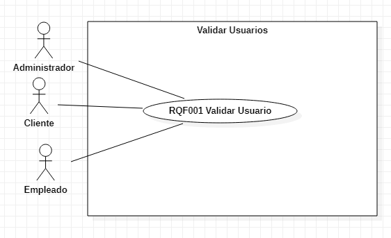

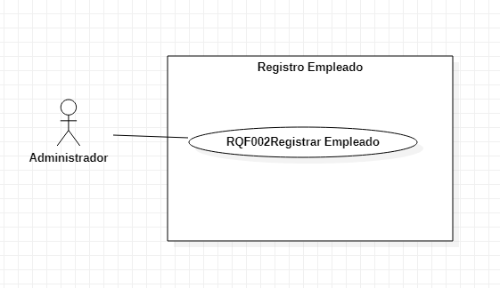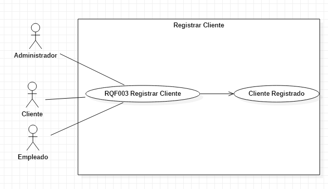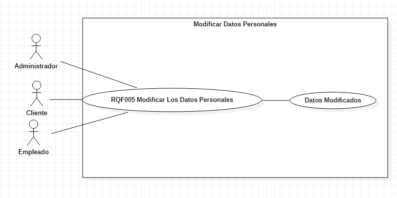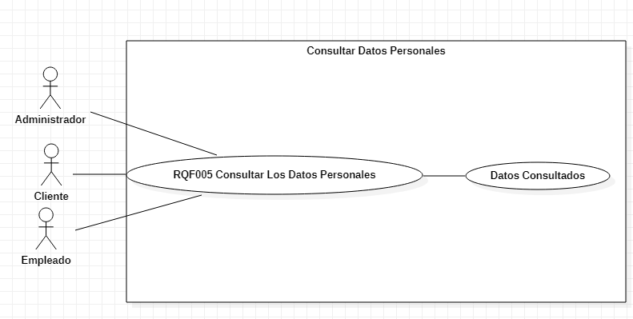

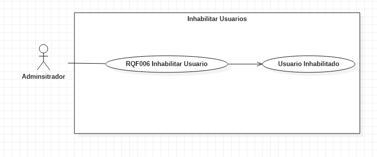

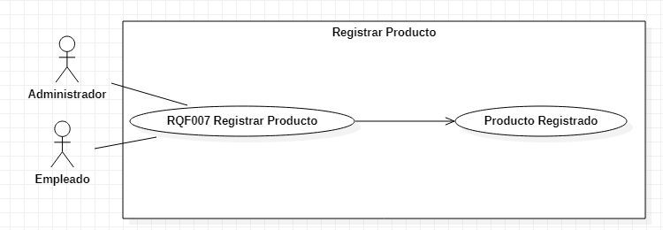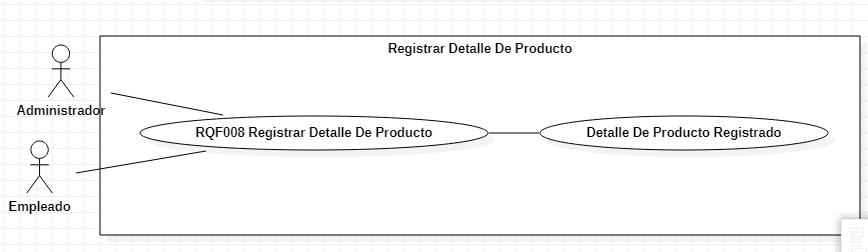

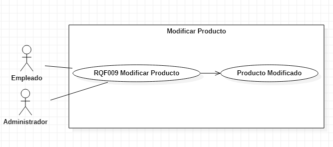

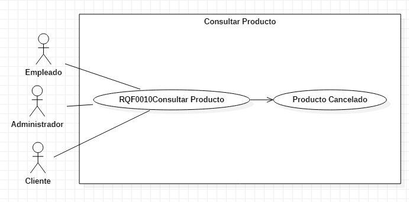

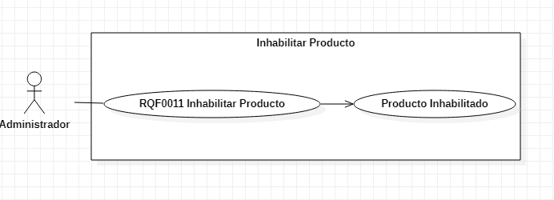

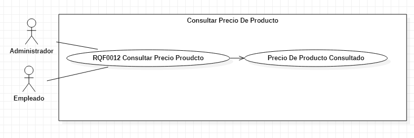

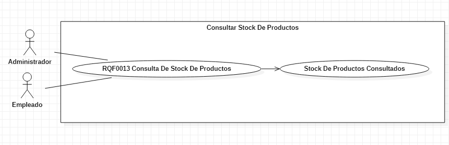

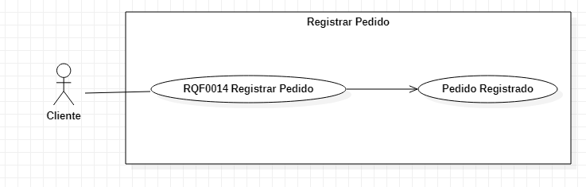

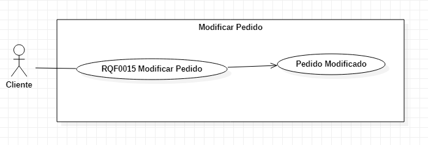

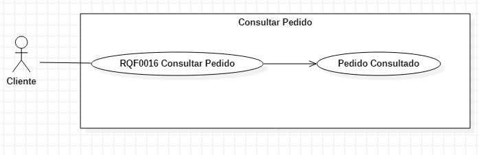

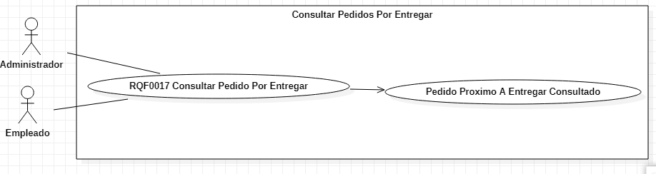

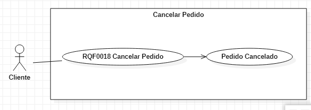

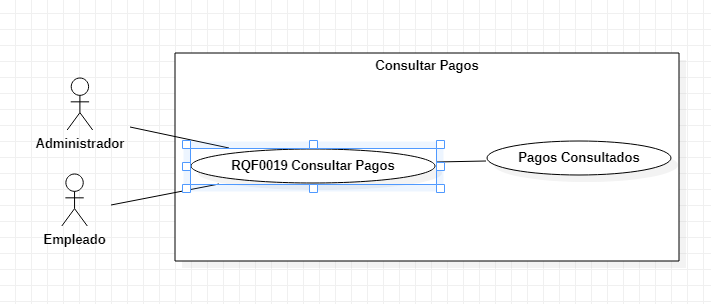

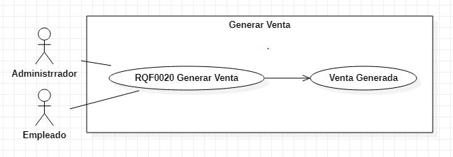

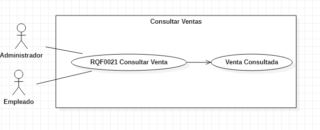

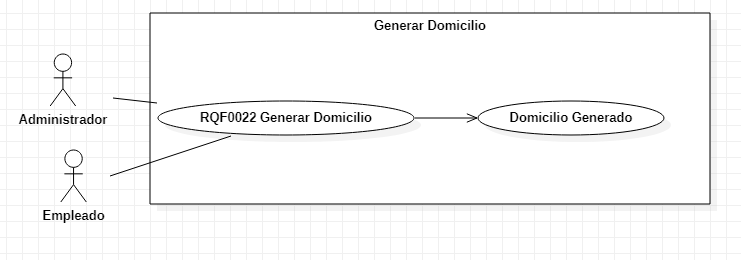

<table>
<colgroup>
<col style="width: 17%" />
<col style="width: 8%" />
<col style="width: 7%" />
<col style="width: 17%" />
<col style="width: 1%" />
<col style="width: 34%" />
<col style="width: 14%" />
</colgroup>
<thead>
<tr class="header">
<th colspan="7"><ol type="1">
<li>
IDENTIFICACIÓN DE CASO DE USO
</li>
</ol></th>
</tr>
</thead>
<tbody>
<tr class="odd">
<td>R. 1.1 Id Caso</td>
<td colspan="2">CU 001</td>
<td colspan="2">1.2 Nombre</td>
<td colspan="2">Validar Usuario</td>
</tr>
<tr class="even">
<td colspan="7">2. HISTÓRICO DE CASO DE USO</td>
</tr>
<tr class="odd">
<td colspan="2">2.1 Autor</td>
<td colspan="5">David Sánchez, David Vargas, Estefanía Agudelo, Juan
David Pulido</td>
</tr>
<tr class="even">
<td colspan="2">2.2 Fecha Creación</td>
<td colspan="2">15/03/2021</td>
<td colspan="2"><blockquote>

2.3 Última Actualización

</blockquote></td>
<td>15/03/2021</td>
</tr>
<tr class="odd">
<td colspan="2">2.4 Actualizado por</td>
<td colspan="2"></td>
<td colspan="2"><blockquote>

2.5 Versión

</blockquote></td>
<td>1.0</td>
</tr>
<tr class="even">
<td colspan="7"><ol start="3" type="1">
<li>
DEFINICIÓN DE UN CASO DE USO
</li>
</ol></td>
</tr>
<tr class="odd">
<td colspan="7">3.1 DESCRIPCIÓN</td>
</tr>
<tr class="even">
<td colspan="7">El sistema permitirá validar las credenciales de
autenticación de cada usuario con el fin de permitirle iniciar
sesión.</td>
</tr>
<tr class="odd">
<td colspan="7">3.2 ACTORES</td>
</tr>
<tr class="even">
<td colspan="7">Administrador, Comprador, Empleado</td>
</tr>
<tr class="odd">
<td colspan="7">3.3 PRECONDICIONES</td>
</tr>
<tr class="even">
<td colspan="7">El administrador académico debe estar autenticado por el
programador.</td>
</tr>
<tr class="odd">
<td colspan="7">3.4 FLUJO NORMAL</td>
</tr>
<tr class="even">
<td colspan="7"><blockquote>

Contando con las precondiciones el flujo normal será el
siguiente:

</blockquote></td>
</tr>
<tr class="odd">
<td colspan="7"><table>
<colgroup>
<col style="width: 9%" />
<col style="width: 41%" />
<col style="width: 48%" />
</colgroup>
<thead>
<tr class="header">
<th>Paso</th>
<th>Actor</th>
<th>Sistema</th>
</tr>
</thead>
<tbody>
<tr class="odd">
<td>1</td>
<td></td>
<td>
El sistema presenta interfaz con dos

opciones las cuales son registro e iniciar

sesión.
</td>
</tr>
<tr class="even">
<td>2</td>
<td>
El usuario selecciona la opción

registrar usuario.
</td>
<td></td>
</tr>
<tr class="odd">
<td>3</td>
<td></td>
<td>El sistema presenta opción registrar.</td>
</tr>
<tr class="even">
<td>4</td>
<td>
El usuario digita sus datos

(Nombres, apellidos, ID,

cargo, correo electrónico,

nombre de usuario y

contraseña).
</td>
<td></td>
</tr>
<tr class="odd">
<td>5</td>
<td>
El usuario da clic al botón

enviar.
</td>
<td></td>
</tr>
<tr class="even">
<td>6</td>
<td></td>
<td>El sistema verifica los datos ingresados en la BD.</td>
</tr>
<tr class="odd">
<td>7</td>
<td></td>
<td>El sistema valida los datos como correctos.</td>
</tr>
<tr class="even">
<td>8</td>
<td></td>
<td>El sistema presenta mensaje de bienvenida.</td>
</tr>
<tr class="odd">
<td>9</td>
<td></td>
<td>El sistema expulsa al usuario y le pide que inicie sesión.</td>
</tr>
</tbody>
</table></td>
</tr>
<tr class="even">
<td colspan="7">3.5 FLUJO EXCEPCIONAL</td>
</tr>
<tr class="odd">
<td colspan="7"><table>
<colgroup>
<col style="width: 9%" />
<col style="width: 41%" />
<col style="width: 48%" />
</colgroup>
<thead>
<tr class="header">
<th>Paso</th>
<th>Actor</th>
<th>Sistema</th>
</tr>
</thead>
<tbody>
<tr class="odd">
<td></td>
<td></td>
<td></td>
</tr>
<tr class="even">
<td></td>
<td></td>
<td></td>
</tr>
</tbody>
</table></td>
</tr>
<tr class="even">
<td colspan="7">3.6 POS CONDICIONES</td>
</tr>
<tr class="odd">
<td colspan="7">Sistema genera confirmación de administrador académico
registrado con éxito.</td>
</tr>
<tr class="even">
<td colspan="7">3.7 FRECUENCIA</td>
</tr>
<tr class="odd">
<td colspan="7">Baja.</td>
</tr>
</tbody>
</table>

<table>
<colgroup>
<col style="width: 16%" />
<col style="width: 7%" />
<col style="width: 6%" />
<col style="width: 15%" />
<col style="width: 1%" />
<col style="width: 29%" />
<col style="width: 22%" />
</colgroup>
<thead>
<tr class="header">
<th colspan="7"><ol type="1">
<li><blockquote>

IDENTIFICACIÓN DE CASO DE USO

</blockquote></li>
</ol></th>
</tr>
</thead>
<tbody>
<tr class="odd">
<td>R. 1.1 Id Caso</td>
<td colspan="2">CU 002</td>
<td colspan="2">1.2 Nombre</td>
<td colspan="2">Gestionar Cliente</td>
</tr>
<tr class="even">
<td colspan="7">2. HISTÓRICO DE CASO DE USO</td>
</tr>
<tr class="odd">
<td colspan="2">2.1 Autor</td>
<td colspan="5">David Sánchez, David Vargas, Estefanía Agudelo, Juan
David Pulido</td>
</tr>
<tr class="even">
<td colspan="2">2.2 Fecha Creación</td>
<td colspan="2">15/03/2021</td>
<td colspan="2"><blockquote>

2.3 Última Actualización

</blockquote></td>
<td>15/03/2021</td>
</tr>
<tr class="odd">
<td colspan="2">2.4 Actualizado por</td>
<td colspan="2"></td>
<td colspan="2"><blockquote>

2.5 Versión

</blockquote></td>
<td>1.0</td>
</tr>
<tr class="even">
<td colspan="7"><ol start="3" type="1">
<li>
DEFINICIÓN DE UN CASO DE USO
</li>
</ol></td>
</tr>
<tr class="odd">
<td colspan="7">3.1 DESCRIPCIÓN</td>
</tr>
<tr class="even">
<td colspan="7">
El sistema permitirá la gestión de usuarios al
Administrador Académico se le permitirá

realizar las operaciones de consulta, registro, modificación e
inactivación del Cliente
</td>
</tr>
<tr class="odd">
<td colspan="7">3.2 ACTORES</td>
</tr>
<tr class="even">
<td colspan="7">Administrador</td>
</tr>
<tr class="odd">
<td colspan="7">3.3 PRECONDICIONES</td>
</tr>
<tr class="even">
<td colspan="7">1. El administrador debe estar logueado</td>
</tr>
<tr class="odd">
<td colspan="7">3.4 FLUJO NORMAL</td>
</tr>
<tr class="even">
<td colspan="7"><blockquote>

Contando con las precondiciones el flujo normal será el
siguiente:

</blockquote></td>
</tr>
<tr class="odd">
<td colspan="7"><table>
<colgroup>
<col style="width: 9%" />
<col style="width: 41%" />
<col style="width: 48%" />
</colgroup>
<thead>
<tr class="header">
<th>Paso</th>
<th>Actor</th>
<th>Sistema</th>
</tr>
</thead>
<tbody>
<tr class="odd">
<td>1</td>
<td></td>
<td>
El sistema presenta interfaz de inicio de

sesión.
</td>
</tr>
<tr class="even">
<td>2</td>
<td>El administrador ingresa nombre de usuario y contraseña.</td>
<td></td>
</tr>
<tr class="odd">
<td>3</td>
<td>
El administrador da clic en

iniciar sesión
</td>
<td></td>
</tr>
<tr class="even">
<td>4</td>
<td></td>
<td>El sistema valida el usuario y la contraseña.</td>
</tr>
<tr class="odd">
<td>5</td>
<td></td>
<td>
El sistema despliega una ventana con

opciones como lo son consultar, registrar, modificar e
inhabilitar
</td>
</tr>
</tbody>
</table></td>
</tr>
<tr class="even">
<td colspan="7">3.5 FLUJO EXCEPCIONAL</td>
</tr>
<tr class="odd">
<td colspan="7"><table>
<colgroup>
<col style="width: 9%" />
<col style="width: 41%" />
<col style="width: 48%" />
</colgroup>
<thead>
<tr class="header">
<th>Paso</th>
<th>Actor</th>
<th>Sistema</th>
</tr>
</thead>
<tbody>
<tr class="odd">
<td>4.a</td>
<td></td>
<td>El sistema valida el usuario y la contraseña en caso de que estos
datos no sean correctos, se le notificara a el usuario de algún
error.</td>
</tr>
</tbody>
</table></td>
</tr>
<tr class="even">
<td colspan="7">3.6 POS CONDICIONES</td>
</tr>
<tr class="odd">
<td colspan="7">Realizo operación de manera exitosa</td>
</tr>
<tr class="even">
<td colspan="7">3.7 FRECUENCIA</td>
</tr>
<tr class="odd">
<td colspan="7">Alta.</td>
</tr>
</tbody>
</table>

<table>
<colgroup>
<col style="width: 17%" />
<col style="width: 8%" />
<col style="width: 7%" />
<col style="width: 17%" />
<col style="width: 1%" />
<col style="width: 34%" />
<col style="width: 14%" />
</colgroup>
<thead>
<tr class="header">
<th colspan="7"><ol type="1">
<li>
IDENTIFICACIÓN DE CASO DE USO
</li>
</ol></th>
</tr>
</thead>
<tbody>
<tr class="odd">
<td>R. 1.1 Id Caso</td>
<td colspan="2">CU 002</td>
<td colspan="2">1.2 Nombre</td>
<td colspan="2">Gestionar Cliente - Consultar</td>
</tr>
<tr class="even">
<td colspan="7">2. HISTÓRICO DE CASO DE USO</td>
</tr>
<tr class="odd">
<td colspan="2">2.1 Autor</td>
<td colspan="5">David Sánchez, David Vargas, Estefanía Agudelo, Juan
David Pulido</td>
</tr>
<tr class="even">
<td colspan="2">2.2 Fecha Creación</td>
<td colspan="2">15/03/2021</td>
<td colspan="2"><blockquote>

2.3 Última Actualización

</blockquote></td>
<td>15/03/2021</td>
</tr>
<tr class="odd">
<td colspan="2">2.4 Actualizado por</td>
<td colspan="2"></td>
<td colspan="2"><blockquote>

2.5 Versión

</blockquote></td>
<td>1.0</td>
</tr>
<tr class="even">
<td colspan="7"><ol start="3" type="1">
<li><blockquote>

DEFINICIÓN DE UN CASO DE USO

</blockquote></li>
</ol></td>
</tr>
<tr class="odd">
<td colspan="7">3.1 DESCRIPCIÓN</td>
</tr>
<tr class="even">
<td colspan="7">El sistema le permitirá al administrador las operaciones
de consulta, registro, modificación e inhabilitar del Cliente</td>
</tr>
<tr class="odd">
<td colspan="7">3.2 ACTORES</td>
</tr>
<tr class="even">
<td colspan="7">Administrador</td>
</tr>
<tr class="odd">
<td colspan="7">3.3 PRECONDICIONES</td>
</tr>
<tr class="even">
<td colspan="7">1. El usuario debe estar autenticado como
administrador</td>
</tr>
<tr class="odd">
<td colspan="7">3.4 FLUJO NORMAL</td>
</tr>
<tr class="even">
<td colspan="7"><blockquote>

Contando con las precondiciones el flujo normal será el
siguiente:

</blockquote></td>
</tr>
<tr class="odd">
<td colspan="7"><table>
<colgroup>
<col style="width: 9%" />
<col style="width: 42%" />
<col style="width: 48%" />
</colgroup>
<thead>
<tr class="header">
<th>Paso</th>
<th>Actor</th>
<th>Sistema</th>
</tr>
</thead>
<tbody>
<tr class="odd">
<td>1</td>
<td>
El administrador vuelve al menú

principal y selecciona la opción de

Gestión Cliente , luego busca

los datos a consultar.
</td>
<td></td>
</tr>
<tr class="even">
<td>2</td>
<td></td>
<td>El sistema consulta y muestra los datos solicitados.</td>
</tr>
</tbody>
</table></td>
</tr>
<tr class="even">
<td colspan="7">3.5 FLUJO EXCEPCIONAL</td>
</tr>
<tr class="odd">
<td colspan="7"><table>
<colgroup>
<col style="width: 9%" />
<col style="width: 41%" />
<col style="width: 48%" />
</colgroup>
<thead>
<tr class="header">
<th>Paso</th>
<th>Actor</th>
<th>Sistema</th>
</tr>
</thead>
<tbody>
<tr class="odd">
<td>1</td>
<td></td>
<td>Los datos buscados no existen</td>
</tr>
</tbody>
</table></td>
</tr>
<tr class="even">
<td colspan="7">3.6 POS CONDICIONES</td>
</tr>
<tr class="odd">
<td colspan="7">Realizo operación de manera exitosa</td>
</tr>
<tr class="even">
<td colspan="7">3.7 FRECUENCIA</td>
</tr>
<tr class="odd">
<td colspan="7">Alta.</td>
</tr>
</tbody>
</table>

<table>
<colgroup>
<col style="width: 16%" />
<col style="width: 8%" />
<col style="width: 6%" />
<col style="width: 16%" />
<col style="width: 1%" />
<col style="width: 31%" />
<col style="width: 19%" />
</colgroup>
<thead>
<tr class="header">
<th colspan="7"><ol type="1">
<li>
IDENTIFICACIÓN DE CASO DE USO
</li>
</ol></th>
</tr>
</thead>
<tbody>
<tr class="odd">
<td>R. 1.1 Id Caso</td>
<td colspan="2">CU 002</td>
<td colspan="2">1.2 Nombre</td>
<td colspan="2">Gestionar Cliente - Registrar</td>
</tr>
<tr class="even">
<td colspan="7">2. HISTÓRICO DE CASO DE USO</td>
</tr>
<tr class="odd">
<td colspan="2">2.1 Autor</td>
<td colspan="5">David Sánchez, David Vargas, Estefanía Agudelo, Juan
David Pulido</td>
</tr>
<tr class="even">
<td colspan="2">2.2 Fecha Creación</td>
<td colspan="2">15/03/2021</td>
<td colspan="2"><blockquote>

2.3 Última Actualización

</blockquote></td>
<td>15/03/2021</td>
</tr>
<tr class="odd">
<td colspan="2">2.4 Actualizado por</td>
<td colspan="2"></td>
<td colspan="2"><blockquote>

2.5 Versión

</blockquote></td>
<td>1.0</td>
</tr>
<tr class="even">
<td colspan="7"><ol start="3" type="1">
<li><blockquote>

DEFINICIÓN DE UN CASO DE USO

</blockquote></li>
</ol></td>
</tr>
<tr class="odd">
<td colspan="7">3.1 DESCRIPCIÓN</td>
</tr>
<tr class="even">
<td colspan="7">El sistema le permitirá al administrador las operaciones
de consulta, registro, modificación e inhabilitar del Comprador</td>
</tr>
<tr class="odd">
<td colspan="7">3.2 ACTORES</td>
</tr>
<tr class="even">
<td colspan="7">Administrador</td>
</tr>
<tr class="odd">
<td colspan="7">3.3 PRECONDICIONES</td>
</tr>
<tr class="even">
<td colspan="7">1. El usuario debe estar autenticado como
administrador</td>
</tr>
<tr class="odd">
<td colspan="7">3.4 FLUJO NORMAL</td>
</tr>
<tr class="even">
<td colspan="7"><blockquote>

Contando con las precondiciones el flujo normal será el
siguiente:

</blockquote></td>
</tr>
<tr class="odd">
<td colspan="7"><table>
<colgroup>
<col style="width: 9%" />
<col style="width: 41%" />
<col style="width: 48%" />
</colgroup>
<thead>
<tr class="header">
<th>Paso</th>
<th>Actor</th>
<th>Sistema</th>
</tr>
</thead>
<tbody>
<tr class="odd">
<td>1</td>
<td>
El administrador vuelve al menú

principal y selecciona la opción de

Gestión Cliente, luego llena los datos a registrar
</td>
<td></td>
</tr>
<tr class="even">
<td>2</td>
<td></td>
<td>El sistema registra los datos mostrando un mensaje, Registro
correcto</td>
</tr>
</tbody>
</table></td>
</tr>
<tr class="even">
<td colspan="7">3.5 FLUJO EXCEPCIONAL</td>
</tr>
<tr class="odd">
<td colspan="7"><table>
<colgroup>
<col style="width: 9%" />
<col style="width: 41%" />
<col style="width: 48%" />
</colgroup>
<thead>
<tr class="header">
<th>Paso</th>
<th>Actor</th>
<th>Sistema</th>
</tr>
</thead>
<tbody>
<tr class="odd">
<td>1</td>
<td></td>
<td>Se digito algo mal</td>
</tr>
</tbody>
</table></td>
</tr>
<tr class="even">
<td colspan="7">3.6 POS CONDICIONES</td>
</tr>
<tr class="odd">
<td colspan="7">Realizo operación de manera exitosa</td>
</tr>
<tr class="even">
<td colspan="7">3.7 FRECUENCIA</td>
</tr>
<tr class="odd">
<td colspan="7">Alta.</td>
</tr>
</tbody>
</table>

<table>
<colgroup>
<col style="width: 17%" />
<col style="width: 8%" />
<col style="width: 7%" />
<col style="width: 17%" />
<col style="width: 1%" />
<col style="width: 34%" />
<col style="width: 14%" />
</colgroup>
<thead>
<tr class="header">
<th colspan="7"><ol type="1">
<li><blockquote>

IDENTIFICACIÓN DE CASO DE USO

</blockquote></li>
</ol></th>
</tr>
</thead>
<tbody>
<tr class="odd">
<td>R. 1.1 Id Caso</td>
<td colspan="2">C 002</td>
<td colspan="2">1.2 Nombre</td>
<td colspan="2">Gestionar Cliente – Modificar</td>
</tr>
<tr class="even">
<td colspan="7">2. HISTÓRICO DE CASO DE USO</td>
</tr>
<tr class="odd">
<td colspan="2">2.1 Autor</td>
<td colspan="5">David Sánchez, David Vargas, Estefanía Agudelo, Juan
David Pulido</td>
</tr>
<tr class="even">
<td colspan="2">2.2 Fecha Creación</td>
<td colspan="2">15/03/2021</td>
<td colspan="2"><blockquote>

2.3 Última Actualización

</blockquote></td>
<td>15/03/2021</td>
</tr>
<tr class="odd">
<td colspan="2">2.4 Actualizado por</td>
<td colspan="2"></td>
<td colspan="2"><blockquote>

2.5 Versión

</blockquote></td>
<td>1.0</td>
</tr>
<tr class="even">
<td colspan="7"><ol start="3" type="1">
<li><blockquote>

DEFINICIÓN DE UN CASO DE USO

</blockquote></li>
</ol></td>
</tr>
<tr class="odd">
<td colspan="7">3.1 DESCRIPCIÓN</td>
</tr>
<tr class="even">
<td colspan="7">El sistema le permitirá al administrador las operaciones
de consulta, registro, modificación e inhabilitar del Cliente</td>
</tr>
<tr class="odd">
<td colspan="7">3.2 ACTORES</td>
</tr>
<tr class="even">
<td colspan="7">Administrador</td>
</tr>
<tr class="odd">
<td colspan="7">3.3 PRECONDICIONES</td>
</tr>
<tr class="even">
<td colspan="7">1. El usuario debe estar autenticado como
administrador.</td>
</tr>
<tr class="odd">
<td colspan="7">3.4 FLUJO NORMAL</td>
</tr>
<tr class="even">
<td colspan="7"><blockquote>

Contando con las precondiciones el flujo normal será el
siguiente:

</blockquote></td>
</tr>
<tr class="odd">
<td colspan="7"><table>
<colgroup>
<col style="width: 9%" />
<col style="width: 41%" />
<col style="width: 48%" />
</colgroup>
<thead>
<tr class="header">
<th>Paso</th>
<th>Actor</th>
<th>Sistema</th>
</tr>
</thead>
<tbody>
<tr class="odd">
<td>1</td>
<td>
El administrador vuelve al menú

principal y selecciona la opción de

Gestión Cliente , luego busca los datos a modificar.
</td>
<td></td>
</tr>
<tr class="even">
<td>2</td>
<td></td>
<td>
El sistema muestra un formulario para

editar y guardar los cambios.
</td>
</tr>
<tr class="odd">
<td>3</td>
<td>
El administrador realiza las

modificaciones.
</td>
<td></td>
</tr>
<tr class="even">
<td>4</td>
<td></td>
<td>
El sistema verifica y valida que las

modificaciones hayan sido almacenadas

correctamente.
</td>
</tr>
</tbody>
</table></td>
</tr>
<tr class="even">
<td colspan="7">3.5 FLUJO EXCEPCIONAL</td>
</tr>
<tr class="odd">
<td colspan="7"><table>
<colgroup>
<col style="width: 9%" />
<col style="width: 41%" />
<col style="width: 48%" />
</colgroup>
<thead>
<tr class="header">
<th>Paso</th>
<th>Actor</th>
<th>Sistema</th>
</tr>
</thead>
<tbody>
<tr class="odd">
<td></td>
<td></td>
<td></td>
</tr>
</tbody>
</table></td>
</tr>
<tr class="even">
<td colspan="7">3.6 POS CONDICIONES</td>
</tr>
<tr class="odd">
<td colspan="7">Realizo operación de manera exitosa</td>
</tr>
<tr class="even">
<td colspan="7">3.7 FRECUENCIA</td>
</tr>
<tr class="odd">
<td colspan="7">Alta.</td>
</tr>
</tbody>
</table>

<table>
<colgroup>
<col style="width: 17%" />
<col style="width: 8%" />
<col style="width: 7%" />
<col style="width: 17%" />
<col style="width: 1%" />
<col style="width: 34%" />
<col style="width: 14%" />
</colgroup>
<thead>
<tr class="header">
<th colspan="7"><ol type="1">
<li>
IDENTIFICACIÓN DE CASO DE USO
</li>
</ol></th>
</tr>
</thead>
<tbody>
<tr class="odd">
<td>R. 1.1 Id Caso</td>
<td colspan="2">CU 002</td>
<td colspan="2">1.2 Nombre</td>
<td colspan="2">Gestionar Cliente- Inhabilitar</td>
</tr>
<tr class="even">
<td colspan="7">2. HISTÓRICO DE CASO DE USO</td>
</tr>
<tr class="odd">
<td colspan="2">2.1 Autor</td>
<td colspan="5">David Sánchez, David Vargas, Estefanía Agudelo, Juan
David Pulido</td>
</tr>
<tr class="even">
<td colspan="2">2.2 Fecha Creación</td>
<td colspan="2">15/03/2021</td>
<td colspan="2"><blockquote>

2.3 Última Actualización

</blockquote></td>
<td>15/03/2021</td>
</tr>
<tr class="odd">
<td colspan="2">2.4 Actualizado por</td>
<td colspan="2"></td>
<td colspan="2"><blockquote>

2.5 Versión

</blockquote></td>
<td>1.0</td>
</tr>
<tr class="even">
<td colspan="7"><ol start="3" type="1">
<li>
DEFINICIÓN DE UN CASO DE USO
</li>
</ol></td>
</tr>
<tr class="odd">
<td colspan="7">3.1 DESCRIPCIÓN</td>
</tr>
<tr class="even">
<td colspan="7">El sistema le permitirá al administrador las operaciones
de consulta, registro, modificación e inhabilitar del Comprador</td>
</tr>
<tr class="odd">
<td colspan="7">3.2 ACTORES</td>
</tr>
<tr class="even">
<td colspan="7">Administrador</td>
</tr>
<tr class="odd">
<td colspan="7">3.3 PRECONDICIONES</td>
</tr>
<tr class="even">
<td colspan="7">1. El usuario debe estar autenticado como
administrador.</td>
</tr>
<tr class="odd">
<td colspan="7">3.4 FLUJO NORMAL</td>
</tr>
<tr class="even">
<td colspan="7"><blockquote>

Contando con las precondiciones el flujo normal será el
siguiente:

</blockquote></td>
</tr>
<tr class="odd">
<td colspan="7"><table>
<colgroup>
<col style="width: 9%" />
<col style="width: 41%" />
<col style="width: 48%" />
</colgroup>
<thead>
<tr class="header">
<th>Paso</th>
<th>Actor</th>
<th>Sistema</th>
</tr>
</thead>
<tbody>
<tr class="odd">
<td>1</td>
<td>
El administrador vuelve al menú

principal y selecciona la opción de

Gestión Cliente, luego busca los datos a inhabilitar.
</td>
<td></td>
</tr>
<tr class="even">
<td>2</td>
<td>El administrador realiza la inhabilitación, con un comentario
mostrando el motivo</td>
<td></td>
</tr>
<tr class="odd">
<td>3</td>
<td></td>
<td>El sistema inhabilita al comprador, y guarda el comentario</td>
</tr>
</tbody>
</table></td>
</tr>
<tr class="even">
<td colspan="7">3.5 FLUJO EXCEPCIONAL</td>
</tr>
<tr class="odd">
<td colspan="7"><table>
<colgroup>
<col style="width: 9%" />
<col style="width: 41%" />
<col style="width: 48%" />
</colgroup>
<thead>
<tr class="header">
<th>Paso</th>
<th>Actor</th>
<th>Sistema</th>
</tr>
</thead>
<tbody>
<tr class="odd">
<td></td>
<td></td>
<td></td>
</tr>
</tbody>
</table></td>
</tr>
<tr class="even">
<td colspan="7">3.6 POS CONDICIONES</td>
</tr>
<tr class="odd">
<td colspan="7">Realizo operación de manera exitosa</td>
</tr>
<tr class="even">
<td colspan="7">3.7 FRECUENCIA</td>
</tr>
<tr class="odd">
<td colspan="7">Alta.</td>
</tr>
</tbody>
</table>

<table style="width:100%;">
<colgroup>
<col style="width: 17%" />
<col style="width: 8%" />
<col style="width: 6%" />
<col style="width: 16%" />
<col style="width: 1%" />
<col style="width: 35%" />
<col style="width: 14%" />
</colgroup>
<thead>
<tr class="header">
<th colspan="7"><ol type="1">
<li><blockquote>

IDENTIFICACIÓN DE CASO DE USO

</blockquote></li>
</ol></th>
</tr>
</thead>
<tbody>
<tr class="odd">
<td>R. 1.1 Id Caso</td>
<td colspan="2">CU 003</td>
<td colspan="2">1.2 Nombre</td>
<td colspan="2">Gestionar Empleados</td>
</tr>
<tr class="even">
<td colspan="7">2. HISTÓRICO DE CASO DE USO</td>
</tr>
<tr class="odd">
<td colspan="2">2.1 Autor</td>
<td colspan="5">David Sánchez, David Vargas, Estefanía Agudelo, Juan
David Pulido</td>
</tr>
<tr class="even">
<td colspan="2">2.2 Fecha Creación</td>
<td colspan="2">15/03/2021</td>
<td colspan="2"><blockquote>

2.3 Última Actualización

</blockquote></td>
<td>15/03/2021</td>
</tr>
<tr class="odd">
<td colspan="2">2.4 Actualizado por</td>
<td colspan="2"></td>
<td colspan="2"><blockquote>

2.5 Versión

</blockquote></td>
<td>1.0</td>
</tr>
<tr class="even">
<td colspan="7"><ol start="3" type="1">
<li><blockquote>

DEFINICIÓN DE UN CASO DE USO

</blockquote></li>
</ol></td>
</tr>
<tr class="odd">
<td colspan="7">3.1 DESCRIPCIÓN</td>
</tr>
<tr class="even">
<td colspan="7">
El sistema le permitirá la gestión de observaciones
al administrador académico se le

permitirá realizar las operaciones de consulta, registro ,
modificación e inhabilitar del Empleado
</td>
</tr>
<tr class="odd">
<td colspan="7">3.2 ACTORES</td>
</tr>
<tr class="even">
<td colspan="7">Administrador</td>
</tr>
<tr class="odd">
<td colspan="7">3.3 PRECONDICIONES</td>
</tr>
<tr class="even">
<td colspan="7">1. El administrador debe estar logueado</td>
</tr>
<tr class="odd">
<td colspan="7">3.4 FLUJO NORMAL</td>
</tr>
<tr class="even">
<td colspan="7"><blockquote>

Contando con las precondiciones el flujo normal será el
siguiente:

</blockquote></td>
</tr>
<tr class="odd">
<td colspan="7"><table>
<colgroup>
<col style="width: 9%" />
<col style="width: 41%" />
<col style="width: 48%" />
</colgroup>
<thead>
<tr class="header">
<th>Paso</th>
<th>Actor</th>
<th>Sistema</th>
</tr>
</thead>
<tbody>
<tr class="odd">
<td>1</td>
<td></td>
<td>Verifica Credenciales de administrador</td>
</tr>
<tr class="even">
<td>2</td>
<td></td>
<td>El sistema presenta menú principal.</td>
</tr>
<tr class="odd">
<td>3</td>
<td>
El administrador selecciona la

opción de Gestión Empleados.
</td>
<td></td>
</tr>
<tr class="even">
<td>4</td>
<td></td>
<td>
El sistema despliega una ventana con

opciones como lo son consultar, registrar, modificar e
inhabilitar
</td>
</tr>
</tbody>
</table></td>
</tr>
<tr class="even">
<td colspan="7">3.5 FLUJO EXCEPCIONAL</td>
</tr>
<tr class="odd">
<td colspan="7"><table>
<colgroup>
<col style="width: 9%" />
<col style="width: 41%" />
<col style="width: 48%" />
</colgroup>
<thead>
<tr class="header">
<th>Paso</th>
<th>Actor</th>
<th>Sistema</th>
</tr>
</thead>
<tbody>
<tr class="odd">
<td>1.a</td>
<td></td>
<td>El sistema verifica que sea administrador si no lo es, no mostrara
esta opción</td>
</tr>
</tbody>
</table></td>
</tr>
<tr class="even">
<td colspan="7">3.6 POS CONDICIONES</td>
</tr>
<tr class="odd">
<td colspan="7">Realizo operación de manera exitosa</td>
</tr>
<tr class="even">
<td colspan="7">3.7 FRECUENCIA</td>
</tr>
<tr class="odd">
<td colspan="7">Alta.</td>
</tr>
</tbody>
</table>

<table>
<colgroup>
<col style="width: 16%" />
<col style="width: 8%" />
<col style="width: 6%" />
<col style="width: 16%" />
<col style="width: 1%" />
<col style="width: 31%" />
<col style="width: 19%" />
</colgroup>
<thead>
<tr class="header">
<th colspan="7"><ol type="1">
<li>
IDENTIFICACIÓN DE CASO DE USO
</li>
</ol></th>
</tr>
</thead>
<tbody>
<tr class="odd">
<td>R. 1.1 Id Caso</td>
<td colspan="2">CU 003</td>
<td colspan="2">1.2 Nombre</td>
<td colspan="2">Gestionar Empleados - Consultar</td>
</tr>
<tr class="even">
<td colspan="7">2. HISTÓRICO DE CASO DE USO</td>
</tr>
<tr class="odd">
<td colspan="2">2.1 Autor</td>
<td colspan="5">David Sánchez, David Vargas, Estefanía Agudelo, Juan
David Pulido</td>
</tr>
<tr class="even">
<td colspan="2">2.2 Fecha Creación</td>
<td colspan="2">15/03/2021</td>
<td colspan="2"><blockquote>

2.3 Última Actualización

</blockquote></td>
<td>15/03/2021</td>
</tr>
<tr class="odd">
<td colspan="2">2.4 Actualizado por</td>
<td colspan="2"></td>
<td colspan="2"><blockquote>

2.5 Versión

</blockquote></td>
<td>1.0</td>
</tr>
<tr class="even">
<td colspan="7"><ol start="3" type="1">
<li>
DEFINICIÓN DE UN CASO DE USO
</li>
</ol></td>
</tr>
<tr class="odd">
<td colspan="7">3.1 DESCRIPCIÓN</td>
</tr>
<tr class="even">
<td colspan="7">El sistema le permitirá al administrador las operaciones
de consulta, registro, modificación e inhabilitar de Empleados</td>
</tr>
<tr class="odd">
<td colspan="7">3.2 ACTORES</td>
</tr>
<tr class="even">
<td colspan="7">Administrador</td>
</tr>
<tr class="odd">
<td colspan="7">3.3 PRECONDICIONES</td>
</tr>
<tr class="even">
<td colspan="7">1. El usuario debe estar autenticado como
administrador.</td>
</tr>
<tr class="odd">
<td colspan="7">3.4 FLUJO NORMAL</td>
</tr>
<tr class="even">
<td colspan="7"><blockquote>

Contando con las precondiciones el flujo normal será el
siguiente:

</blockquote></td>
</tr>
<tr class="odd">
<td colspan="7"><table>
<colgroup>
<col style="width: 9%" />
<col style="width: 42%" />
<col style="width: 48%" />
</colgroup>
<thead>
<tr class="header">
<th>Paso</th>
<th>Actor</th>
<th>Sistema</th>
</tr>
</thead>
<tbody>
<tr class="odd">
<td>1</td>
<td>
El administrador vuelve al menú

principal y selecciona la opción de

Gestión Empleado, luego busca

los datos a consultar.
</td>
<td></td>
</tr>
<tr class="even">
<td>2</td>
<td></td>
<td>
El sistema consulta y muestra los datos

solicitados.
</td>
</tr>
</tbody>
</table></td>
</tr>
<tr class="even">
<td colspan="7">3.5 FLUJO EXCEPCIONAL</td>
</tr>
<tr class="odd">
<td colspan="7"><table>
<colgroup>
<col style="width: 9%" />
<col style="width: 41%" />
<col style="width: 48%" />
</colgroup>
<thead>
<tr class="header">
<th>Paso</th>
<th>Actor</th>
<th>Sistema</th>
</tr>
</thead>
<tbody>
<tr class="odd">
<td>1</td>
<td></td>
<td>Los datos buscados no existen</td>
</tr>
</tbody>
</table></td>
</tr>
<tr class="even">
<td colspan="7">3.6 POS CONDICIONES</td>
</tr>
<tr class="odd">
<td colspan="7">Realizo operación de manera exitosa</td>
</tr>
<tr class="even">
<td colspan="7">3.7 FRECUENCIA</td>
</tr>
<tr class="odd">
<td colspan="7">Alta.</td>
</tr>
</tbody>
</table>

<table>
<colgroup>
<col style="width: 17%" />
<col style="width: 8%" />
<col style="width: 7%" />
<col style="width: 17%" />
<col style="width: 1%" />
<col style="width: 34%" />
<col style="width: 14%" />
</colgroup>
<thead>
<tr class="header">
<th colspan="7"><ol type="1">
<li><blockquote>

IDENTIFICACIÓN DE CASO DE USO

</blockquote></li>
</ol></th>
</tr>
</thead>
<tbody>
<tr class="odd">
<td>R. 1.1 Id Caso</td>
<td colspan="2">CU 003</td>
<td colspan="2">1.2 Nombre</td>
<td colspan="2">Gestionar Empleados – Registrar</td>
</tr>
<tr class="even">
<td colspan="7">2. HISTÓRICO DE CASO DE USO</td>
</tr>
<tr class="odd">
<td colspan="2">2.1 Autor</td>
<td colspan="5">David Sánchez, David Vargas, Estefanía Agudelo, Juan
David Pulido</td>
</tr>
<tr class="even">
<td colspan="2">2.2 Fecha Creación</td>
<td colspan="2">15/03/2021</td>
<td colspan="2"><blockquote>

2.3 Última Actualización

</blockquote></td>
<td>15/03/2021</td>
</tr>
<tr class="odd">
<td colspan="2">2.4 Actualizado por</td>
<td colspan="2"></td>
<td colspan="2"><blockquote>

2.5 Versión

</blockquote></td>
<td>1.0</td>
</tr>
<tr class="even">
<td colspan="7"><ol start="3" type="1">
<li>
DEFINICIÓN DE UN CASO DE USO
</li>
</ol></td>
</tr>
<tr class="odd">
<td colspan="7">3.1 DESCRIPCIÓN</td>
</tr>
<tr class="even">
<td colspan="7">El sistema le permitirá al administrador las operaciones
de consulta, registro, modificación e inhabilitar de Empleados</td>
</tr>
<tr class="odd">
<td colspan="7">3.2 ACTORES</td>
</tr>
<tr class="even">
<td colspan="7">Administrador</td>
</tr>
<tr class="odd">
<td colspan="7">3.3 PRECONDICIONES</td>
</tr>
<tr class="even">
<td colspan="7">1. El usuario debe estar autenticado como
administrador.</td>
</tr>
<tr class="odd">
<td colspan="7">3.4 FLUJO NORMAL</td>
</tr>
<tr class="even">
<td colspan="7"><blockquote>

Contando con las precondiciones el flujo normal será el
siguiente:

</blockquote></td>
</tr>
<tr class="odd">
<td colspan="7"><table>
<colgroup>
<col style="width: 9%" />
<col style="width: 41%" />
<col style="width: 48%" />
</colgroup>
<thead>
<tr class="header">
<th>Paso</th>
<th>Actor</th>
<th>Sistema</th>
</tr>
</thead>
<tbody>
<tr class="odd">
<td>1</td>
<td>
El administrador vuelve al menú

principal y selecciona la opción de

Gestión Empleados, luego llena los datos a registrar
</td>
<td></td>
</tr>
<tr class="even">
<td>2</td>
<td></td>
<td>El sistema registra los datos y muestra una notificación de,
Registro correcto</td>
</tr>
</tbody>
</table></td>
</tr>
<tr class="even">
<td colspan="7">3.5 FLUJO EXCEPCIONAL</td>
</tr>
<tr class="odd">
<td colspan="7"><table>
<colgroup>
<col style="width: 9%" />
<col style="width: 41%" />
<col style="width: 48%" />
</colgroup>
<thead>
<tr class="header">
<th>Paso</th>
<th>Actor</th>
<th>Sistema</th>
</tr>
</thead>
<tbody>
<tr class="odd">
<td>1</td>
<td></td>
<td>Se digito algo mal</td>
</tr>
</tbody>
</table></td>
</tr>
<tr class="even">
<td colspan="7">3.6 POS CONDICIONES</td>
</tr>
<tr class="odd">
<td colspan="7">Realizo operación de manera exitosa</td>
</tr>
<tr class="even">
<td colspan="7">3.7 FRECUENCIA</td>
</tr>
<tr class="odd">
<td colspan="7">Alta.</td>
</tr>
</tbody>
</table>

<table>
<colgroup>
<col style="width: 17%" />
<col style="width: 8%" />
<col style="width: 7%" />
<col style="width: 17%" />
<col style="width: 1%" />
<col style="width: 34%" />
<col style="width: 14%" />
</colgroup>
<thead>
<tr class="header">
<th colspan="7"><ol type="1">
<li>
IDENTIFICACIÓN DE CASO DE USO
</li>
</ol></th>
</tr>
</thead>
<tbody>
<tr class="odd">
<td>R. 1.1 Id Caso</td>
<td colspan="2">CU 003</td>
<td colspan="2">1.2 Nombre</td>
<td colspan="2">Gestionar Empleados – Modificar</td>
</tr>
<tr class="even">
<td colspan="7">2. HISTÓRICO DE CASO DE USO</td>
</tr>
<tr class="odd">
<td colspan="2">2.1 Autor</td>
<td colspan="5">David Sánchez, David Vargas, Estefanía Agudelo, Juan
David Pulido</td>
</tr>
<tr class="even">
<td colspan="2">2.2 Fecha Creación</td>
<td colspan="2">15/03/2021</td>
<td colspan="2"><blockquote>

2.3 Última Actualización

</blockquote></td>
<td>15/03/2021</td>
</tr>
<tr class="odd">
<td colspan="2">2.4 Actualizado por</td>
<td colspan="2"></td>
<td colspan="2"><blockquote>

2.5 Versión

</blockquote></td>
<td>1.0</td>
</tr>
<tr class="even">
<td colspan="7"><ol start="4" type="1">
<li><blockquote>

DEFINICIÓN DE UN CASO DE USO

</blockquote></li>
</ol></td>
</tr>
<tr class="odd">
<td colspan="7">3.1 DESCRIPCIÓN</td>
</tr>
<tr class="even">
<td colspan="7">El sistema le permitirá al administrador las operaciones
de consulta, registro, modificación e inhabilitar de Empleados</td>
</tr>
<tr class="odd">
<td colspan="7">3.2 ACTORES</td>
</tr>
<tr class="even">
<td colspan="7">Administrador</td>
</tr>
<tr class="odd">
<td colspan="7">3.3 PRECONDICIONES</td>
</tr>
<tr class="even">
<td colspan="7">1. El usuario debe estar autenticado como
administrador.</td>
</tr>
<tr class="odd">
<td colspan="7">3.4 FLUJO NORMAL</td>
</tr>
<tr class="even">
<td colspan="7"><blockquote>

Contando con las precondiciones el flujo normal será el
siguiente:

</blockquote></td>
</tr>
<tr class="odd">
<td colspan="7"><table>
<colgroup>
<col style="width: 9%" />
<col style="width: 41%" />
<col style="width: 48%" />
</colgroup>
<thead>
<tr class="header">
<th>Paso</th>
<th>Actor</th>
<th>Sistema</th>
</tr>
</thead>
<tbody>
<tr class="odd">
<td>1</td>
<td>
El administrador vuelve al menú

principal y selecciona la opción de

Gestión Empleado, luego busca los datos a modificar.
</td>
<td></td>
</tr>
<tr class="even">
<td>2</td>
<td></td>
<td>
El sistema muestra un formulario para

editar y guardar los cambios.
</td>
</tr>
<tr class="odd">
<td>3</td>
<td>
El administrador realiza las

modificaciones.
</td>
<td></td>
</tr>
<tr class="even">
<td>4</td>
<td></td>
<td>
El sistema verifica y valida que las

modificaciones hayan sido almacenadas

correctamente.
</td>
</tr>
</tbody>
</table></td>
</tr>
<tr class="even">
<td colspan="7">3.5 FLUJO EXCEPCIONAL</td>
</tr>
<tr class="odd">
<td colspan="7"><table>
<colgroup>
<col style="width: 9%" />
<col style="width: 41%" />
<col style="width: 48%" />
</colgroup>
<thead>
<tr class="header">
<th>Paso</th>
<th>Actor</th>
<th>Sistema</th>
</tr>
</thead>
<tbody>
<tr class="odd">
<td></td>
<td></td>
<td></td>
</tr>
</tbody>
</table></td>
</tr>
<tr class="even">
<td colspan="7">3.6 POS CONDICIONES</td>
</tr>
<tr class="odd">
<td colspan="7">Realizo operación de manera exitosa</td>
</tr>
<tr class="even">
<td colspan="7">3.7 FRECUENCIA</td>
</tr>
<tr class="odd">
<td colspan="7">Alta.</td>
</tr>
</tbody>
</table>

<table>
<colgroup>
<col style="width: 17%" />
<col style="width: 8%" />
<col style="width: 7%" />
<col style="width: 17%" />
<col style="width: 1%" />
<col style="width: 34%" />
<col style="width: 14%" />
</colgroup>
<thead>
<tr class="header">
<th colspan="7"><ol type="1">
<li>
IDENTIFICACIÓN DE CASO DE USO
</li>
</ol></th>
</tr>
</thead>
<tbody>
<tr class="odd">
<td>R. 1.1 Id Caso</td>
<td colspan="2">CU 003</td>
<td colspan="2">1.2 Nombre</td>
<td colspan="2">Gestionar Empleado - Inhabilitar</td>
</tr>
<tr class="even">
<td colspan="7">2. HISTÓRICO DE CASO DE USO</td>
</tr>
<tr class="odd">
<td colspan="2">2.1 Autor</td>
<td colspan="5">David Sánchez, David Vargas, Estefanía Agudelo, Juan
David Pulido</td>
</tr>
<tr class="even">
<td colspan="2">2.2 Fecha Creación</td>
<td colspan="2">15/03/2021</td>
<td colspan="2"><blockquote>

2.3 Última Actualización

</blockquote></td>
<td>15/03/2021</td>
</tr>
<tr class="odd">
<td colspan="2">2.4 Actualizado por</td>
<td colspan="2"></td>
<td colspan="2"><blockquote>

2.5 Versión

</blockquote></td>
<td>1.0</td>
</tr>
<tr class="even">
<td colspan="7"><ol start="4" type="1">
<li>
DEFINICIÓN DE UN CASO DE USO
</li>
</ol></td>
</tr>
<tr class="odd">
<td colspan="7">3.1 DESCRIPCIÓN</td>
</tr>
<tr class="even">
<td colspan="7">El sistema le permitirá al administrador las operaciones
de consulta, registro, modificación e inhabilitar de Empleados</td>
</tr>
<tr class="odd">
<td colspan="7">3.2 ACTORES</td>
</tr>
<tr class="even">
<td colspan="7">Administrador</td>
</tr>
<tr class="odd">
<td colspan="7">3.3 PRECONDICIONES</td>
</tr>
<tr class="even">
<td colspan="7">1. El usuario debe estar autenticado como
administrador.</td>
</tr>
<tr class="odd">
<td colspan="7">3.4 FLUJO NORMAL</td>
</tr>
<tr class="even">
<td colspan="7"><blockquote>

Contando con las precondiciones el flujo normal será el
siguiente:

</blockquote></td>
</tr>
<tr class="odd">
<td colspan="7"><table>
<colgroup>
<col style="width: 9%" />
<col style="width: 41%" />
<col style="width: 48%" />
</colgroup>
<thead>
<tr class="header">
<th>Paso</th>
<th>Actor</th>
<th>Sistema</th>
</tr>
</thead>
<tbody>
<tr class="odd">
<td>1</td>
<td>
El administrador vuelve al menú

principal y selecciona la opción de

Gestión Empleado, luego busca los datos a inhabilitar.
</td>
<td></td>
</tr>
<tr class="even">
<td>2</td>
<td>El administrador realiza la inhabilitación, con un comentario
mostrando el motivo</td>
<td></td>
</tr>
<tr class="odd">
<td>3</td>
<td></td>
<td>El sistema inhabilita al comprador, y guarda el comentario</td>
</tr>
</tbody>
</table></td>
</tr>
<tr class="even">
<td colspan="7">3.5 FLUJO EXCEPCIONAL</td>
</tr>
<tr class="odd">
<td colspan="7"><table>
<colgroup>
<col style="width: 9%" />
<col style="width: 41%" />
<col style="width: 48%" />
</colgroup>
<thead>
<tr class="header">
<th>Paso</th>
<th>Actor</th>
<th>Sistema</th>
</tr>
</thead>
<tbody>
<tr class="odd">
<td></td>
<td></td>
<td></td>
</tr>
</tbody>
</table></td>
</tr>
<tr class="even">
<td colspan="7">3.6 POS CONDICIONES</td>
</tr>
<tr class="odd">
<td colspan="7">Realizo operación de manera exitosa</td>
</tr>
<tr class="even">
<td colspan="7">3.7 FRECUENCIA</td>
</tr>
<tr class="odd">
<td colspan="7">Alta.</td>
</tr>
</tbody>
</table>

<table>
<colgroup>
<col style="width: 17%" />
<col style="width: 8%" />
<col style="width: 7%" />
<col style="width: 17%" />
<col style="width: 1%" />
<col style="width: 34%" />
<col style="width: 14%" />
</colgroup>
<thead>
<tr class="header">
<th colspan="7"><ol type="1">
<li>
IDENTIFICACIÓN DE CASO DE USO
</li>
</ol></th>
</tr>
</thead>
<tbody>
<tr class="odd">
<td>R. 1.1 Id Caso</td>
<td colspan="2">CU 004</td>
<td colspan="2">1.2 Nombre</td>
<td colspan="2">Gestionar Ventas</td>
</tr>
<tr class="even">
<td colspan="7">2. HISTÓRICO DE CASO DE USO</td>
</tr>
<tr class="odd">
<td colspan="2">2.1 Autor</td>
<td colspan="5">David Sánchez, David Vargas, Estefanía Agudelo, Juan
David Pulido</td>
</tr>
<tr class="even">
<td colspan="2">2.2 Fecha Creación</td>
<td colspan="2">15/03/2021</td>
<td colspan="2"><blockquote>

2.3 Última Actualización

</blockquote></td>
<td>15/03/2021</td>
</tr>
<tr class="odd">
<td colspan="2">2.4 Actualizado por</td>
<td colspan="2"></td>
<td colspan="2"><blockquote>

2.5 Versión

</blockquote></td>
<td>1.0</td>
</tr>
<tr class="even">
<td colspan="7"><ol start="3" type="1">
<li><blockquote>

DEFINICIÓN DE UN CASO DE USO

</blockquote></li>
</ol></td>
</tr>
<tr class="odd">
<td colspan="7">3.1 DESCRIPCIÓN</td>
</tr>
<tr class="even">
<td colspan="7">El sistema le permitirá al usuario las operaciones de
consulta, registro, modificación e inhabilitar de Ventas</td>
</tr>
<tr class="odd">
<td colspan="7">3.2 ACTORES</td>
</tr>
<tr class="even">
<td colspan="7">Administrador Empleado Cliente</td>
</tr>
<tr class="odd">
<td colspan="7">3.3 PRECONDICIONES</td>
</tr>
<tr class="even">
<td colspan="7">1. El usuario debe estar autenticado en el sistema CU
001</td>
</tr>
<tr class="odd">
<td colspan="7">3.4 FLUJO NORMAL</td>
</tr>
<tr class="even">
<td colspan="7"><blockquote>

Contando con las precondiciones el flujo normal será el
siguiente:

</blockquote></td>
</tr>
<tr class="odd">
<td colspan="7"><table>
<colgroup>
<col style="width: 9%" />
<col style="width: 41%" />
<col style="width: 48%" />
</colgroup>
<thead>
<tr class="header">
<th>Paso</th>
<th>Actor</th>
<th>Sistema</th>
</tr>
</thead>
<tbody>
<tr class="odd">
<td>1</td>
<td></td>
<td>Verifica Credenciales</td>
</tr>
<tr class="even">
<td>2</td>
<td></td>
<td>El sistema presenta menú principal.</td>
</tr>
<tr class="odd">
<td>3</td>
<td>
El usuario selecciona la

opción de Ventas
</td>
<td></td>
</tr>
<tr class="even">
<td>4</td>
<td></td>
<td>Para el usuario Cliente: El sistema despliega una ventana, este ve
la opción de registrar, consultar Venta</td>
</tr>
<tr class="odd">
<td>5</td>
<td></td>
<td>Para el usuario Empleado: El sistema despliega una ventana, este ve
la opción de registrar ,consultar, modificar Venta.</td>
</tr>
<tr class="even">
<td>6</td>
<td></td>
<td>Para el usuario Administrador: El sistema despliega una ventana,
este ve la opción de registrar, consultar, modificar e inhabilitar
venta</td>
</tr>
</tbody>
</table></td>
</tr>
<tr class="even">
<td colspan="7">3.5 FLUJO EXCEPCIONAL</td>
</tr>
<tr class="odd">
<td colspan="7"><table>
<colgroup>
<col style="width: 9%" />
<col style="width: 41%" />
<col style="width: 48%" />
</colgroup>
<thead>
<tr class="header">
<th>Paso</th>
<th>Actor</th>
<th>Sistema</th>
</tr>
</thead>
<tbody>
<tr class="odd">
<td></td>
<td></td>
<td></td>
</tr>
</tbody>
</table></td>
</tr>
<tr class="even">
<td colspan="7">3.6 POS CONDICIONES</td>
</tr>
<tr class="odd">
<td colspan="7">Realizo operación de manera exitosa</td>
</tr>
<tr class="even">
<td colspan="7">3.7 FRECUENCIA</td>
</tr>
<tr class="odd">
<td colspan="7">Alta.</td>
</tr>
</tbody>
</table>

<table>
<colgroup>
<col style="width: 17%" />
<col style="width: 8%" />
<col style="width: 7%" />
<col style="width: 17%" />
<col style="width: 1%" />
<col style="width: 34%" />
<col style="width: 14%" />
</colgroup>
<thead>
<tr class="header">
<th colspan="7"><ol type="1">
<li><blockquote>

IDENTIFICACIÓN DE CASO DE USO

</blockquote></li>
</ol></th>
</tr>
</thead>
<tbody>
<tr class="odd">
<td>R. 1.1 Id Caso</td>
<td colspan="2">CU 00</td>
<td colspan="2">1.2 Nombre</td>
<td colspan="2">Gestionar Ventas – Consultar</td>
</tr>
<tr class="even">
<td colspan="7">2. HISTÓRICO DE CASO DE USO</td>
</tr>
<tr class="odd">
<td colspan="2">2.1 Autor</td>
<td colspan="5">David Sánchez, David Vargas, Estefanía Agudelo, Juan
David Pulido</td>
</tr>
<tr class="even">
<td colspan="2">2.2 Fecha Creación</td>
<td colspan="2">15/03/2021</td>
<td colspan="2"><blockquote>

2.3 Última Actualización

</blockquote></td>
<td>15/03/2021</td>
</tr>
<tr class="odd">
<td colspan="2">2.4 Actualizado por</td>
<td colspan="2"></td>
<td colspan="2"><blockquote>

2.5 Versión

</blockquote></td>
<td>1.0</td>
</tr>
<tr class="even">
<td colspan="7"><ol start="3" type="1">
<li><blockquote>

DEFINICIÓN DE UN CASO DE USO

</blockquote></li>
</ol></td>
</tr>
<tr class="odd">
<td colspan="7">3.1 DESCRIPCIÓN</td>
</tr>
<tr class="even">
<td colspan="7">El sistema le permitirá al usuario las operaciones de
consulta, registro, modificación e inhabilitar de Ventas</td>
</tr>
<tr class="odd">
<td colspan="7">3.2 ACTORES</td>
</tr>
<tr class="even">
<td colspan="7">Administrador Empleado Cliente</td>
</tr>
<tr class="odd">
<td colspan="7">3.3 PRECONDICIONES</td>
</tr>
<tr class="even">
<td colspan="7">1. El usuario debe estar autenticado en el sistema CU
001.</td>
</tr>
<tr class="odd">
<td colspan="7">3.4 FLUJO NORMAL</td>
</tr>
<tr class="even">
<td colspan="7"><blockquote>

Contando con las precondiciones el flujo normal será el
siguiente:

</blockquote></td>
</tr>
<tr class="odd">
<td colspan="7"><table>
<colgroup>
<col style="width: 9%" />
<col style="width: 41%" />
<col style="width: 48%" />
</colgroup>
<thead>
<tr class="header">
<th>Paso</th>
<th>Actor</th>
<th>Sistema</th>
</tr>
</thead>
<tbody>
<tr class="odd">
<td>1</td>
<td>
El usuario vuelve al menú

principal y selecciona la opción de

Gestión Empleado, luego busca

los datos para consultar.
</td>
<td></td>
</tr>
<tr class="even">
<td>2</td>
<td></td>
<td>
El sistema consulta y muestra los datos

solicitados.
</td>
</tr>
</tbody>
</table></td>
</tr>
<tr class="even">
<td colspan="7">3.5 FLUJO EXCEPCIONAL</td>
</tr>
<tr class="odd">
<td colspan="7"><table>
<colgroup>
<col style="width: 9%" />
<col style="width: 41%" />
<col style="width: 48%" />
</colgroup>
<thead>
<tr class="header">
<th>Paso</th>
<th>Actor</th>
<th>Sistema</th>
</tr>
</thead>
<tbody>
<tr class="odd">
<td>1</td>
<td></td>
<td>Datos no existen</td>
</tr>
</tbody>
</table></td>
</tr>
<tr class="even">
<td colspan="7">3.6 POS CONDICIONES</td>
</tr>
<tr class="odd">
<td colspan="7">Realizo operación de manera exitosa</td>
</tr>
<tr class="even">
<td colspan="7">3.7 FRECUENCIA</td>
</tr>
<tr class="odd">
<td colspan="7">Alta.</td>
</tr>
</tbody>
</table>

<table>
<colgroup>
<col style="width: 17%" />
<col style="width: 8%" />
<col style="width: 7%" />
<col style="width: 17%" />
<col style="width: 1%" />
<col style="width: 34%" />
<col style="width: 14%" />
</colgroup>
<thead>
<tr class="header">
<th colspan="7"><ol type="1">
<li><blockquote>

IDENTIFICACIÓN DE CASO DE USO

</blockquote></li>
</ol></th>
</tr>
</thead>
<tbody>
<tr class="odd">
<td>R. 1.1 Id Caso</td>
<td colspan="2">CUD 004</td>
<td colspan="2">1.2 Nombre</td>
<td colspan="2">Gestionar Ventas - Registrar</td>
</tr>
<tr class="even">
<td colspan="7">2. HISTÓRICO DE CASO DE USO</td>
</tr>
<tr class="odd">
<td colspan="2">2.1 Autor</td>
<td colspan="5">David Sánchez, David Vargas, Estefanía Agudelo, Juan
David Pulido</td>
</tr>
<tr class="even">
<td colspan="2">2.2 Fecha Creación</td>
<td colspan="2">15/03/2021</td>
<td colspan="2"><blockquote>

2.3 Última Actualización

</blockquote></td>
<td>15/03/2021</td>
</tr>
<tr class="odd">
<td colspan="2">2.4 Actualizado por</td>
<td colspan="2"></td>
<td colspan="2"><blockquote>

2.5 Versión

</blockquote></td>
<td>1.0</td>
</tr>
<tr class="even">
<td colspan="7"><ol start="3" type="1">
<li><blockquote>

DEFINICIÓN DE UN CASO DE USO

</blockquote></li>
</ol></td>
</tr>
<tr class="odd">
<td colspan="7">3.1 DESCRIPCIÓN</td>
</tr>
<tr class="even">
<td colspan="7">El sistema le permitirá al usuario las operaciones de
consulta, registro, modificación e inhabilitar de Ventas</td>
</tr>
<tr class="odd">
<td colspan="7">3.2 ACTORES</td>
</tr>
<tr class="even">
<td colspan="7">Administrador Empleado Cliente</td>
</tr>
<tr class="odd">
<td colspan="7">3.3 PRECONDICIONES</td>
</tr>
<tr class="even">
<td colspan="7">1. El usuario debe estar autenticado en el sistema CU
001.</td>
</tr>
<tr class="odd">
<td colspan="7">3.4 FLUJO NORMAL</td>
</tr>
<tr class="even">
<td colspan="7"><blockquote>

Contando con las precondiciones el flujo normal será el
siguiente:

</blockquote></td>
</tr>
<tr class="odd">
<td colspan="7"><table>
<colgroup>
<col style="width: 9%" />
<col style="width: 41%" />
<col style="width: 48%" />
</colgroup>
<thead>
<tr class="header">
<th>Paso</th>
<th>Actor</th>
<th>Sistema</th>
</tr>
</thead>
<tbody>
<tr class="odd">
<td>1</td>
<td>
El usuario vuelve al menú

principal y selecciona la opción de

Gestión Ventas, luego llena los datos a registrar
</td>
<td></td>
</tr>
<tr class="even">
<td>2</td>
<td></td>
<td>El sistema registra los datos y muestra una notificación de,
Registro correcto</td>
</tr>
</tbody>
</table></td>
</tr>
<tr class="even">
<td colspan="7">3.5 FLUJO EXCEPCIONAL</td>
</tr>
<tr class="odd">
<td colspan="7"><table>
<colgroup>
<col style="width: 9%" />
<col style="width: 41%" />
<col style="width: 48%" />
</colgroup>
<thead>
<tr class="header">
<th>Paso</th>
<th>Actor</th>
<th>Sistema</th>
</tr>
</thead>
<tbody>
<tr class="odd">
<td>1</td>
<td></td>
<td>Datos mal ingresados</td>
</tr>
</tbody>
</table></td>
</tr>
<tr class="even">
<td colspan="7">3.6 POS CONDICIONES</td>
</tr>
<tr class="odd">
<td colspan="7">Realizo operación de manera exitosa</td>
</tr>
<tr class="even">
<td colspan="7">3.7 FRECUENCIA</td>
</tr>
<tr class="odd">
<td colspan="7">Alta.</td>
</tr>
<tr class="even">
<td colspan="7"></td>
</tr>
</tbody>
</table>

<table>
<colgroup>
<col style="width: 17%" />
<col style="width: 8%" />
<col style="width: 7%" />
<col style="width: 17%" />
<col style="width: 1%" />
<col style="width: 34%" />
<col style="width: 14%" />
</colgroup>
<thead>
<tr class="header">
<th colspan="7"><ol start="2" type="1">
<li>
IDENTIFICACIÓN DE CASO DE USO
</li>
</ol></th>
</tr>
</thead>
<tbody>
<tr class="odd">
<td>R. 1.1 Id Caso</td>
<td colspan="2">CU 004</td>
<td colspan="2">1.2 Nombre</td>
<td colspan="2">Gestionar Ventas – Modificar</td>
</tr>
<tr class="even">
<td colspan="7">2. HISTÓRICO DE CASO DE USO</td>
</tr>
<tr class="odd">
<td colspan="2">2.1 Autor</td>
<td colspan="5">David Sánchez, David Vargas, Estefanía Agudelo, Juan
David Pulido</td>
</tr>
<tr class="even">
<td colspan="2">2.2 Fecha Creación</td>
<td colspan="2">15/03/2021</td>
<td colspan="2"><blockquote>

2.3 Última Actualización

</blockquote></td>
<td>15/03/2021</td>
</tr>
<tr class="odd">
<td colspan="2">2.4 Actualizado por</td>
<td colspan="2"></td>
<td colspan="2"><blockquote>

2.5 Versión

</blockquote></td>
<td>1.0</td>
</tr>
<tr class="even">
<td colspan="7"><ol start="5" type="1">
<li><blockquote>

DEFINICIÓN DE UN CASO DE USO

</blockquote></li>
</ol></td>
</tr>
<tr class="odd">
<td colspan="7">3.1 DESCRIPCIÓN</td>
</tr>
<tr class="even">
<td colspan="7">El sistema le permitirá al usuario las operaciones de
consulta, registro, modificación e inhabilitar de Ventas</td>
</tr>
<tr class="odd">
<td colspan="7">3.2 ACTORES</td>
</tr>
<tr class="even">
<td colspan="7">Administrador Empleado</td>
</tr>
<tr class="odd">
<td colspan="7">3.3 PRECONDICIONES</td>
</tr>
<tr class="even">
<td colspan="7">1. El usuario debe estar autenticado en el sistema CU
001.</td>
</tr>
<tr class="odd">
<td colspan="7">3.4 FLUJO NORMAL</td>
</tr>
<tr class="even">
<td colspan="7"><blockquote>

Contando con las precondiciones el flujo normal será el
siguiente:

</blockquote></td>
</tr>
<tr class="odd">
<td colspan="7"><table>
<colgroup>
<col style="width: 9%" />
<col style="width: 41%" />
<col style="width: 48%" />
</colgroup>
<thead>
<tr class="header">
<th>Paso</th>
<th>Actor</th>
<th>Sistema</th>
</tr>
</thead>
<tbody>
<tr class="odd">
<td>1</td>
<td>
El usuario vuelve al menú

principal y selecciona la opción de

Gestión Cliente, luego busca los datos a modificar.
</td>
<td></td>
</tr>
<tr class="even">
<td>2</td>
<td></td>
<td>
El sistema muestra un formulario para

editar y guardar los cambios.
</td>
</tr>
<tr class="odd">
<td>3</td>
<td>
El administrador realiza las

modificaciones.
</td>
<td></td>
</tr>
<tr class="even">
<td>4</td>
<td></td>
<td>
El sistema verifica y valida que las

modificaciones hayan sido almacenadas

correctamente.
</td>
</tr>
</tbody>
</table></td>
</tr>
<tr class="even">
<td colspan="7">3.5 FLUJO EXCEPCIONAL</td>
</tr>
<tr class="odd">
<td colspan="7"><table>
<colgroup>
<col style="width: 9%" />
<col style="width: 41%" />
<col style="width: 48%" />
</colgroup>
<thead>
<tr class="header">
<th>Paso</th>
<th>Actor</th>
<th>Sistema</th>
</tr>
</thead>
<tbody>
<tr class="odd">
<td></td>
<td></td>
<td></td>
</tr>
</tbody>
</table></td>
</tr>
<tr class="even">
<td colspan="7">3.6 POS CONDICIONES</td>
</tr>
<tr class="odd">
<td colspan="7">Realizo operación de manera exitosa</td>
</tr>
<tr class="even">
<td colspan="7">3.7 FRECUENCIA</td>
</tr>
<tr class="odd">
<td colspan="7">Alta.</td>
</tr>
<tr class="even">
<td colspan="7"></td>
</tr>
</tbody>
</table>

<table>
<colgroup>
<col style="width: 17%" />
<col style="width: 8%" />
<col style="width: 7%" />
<col style="width: 17%" />
<col style="width: 1%" />
<col style="width: 34%" />
<col style="width: 14%" />
</colgroup>
<thead>
<tr class="header">
<th colspan="7"><ol start="2" type="1">
<li>
IDENTIFICACIÓN DE CASO DE USO
</li>
</ol></th>
</tr>
</thead>
<tbody>
<tr class="odd">
<td>R. 1.1 Id Caso</td>
<td colspan="2">CU 004</td>
<td colspan="2">1.2 Nombre</td>
<td colspan="2">Gestionar Ventas - Inhabilitar</td>
</tr>
<tr class="even">
<td colspan="7">2. HISTÓRICO DE CASO DE USO</td>
</tr>
<tr class="odd">
<td colspan="2">2.1 Autor</td>
<td colspan="5">David Sánchez, David Vargas, Estefanía Agudelo, Juan
David Pulido</td>
</tr>
<tr class="even">
<td colspan="2">2.2 Fecha Creación</td>
<td colspan="2">15/03/2021</td>
<td colspan="2"><blockquote>

2.3 Última Actualización

</blockquote></td>
<td>15/03/2021</td>
</tr>
<tr class="odd">
<td colspan="2">2.4 Actualizado por</td>
<td colspan="2"></td>
<td colspan="2"><blockquote>

2.5 Versión

</blockquote></td>
<td>1.0</td>
</tr>
<tr class="even">
<td colspan="7"><ol start="5" type="1">
<li>
DEFINICIÓN DE UN CASO DE USO
</li>
</ol></td>
</tr>
<tr class="odd">
<td colspan="7">3.1 DESCRIPCIÓN</td>
</tr>
<tr class="even">
<td colspan="7">El sistema le permitirá al usuario las operaciones de
consulta, registro, modificación e inhabilitar de Ventas</td>
</tr>
<tr class="odd">
<td colspan="7">3.2 ACTORES</td>
</tr>
<tr class="even">
<td colspan="7">Administrador</td>
</tr>
<tr class="odd">
<td colspan="7">3.3 PRECONDICIONES</td>
</tr>
<tr class="even">
<td colspan="7">1. El usuario debe estar autenticado como
administrador.</td>
</tr>
<tr class="odd">
<td colspan="7">3.4 FLUJO NORMAL</td>
</tr>
<tr class="even">
<td colspan="7"><blockquote>

Contando con las precondiciones el flujo normal será el
siguiente:

</blockquote></td>
</tr>
<tr class="odd">
<td colspan="7"><table>
<colgroup>
<col style="width: 9%" />
<col style="width: 41%" />
<col style="width: 48%" />
</colgroup>
<thead>
<tr class="header">
<th>Paso</th>
<th>Actor</th>
<th>Sistema</th>
</tr>
</thead>
<tbody>
<tr class="odd">
<td>1</td>
<td>
El administrador vuelve al menú

principal y selecciona la opción de

Gestión Empleado, luego busca los datos a inhabilitar.
</td>
<td></td>
</tr>
<tr class="even">
<td>2</td>
<td>El administrador realiza la inhabilitación, con un comentario
mostrando el motivo</td>
<td></td>
</tr>
<tr class="odd">
<td>3</td>
<td></td>
<td>El sistema inhabilita al comprador, y guarda el comentario</td>
</tr>
</tbody>
</table></td>
</tr>
<tr class="even">
<td colspan="7">3.5 FLUJO EXCEPCIONAL</td>
</tr>
<tr class="odd">
<td colspan="7"><table>
<colgroup>
<col style="width: 9%" />
<col style="width: 41%" />
<col style="width: 48%" />
</colgroup>
<thead>
<tr class="header">
<th>Paso</th>
<th>Actor</th>
<th>Sistema</th>
</tr>
</thead>
<tbody>
<tr class="odd">
<td></td>
<td></td>
<td></td>
</tr>
</tbody>
</table></td>
</tr>
<tr class="even">
<td colspan="7">3.6 POS CONDICIONES</td>
</tr>
<tr class="odd">
<td colspan="7">Realizo operación de manera exitosa</td>
</tr>
<tr class="even">
<td colspan="7">3.7 FRECUENCIA</td>
</tr>
<tr class="odd">
<td colspan="7">Alta.</td>
</tr>
</tbody>
</table>

<table>
<colgroup>
<col style="width: 17%" />
<col style="width: 8%" />
<col style="width: 7%" />
<col style="width: 17%" />
<col style="width: 1%" />
<col style="width: 34%" />
<col style="width: 14%" />
</colgroup>
<thead>
<tr class="header">
<th colspan="7"><ol type="1">
<li>
IDENTIFICACIÓN DE CASO DE USO
</li>
</ol></th>
</tr>
</thead>
<tbody>
<tr class="odd">
<td>R. 1.1 Id Caso</td>
<td colspan="2">CU 004</td>
<td colspan="2">1.2 Nombre</td>
<td colspan="2">Gestionar Ventas – Precio Venta</td>
</tr>
<tr class="even">
<td colspan="7">2. HISTÓRICO DE CASO DE USO</td>
</tr>
<tr class="odd">
<td colspan="2">2.1 Autor</td>
<td colspan="5">David Sánchez, David Vargas, Estefanía Agudelo, Juan
David Pulido</td>
</tr>
<tr class="even">
<td colspan="2">2.2 Fecha Creación</td>
<td colspan="2">15/03/2021</td>
<td colspan="2"><blockquote>

2.3 Última Actualización

</blockquote></td>
<td>15/03/2021</td>
</tr>
<tr class="odd">
<td colspan="2">2.4 Actualizado por</td>
<td colspan="2"></td>
<td colspan="2"><blockquote>

2.5 Versión

</blockquote></td>
<td>1.0</td>
</tr>
<tr class="even">
<td colspan="7">3. DEFINICIÓN DE UN CASO DE USO</td>
</tr>
<tr class="odd">
<td colspan="7">3.1 DESCRIPCIÓN</td>
</tr>
<tr class="even">
<td colspan="7">El sistema le permitirá al usuario las operaciones de
consulta, registro, modificación e inhabilitar de Ventas</td>
</tr>
<tr class="odd">
<td colspan="7">3.2 ACTORES</td>
</tr>
<tr class="even">
<td colspan="7">Administrador Empleado</td>
</tr>
<tr class="odd">
<td colspan="7">3.3 PRECONDICIONES</td>
</tr>
<tr class="even">
<td colspan="7">1. El usuario debe estar logueado en el sistema CU
001</td>
</tr>
<tr class="odd">
<td colspan="7">3.4 FLUJO NORMAL</td>
</tr>
<tr class="even">
<td colspan="7"><blockquote>

Contando con las precondiciones el flujo normal será el
siguiente:

</blockquote></td>
</tr>
<tr class="odd">
<td colspan="7"><table>
<colgroup>
<col style="width: 9%" />
<col style="width: 41%" />
<col style="width: 48%" />
</colgroup>
<thead>
<tr class="header">
<th>Paso</th>
<th>Actor</th>
<th>Sistema</th>
</tr>
</thead>
<tbody>
<tr class="odd">
<td>1</td>
<td>El Usuario verifica el precio de producto antes de ser enviado,
dando en la opción de Precio</td>
<td></td>
</tr>
<tr class="even">
<td>2</td>
<td></td>
<td>El sistema mostrara el precio de la venta</td>
</tr>
</tbody>
</table></td>
</tr>
<tr class="even">
<td colspan="7">3.5 FLUJO EXCEPCIONAL</td>
</tr>
<tr class="odd">
<td colspan="7"><table>
<colgroup>
<col style="width: 9%" />
<col style="width: 41%" />
<col style="width: 48%" />
</colgroup>
<thead>
<tr class="header">
<th>Paso</th>
<th>Actor</th>
<th>Sistema</th>
</tr>
</thead>
<tbody>
<tr class="odd">
<td>1</td>
<td></td>
<td>El sistema dice que esta venta no existe</td>
</tr>
</tbody>
</table></td>
</tr>
<tr class="even">
<td colspan="7">3.6 POS CONDICIONES</td>
</tr>
<tr class="odd">
<td colspan="7">Realizo operación de manera exitosa</td>
</tr>
<tr class="even">
<td colspan="7">3.7 FRECUENCIA</td>
</tr>
<tr class="odd">
<td colspan="7">Alta.</td>
</tr>
</tbody>
</table>

<table>
<colgroup>
<col style="width: 17%" />
<col style="width: 8%" />
<col style="width: 7%" />
<col style="width: 17%" />
<col style="width: 1%" />
<col style="width: 34%" />
<col style="width: 14%" />
</colgroup>
<thead>
<tr class="header">
<th colspan="7"><ol type="1">
<li>
IDENTIFICACIÓN DE CASO DE USO
</li>
</ol></th>
</tr>
</thead>
<tbody>
<tr class="odd">
<td>R. 1.1 Id Caso</td>
<td colspan="2">CU 004</td>
<td colspan="2">1.2 Nombre</td>
<td colspan="2">Gestionar Ventas – Stock Productos</td>
</tr>
<tr class="even">
<td colspan="7">2. HISTÓRICO DE CASO DE USO</td>
</tr>
<tr class="odd">
<td colspan="2">2.1 Autor</td>
<td colspan="5">David Sánchez, David Vargas, Estefanía Agudelo, Juan
David Pulido</td>
</tr>
<tr class="even">
<td colspan="2">2.2 Fecha Creación</td>
<td colspan="2">15/03/2021</td>
<td colspan="2"><blockquote>

2.3 Última Actualización

</blockquote></td>
<td>15/03/2021</td>
</tr>
<tr class="odd">
<td colspan="2">2.4 Actualizado por</td>
<td colspan="2"></td>
<td colspan="2"><blockquote>

2.5 Versión

</blockquote></td>
<td>1.0</td>
</tr>
<tr class="even">
<td colspan="7">3. DEFINICIÓN DE UN CASO DE USO</td>
</tr>
<tr class="odd">
<td colspan="7">3.1 DESCRIPCIÓN</td>
</tr>
<tr class="even">
<td colspan="7">El sistema le permitirá al usuario las operaciones de
consulta, registro, modificación e inhabilitar de Ventas</td>
</tr>
<tr class="odd">
<td colspan="7">3.2 ACTORES</td>
</tr>
<tr class="even">
<td colspan="7">Administrador</td>
</tr>
<tr class="odd">
<td colspan="7">3.3 PRECONDICIONES</td>
</tr>
<tr class="even">
<td colspan="7">1. El usuario debe estar logueado como
Administrador</td>
</tr>
<tr class="odd">
<td colspan="7">3.4 FLUJO NORMAL</td>
</tr>
<tr class="even">
<td colspan="7"><blockquote>

Contando con las precondiciones el flujo normal será el
siguiente:

</blockquote></td>
</tr>
<tr class="odd">
<td colspan="7"><table>
<colgroup>
<col style="width: 9%" />
<col style="width: 41%" />
<col style="width: 48%" />
</colgroup>
<thead>
<tr class="header">
<th>Paso</th>
<th>Actor</th>
<th>Sistema</th>
</tr>
</thead>
<tbody>
<tr class="odd">
<td>1</td>
<td>El administrador podrá ver la cantidad en stock de un producto para
elegir, comprar mas o no</td>
<td></td>
</tr>
<tr class="even">
<td>2</td>
<td></td>
<td>El sistema mostrara la cantidad de un producto ingresada en el
sistema</td>
</tr>
</tbody>
</table></td>
</tr>
<tr class="even">
<td colspan="7">p3.5 FLUJO EXCEPCIONAL</td>
</tr>
<tr class="odd">
<td colspan="7"><table>
<colgroup>
<col style="width: 9%" />
<col style="width: 41%" />
<col style="width: 48%" />
</colgroup>
<thead>
<tr class="header">
<th>Paso</th>
<th>Actor</th>
<th>Sistema</th>
</tr>
</thead>
<tbody>
<tr class="odd">
<td>1</td>
<td></td>
<td>El sistema dice que esta venta no existe</td>
</tr>
</tbody>
</table></td>
</tr>
<tr class="even">
<td colspan="7">3.6 POS CONDICIONES</td>
</tr>
<tr class="odd">
<td colspan="7">Realizo operación de manera exitosa</td>
</tr>
<tr class="even">
<td colspan="7">3.7 FRECUENCIA</td>
</tr>
<tr class="odd">
<td colspan="7">Alta.</td>
</tr>
</tbody>
</table>

<table>
<colgroup>
<col style="width: 17%" />
<col style="width: 8%" />
<col style="width: 7%" />
<col style="width: 17%" />
<col style="width: 1%" />
<col style="width: 34%" />
<col style="width: 14%" />
</colgroup>
<thead>
<tr class="header">
<th colspan="7"><ol start="2" type="1">
<li>
IDENTIFICACIÓN DE CASO DE USO
</li>
</ol></th>
</tr>
</thead>
<tbody>
<tr class="odd">
<td>R. 1.1 Id Caso</td>
<td colspan="2">CU 005</td>
<td colspan="2">1.2 Nombre</td>
<td colspan="2">Gestionar Pedidos</td>
</tr>
<tr class="even">
<td colspan="7">2. HISTÓRICO DE CASO DE USO</td>
</tr>
<tr class="odd">
<td colspan="2">2.1 Autor</td>
<td colspan="5">David Sánchez, David Vargas, Estefanía Agudelo, Juan
David Pulido</td>
</tr>
<tr class="even">
<td colspan="2">2.2 Fecha Creación</td>
<td colspan="2">15/03/2021</td>
<td colspan="2"><blockquote>

2.3 Última Actualización

</blockquote></td>
<td>15/03/2021</td>
</tr>
<tr class="odd">
<td colspan="2">2.4 Actualizado por</td>
<td colspan="2"></td>
<td colspan="2"><blockquote>

2.5 Versión

</blockquote></td>
<td>1.0</td>
</tr>
<tr class="even">
<td colspan="7">3. DEFINICIÓN DE UN CASO DE USO</td>
</tr>
<tr class="odd">
<td colspan="7">3.1 DESCRIPCIÓN</td>
</tr>
<tr class="even">
<td colspan="7">El sistema le permitirá al usuario las operaciones de
consulta, registro, modificación e inhabilitar de Ventas</td>
</tr>
<tr class="odd">
<td colspan="7">3.2 ACTORES</td>
</tr>
<tr class="even">
<td colspan="7">Administrador Empleado</td>
</tr>
<tr class="odd">
<td colspan="7">3.3 PRECONDICIONES</td>
</tr>
<tr class="even">
<td colspan="7">1. El usuario debe estar logueado en el sistema CU
001</td>
</tr>
<tr class="odd">
<td colspan="7">3.4 FLUJO NORMAL</td>
</tr>
<tr class="even">
<td colspan="7"><blockquote>

Contando con las precondiciones el flujo normal será el
siguiente:

</blockquote></td>
</tr>
<tr class="odd">
<td colspan="7"><table>
<colgroup>
<col style="width: 9%" />
<col style="width: 41%" />
<col style="width: 48%" />
</colgroup>
<thead>
<tr class="header">
<th>Paso</th>
<th>Actor</th>
<th>Sistema</th>
</tr>
</thead>
<tbody>
<tr class="odd">
<td>1</td>
<td></td>
<td>Verifica Credenciales</td>
</tr>
<tr class="even">
<td>2</td>
<td></td>
<td>El sistema presenta menú principal.</td>
</tr>
<tr class="odd">
<td>3</td>
<td>
El usuario selecciona la

opción de Pedidos
</td>
<td></td>
</tr>
<tr class="even">
<td>4</td>
<td></td>
<td></td>
</tr>
<tr class="odd">
<td>5</td>
<td></td>
<td>Para el usuario Empleado: El sistema muestra en pantalla las
opciones consultar pedido, consultar pagos y generar domicilio.</td>
</tr>
<tr class="even">
<td>6</td>
<td></td>
<td>Para el usuario Administrador: El sistema muestra en pantalla las
opciones consultar pedido, consultar pagos y generar domicilio.</td>
</tr>
</tbody>
</table></td>
</tr>
<tr class="even">
<td colspan="7">p3.5 FLUJO EXCEPCIONAL</td>
</tr>
<tr class="odd">
<td colspan="7"><table>
<colgroup>
<col style="width: 9%" />
<col style="width: 41%" />
<col style="width: 48%" />
</colgroup>
<thead>
<tr class="header">
<th>Paso</th>
<th>Actor</th>
<th>Sistema</th>
</tr>
</thead>
<tbody>
<tr class="odd">
<td>1</td>
<td></td>
<td></td>
</tr>
</tbody>
</table></td>
</tr>
<tr class="even">
<td colspan="7">3.6 POS CONDICIONES</td>
</tr>
<tr class="odd">
<td colspan="7">Realizo operación de manera exitosa</td>
</tr>
<tr class="even">
<td colspan="7">3.7 FRECUENCIA</td>
</tr>
<tr class="odd">
<td colspan="7">Alta.</td>
</tr>
</tbody>
</table>

<table>
<colgroup>
<col style="width: 17%" />
<col style="width: 8%" />
<col style="width: 7%" />
<col style="width: 17%" />
<col style="width: 1%" />
<col style="width: 34%" />
<col style="width: 14%" />
</colgroup>
<thead>
<tr class="header">
<th colspan="7"><ol type="1">
<li>
IDENTIFICACIÓN DE CASO DE USO
</li>
</ol></th>
</tr>
</thead>
<tbody>
<tr class="odd">
<td>R. 1.1 Id Caso</td>
<td colspan="2">CU 005</td>
<td colspan="2">1.2 Nombre</td>
<td colspan="2">Gestionar Pedidos – Consultar Pedido</td>
</tr>
<tr class="even">
<td colspan="7">2. HISTÓRICO DE CASO DE USO</td>
</tr>
<tr class="odd">
<td colspan="2">2.1 Autor</td>
<td colspan="5">David Sánchez, David Vargas, Estefanía Agudelo, Juan
David Pulido</td>
</tr>
<tr class="even">
<td colspan="2">2.2 Fecha Creación</td>
<td colspan="2">15/03/2021</td>
<td colspan="2"><blockquote>

2.3 Última Actualización

</blockquote></td>
<td>15/03/2021</td>
</tr>
<tr class="odd">
<td colspan="2">2.4 Actualizado por</td>
<td colspan="2"></td>
<td colspan="2"><blockquote>

2.5 Versión

</blockquote></td>
<td>1.0</td>
</tr>
<tr class="even">
<td colspan="7">3. DEFINICIÓN DE UN CASO DE USO</td>
</tr>
<tr class="odd">
<td colspan="7">3.1 DESCRIPCIÓN</td>
</tr>
<tr class="even">
<td colspan="7">El sistema le permitirá al usuario las operaciones de
consulta, registro, modificación e inhabilitar de Ventas</td>
</tr>
<tr class="odd">
<td colspan="7">3.2 ACTORES</td>
</tr>
<tr class="even">
<td colspan="7">Administrador Empleado</td>
</tr>
<tr class="odd">
<td colspan="7">3.3 PRECONDICIONES</td>
</tr>
<tr class="even">
<td colspan="7">1. El usuario debe estar logueado en el sistema CU
001</td>
</tr>
<tr class="odd">
<td colspan="7">3.4 FLUJO NORMAL</td>
</tr>
<tr class="even">
<td colspan="7"><blockquote>

Contando con las precondiciones el flujo normal será el
siguiente:

</blockquote></td>
</tr>
<tr class="odd">
<td colspan="7"><table>
<colgroup>
<col style="width: 9%" />
<col style="width: 41%" />
<col style="width: 48%" />
</colgroup>
<thead>
<tr class="header">
<th>Paso</th>
<th>Actor</th>
<th>Sistema</th>
</tr>
</thead>
<tbody>
<tr class="odd">
<td>1</td>
<td>El usuario selecciona la opción Consultar pedido</td>
<td></td>
</tr>
<tr class="even">
<td>2</td>
<td></td>
<td>El sistema mostrara una lista con los pedidos recientes, y una barra
de búsqueda para hacer una búsqueda especifica</td>
</tr>
<tr class="odd">
<td>3</td>
<td>El usuario selecciona el pedido buscado, y ve lo que necesita</td>
<td></td>
</tr>
<tr class="even">
<td>4</td>
<td></td>
<td>El sistema muestra al usuario los datos del pedido</td>
</tr>
</tbody>
</table></td>
</tr>
<tr class="even">
<td colspan="7">p3.5 FLUJO EXCEPCIONAL</td>
</tr>
<tr class="odd">
<td colspan="7"><table>
<colgroup>
<col style="width: 9%" />
<col style="width: 41%" />
<col style="width: 48%" />
</colgroup>
<thead>
<tr class="header">
<th>Paso</th>
<th>Actor</th>
<th>Sistema</th>
</tr>
</thead>
<tbody>
<tr class="odd">
<td>1</td>
<td>Usuario ingresa datos para consulta específica</td>
<td></td>
</tr>
<tr class="even">
<td>2</td>
<td></td>
<td>Pedido Inexistente</td>
</tr>
</tbody>
</table></td>
</tr>
<tr class="even">
<td colspan="7">3.6 POS CONDICIONES</td>
</tr>
<tr class="odd">
<td colspan="7">Realizo operación de manera exitosa</td>
</tr>
<tr class="even">
<td colspan="7">3.7 FRECUENCIA</td>
</tr>
<tr class="odd">
<td colspan="7">Alta.</td>
</tr>
</tbody>
</table>

2.  **Diseño Físico
    de la Base de Datos**

### **Modelo Entidad Relación**

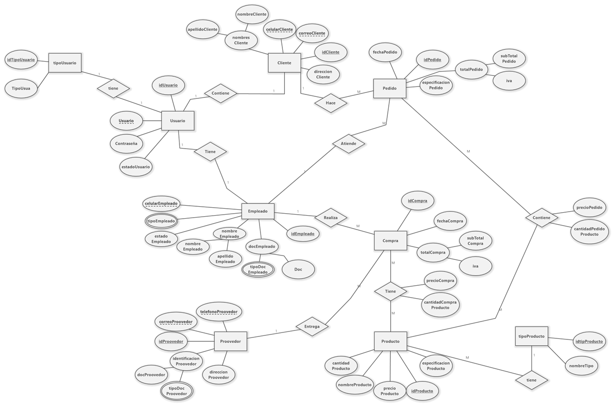

### **Modelo Relacional**

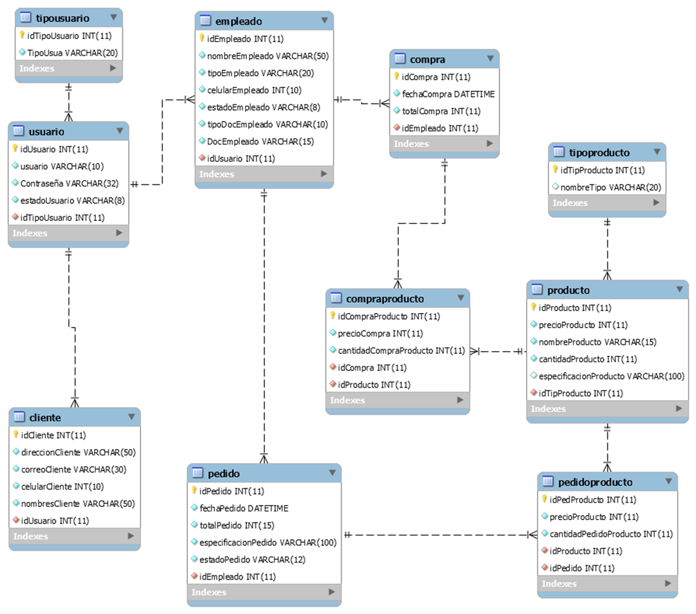

### **Diccionario de la Base de Datos**

1.  **Diagrama de
    Clases**

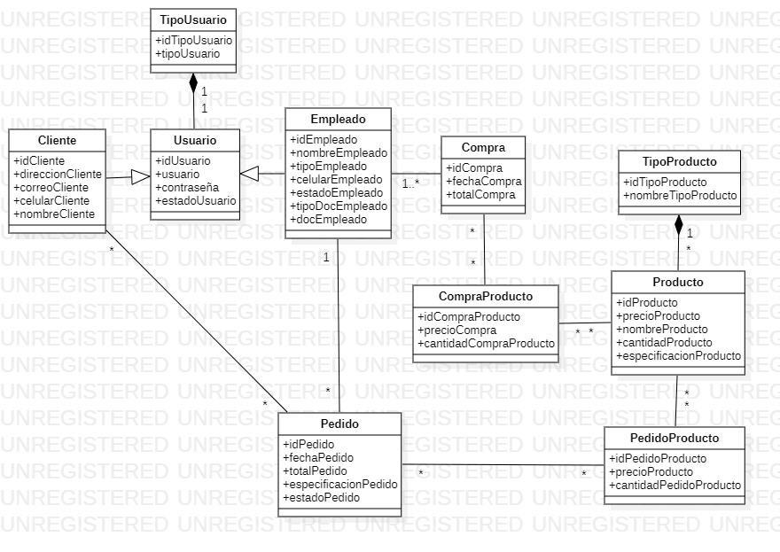

2.  **Diseño
    Interfaz y Navegación**

    1.  **Mockups –
        Wireframes**

(Página de inicio)

(Vista de todo acerca de nosotros)

(Vista de la tienda)

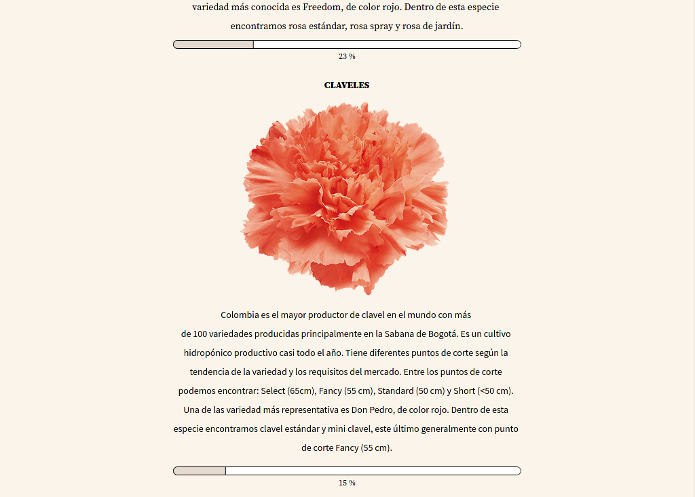

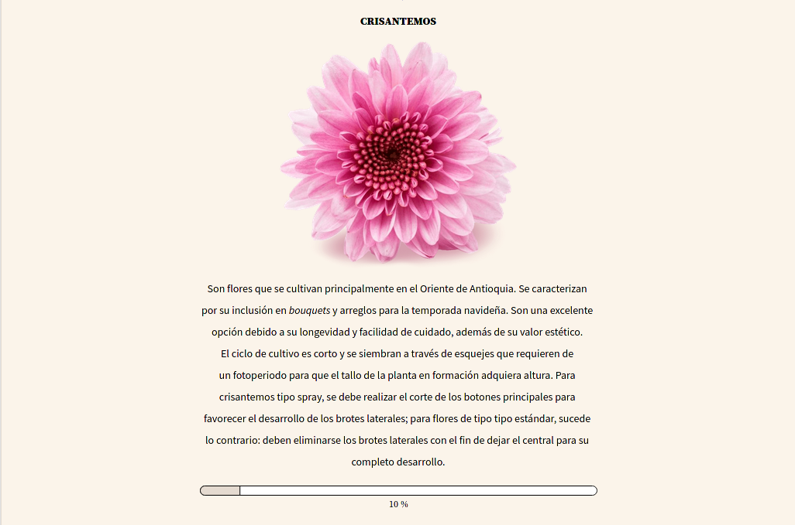

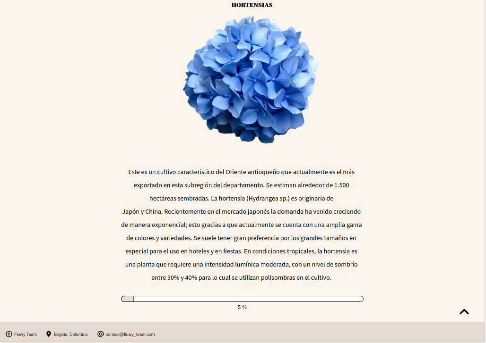

(Vista del apartado flores)
