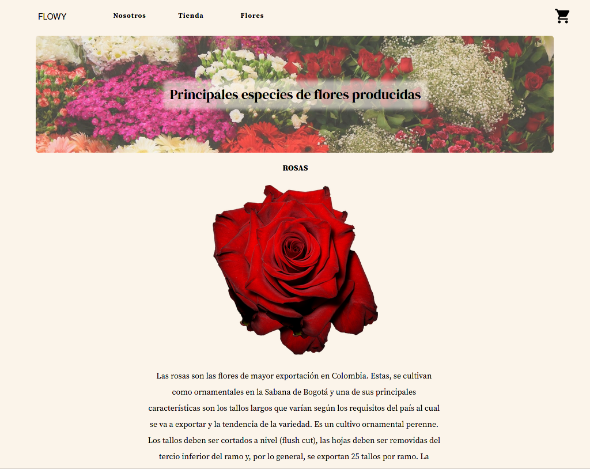
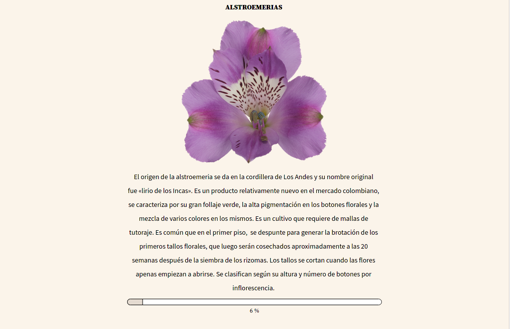

Sistema de Gestión de Ventas en la Industria Floricultora

Estefania Herrera Agudelo

Juan David Pulido Agudelo

David Santiago Sánchez Buitrago

David Vargas Monroy

Servicio nacional de aprendizaje SENA

Notas del Autor

Estefania Herrera, Juan Pulido, David Sánchez, David Vargas

Este trabajo ha sido financiado por los propios alumnos

La correspondencia relacionada con este trabajo debe ser dirigida a
Uldarico Andrade Hernández

Centro de Gestión de Mercados, Logística y Tecnología de la Información,
Carrera 19A \#96c-40

Contacto: eherrera173\@misena.edu.co, jdpulido61\@misena.edu.co,
dssanchez752\@misena.edu.co, dvargas896\@misena.edu.co

**Tabla de Contenidos**

[**1.**](#_heading=h.gjdgxs) **Introducción e Información General** 1

> [**1.1.**](#_heading=h.30j0zll) **Descripción del Problema** 1
>
> [**1.2.**](#_heading=h.3znysh7) **Objetivos** 1
>
> [**1.2.1**](#_heading=h.2et92p0) **Objetivo General** 1
>
> [**1.2.2.**](#_heading=h.tyjcwt) **Objetivos Específicos** 1
>
> [**1.3.**](#_heading=h.3dy6vkm) **Justificación** 2
>
> [**1.4.**](#_heading=h.1t3h5sf) **Alcances y Delimitaciones** 2
>
> [**1.4.1**](#_heading=h.4d34og8) **Alcances** 3
>
> [**1.4.2**](#_heading=h.2s8eyo1) **Delimitaciones** 3
>
> [**1.5.**](#_heading=h.17dp8vu) **Cronograma de Actividades** 4

[**2.**](#_heading=h.3rdcrjn) **Análisis de la Situación Actual** 4

> [**2.1.**](#_heading=h.26in1rg) **Mapa de Procesos de la Empresa** 4
>
> [**2.2.**](#_heading=h.lnxbz9) **Diagrama de Flujo del Proceso** 5
>
> [**2.3.**](#_heading=h.35nkun2) **Análisis de los Stakeholders** 6
>
> [**2.3.1**](#_heading=h.1ksv4uv) **Diagrama De Caso De Uso General** 8
>
> [**2.4.**](#_heading=h.44sinio) **Requisitos Funcionales** 9
>
> [**2.5.**](#_heading=h.2jxsxqh) **Requisitos no Funcionales** 32
>
> [**2.5.1**](#_heading=h.z337ya) **Requerimientos de Hardware y
> Software** 32
>
> [**2.5.2**](#_heading=h.3j2qqm3) **Requerimientos de Interfaz de
> Usuario** 34
>
> [**2.5.3**](#_heading=h.1y810tw) **Requerimientos de Desarrollo y
> Seguridad** 35

[**3.**](#_heading=h.4i7ojhp) **Diseño del Sistema** 37

[**3.1**](#_heading=h.2xcytpi) **Diagramas y Documentación de Casos de
Uso.** 37

> [**3.2**](#_heading=h.3as4poj) **Diseño Físico de la Base de Datos**
> 84
>
> [**3.2.1.**](#modelo-entidad-relación) **Modelo Entidad Relación** 85
>
> [**3.2.2.**](#modelo-relacional) **Modelo Relacional** 86
>
> [**3.2.3.**](#diccionario-de-la-base-de-datos) **Diccionario de la
> Base de Datos** 86
>
> [**3.2.4.**](#_heading=h.147n2zr) **Diagrama de Clases** 86
>
> [**3.3.**](#_heading=h.3o7alnk) **Diseño Interfaz y Navegación** 87
>
> [**3.3.1.**](#_heading=h.23ckvvd) **Mockups -- Wireframes** 87

1.  []{#_heading=h.gjdgxs .anchor}**Introducción e Información General**

    1.  []{#_heading=h.30j0zll .anchor}**Descripción del Problema**

Las actividades de levantamiento de información del grupo con respecto
al Departamento Administrativo Nacional de Estadística - DANE, dan como
resultado falencias en la cantidad de empresas dirigidas al desarrollo
de sistemas de información para ventas en el sector agrario y más
específicamente en el sector floricultor.

Así mismo, también se descubrieron problemas en el proceso de ventas y
de distribución de flores, debido a la gran cantidad de intermediarios
que hay para llegar al cliente final, donde se evidencio que el
productor agrario floricultor obtiene una mínima parte con respecto al
precio final de venta del producto.

Por otra parte, se encontró que a nivel internacional Colombia afronta
grandes problemas entorno a productividad y emprendimiento en donde
"Colombia está 10 pociones por debajo del promedio regional en el
indicador de competencia del WEF y ocupa la posición 126 entre 141 en
países de distorsión de la regulación sobre la competencia" (WEF, 2019).

2.  []{#_heading=h.3znysh7 .anchor}**Objetivos**

    1.  []{#_heading=h.2et92p0 .anchor}**Objetivo General**

Desarrollar un sistema de información orientado a la web para la gestión
de ventas en la industria floricultora.

2.  []{#_heading=h.tyjcwt .anchor}**Objetivos Específicos**

```{=html}
<!-- -->
```
1.  Realizar el levantamiento de información para conocer el negocio e
    identificar los requisitos del proyecto, utilizando las herramientas
    de recolección necesarias.

2.  Analizar la información recolectada y proponer la solución adecuada
    al problema identificado.

3.  Diseñar el modelo de solución a partir de la arquitectura propuesta
    teniendo en cuenta cada uno de los elementos necesarios.

4.  Construir la arquitectura con las herramientas tecnológicas
    previstas.

5.  Implantar la solución informática de acuerdo con la configuración
    planeada.

    1.  []{#_heading=h.3dy6vkm .anchor}**Justificación**

Con el trabajo se pretende realizar una revisión, análisis e
interpretación relacionada con la creación de un proceso de gestión de
ventas en la industria floricultora.

Además, se pretende crear un sistema de información que permita llevar a
cabo el proceso de ventas y por lo tanto justificarlo a partir de los
siguientes factores:

1.  En un contexto temporal como el actual, las personas en algunas
    ocasiones encuentran la necesidad de adquirir una flor o arreglo
    floral, en donde el individuo en cuestión no encuentra el medio de
    realizar dicho fin, es por ello que se propone realizar este
    proyecto en un contexto digital.

2.  Actualmente en este proyecto intentamos beneficiar a ambas partes,
    tanto a los floricultores ayudándoles a obtener mayores beneficios
    con el mismo trabajo como al consumidor final el cual no pagará un
    precio tan elevado como el habitual.

3.  El cliente final obtendrá su pedido realizándolo desde la comodidad
    de su casa a un precio ideal, esto gracias a la eliminación de una
    cadena de intermediarios los cuales adquirían este producto de la
    manera tradicional.

```{=html}
<!-- -->
```
2.  []{#_heading=h.1t3h5sf .anchor}**Alcances y Delimitaciones**

    1.  []{#_heading=h.4d34og8 .anchor} **Alcances**

El proyecto se creará en un ciclo de innovación con el surgimiento de
esta nueva idea, específicamente en el área de gestión de ventas para la
industria floricultora, en dónde se realiza el levantamiento de
información necesario para identificar las necesidades de los
consumidores y cualquier persona que se encuentre involucrada en el
desarrollo del proyecto.

El tiempo de desarrollo inicial del proyecto no debe ser superior a
nueve (9) meses desde el momento de aceptación de la idea de proyecto.

El país de origen del proyecto (Colombia) será el único involucrado en
la fase de implementación en esta etapa inicial, y se dejaran las bases
para que este se pueda poner en funcionamiento en otros países a tiempo
futuro.

2.  []{#_heading=h.2s8eyo1 .anchor}**Delimitaciones**

El proyecto en desarrollo tiene como fin gestionar los procesos de
ventas en la industria floricultora tomando en cuenta el estudio y
análisis de la información referente a la problemática presentada con el
fin de brindar una compra segura y eficaz a los usuarios.

Las presentes delimitaciones reducen la investigación:

1.  La partida de un miembro del proyecto.

> Este proyecto está siendo construido por cuatro personas, lo cual hace
> necesario la presencia de todas las partes en la construcción del
> mismo.

2.  Anexar al sistema funciones adicionales.

> Anexar al sistema características adicionales solicitadas
> extemporáneamente por parte de los clientes.

3.  Realizar cambios mayores al sistema ya que esto requerirá repensar
    el proyecto inicial, lo que llevará a una mayor inversión de tiempo
    y costos.

```{=html}
<!-- -->
```
3.  []{#_heading=h.17dp8vu .anchor}**Cronograma de Actividades**

{width="6.463864829396326in"
height="5.14625656167979in"}

2.  []{#_heading=h.3rdcrjn .anchor}**Análisis de la Situación Actual**

    1.  []{#_heading=h.26in1rg .anchor}**Mapa de Procesos de la
        Empresa**

{width="6.5in" height="3.65625in"}

2.  []{#_heading=h.lnxbz9 .anchor}**Diagrama de Flujo del Proceso**

{width="7.145719597550306in"
height="4.688211942257218in"}

3.  []{#_heading=h.35nkun2 .anchor}**Análisis de los Stakeholders**

  PROYECTO DE GESTIÓN DE VENTAS PARA LA INDUSTRIA FLORICULTORA                                                                                                                                                                                                                                                                                                                                                                                                                                                                                                                                                                       
  -------------------------------------------------------------- --------------- --------------------------------------------------------------------------------------------------------------------------------------------------------------------------------------------------------------------------------------------------------------------------------------------------------------------------------------------------------------------- -------- --------------------------------------------------------------- ------ --------- -------------------------------------------------------------------------- -------- ---------------------------------------------------------------
  INTERNOS                                                       EXTERNOS                                                                                                                                                                                                                                                                                                                                                                                                                                                                                                                                                            
  ID                                                             ROL             DEFINICION                                                                                                                                                                                                                                                                                                                                                            CODIGO   REQUERIMIENTOS FUNCIONALES O SERVICIOS QUE ESPERA DEL SISTEMA   ID     ROL       DEFINICION                                                                 CODIGO   REQUERIMIENTOS FUNCIONALES O SERVICIOS QUE ESPERA DEL SISTEMA
  SHI1                                                           Administrador   Responsable de establecer conexiones entre empleados y clientes; también de planificar, ejecutar y controlar todas las actividades relacionadas con la gestión de ventas de la industria floricultora, además es responsable del mantenimiento del sistema y la correcta operación, gestión, control y seguimiento de las capacidades de procesamiento del trabajo.   RQF001   Validar usuarios                                                SHI1   Cliente   Responsable de obtener uno o más productos de la industria floricultora.   RQF001   Validar usuarios
                                                                                                                                                                                                                                                                                                                                                                                                                                                       RQF002   Registrar empleado.                                                                                                                                         RQF003   Registrar cliente.
                                                                                                                                                                                                                                                                                                                                                                                                                                                       RQF003   Registrar cliente.                                                                                                                                          RQF004   Modificar datos personales.
                                                                                                                                                                                                                                                                                                                                                                                                                                                       RQF004   Modificar datos personales.                                                                                                                                 RQF005   Consultar datos personales.
                                                                                                                                                                                                                                                                                                                                                                                                                                                       RQF005   Consultar datos personales.                                                                                                                                 RQF007   Navegación de usuario.
                                                                                                                                                                                                                                                                                                                                                                                                                                                       RQF006   Inhabilitar usuario.                                                                                                                                        RQF011   Consultar producto.
                                                                                                                                                                                                                                                                                                                                                                                                                                                       RQF008   Registrar producto.                                                                                                                                         RQF013   Consultar productos agotados.
                                                                                                                                                                                                                                                                                                                                                                                                                                                       RQF009   Registrar detalle del producto.                                                                                                                             RQF017   Registrar pedido.
                                                                                                                                                                                                                                                                                                                                                                                                                                                       RQF010   Modificar producto.                                                                                                                                         RQF018   Modificar pedido.
                                                                                                                                                                                                                                                                                                                                                                                                                                                       RQF011   Consultar producto.                                                                                                                                         RQF019   Consultar pedido.
                                                                                                                                                                                                                                                                                                                                                                                                                                                       RQF012   Consultar previsiones de productos.                                                                                                                         RQF021   Cancelar pedido.
                                                                                                                                                                                                                                                                                                                                                                                                                                                       RQF013   Consultar productos agotados.                                                                                                                                        
                                                                                                                                                                                                                                                                                                                                                                                                                                                       RQF014   Inhabilitar producto.                                                                                                                                                
                                                                                                                                                                                                                                                                                                                                                                                                                                                       RQF015   Calcular precio producto.                                                                                                                                            
                                                                                                                                                                                                                                                                                                                                                                                                                                                       RQF016   Consultar stock de productos.                                                                                                                                        
                                                                                                                                                                                                                                                                                                                                                                                                                                                       RQF020   Consultar pedidos en el sistema.                                                                                                                                     
                                                                                                                                                                                                                                                                                                                                                                                                                                                       RQF022   Consultar pagos.                                                                                                                                                     
                                                                                                                                                                                                                                                                                                                                                                                                                                                       RQF023   Registrar venta.                                                                                                                                                     
                                                                                                                                                                                                                                                                                                                                                                                                                                                       RQF024   Consultar venta.                                                                                                                                                     
                                                                                                                                                                                                                                                                                                                                                                                                                                                       RQF025   Generar domicilio.                                                                                                                                                   
  SHI2                                                           Empleado        Responsable de establecer vender, ejecutar y controlar determinadas actividades relacionadas con la gestión de ventas de la industria floricultora.                                                                                                                                                                                                                   RQF001   Validar usuarios                                                                                                                                                     
                                                                                                                                                                                                                                                                                                                                                                                                                                                       RQF003   Registrar cliente.                                                                                                                                                   
                                                                                                                                                                                                                                                                                                                                                                                                                                                       RQF004   Modificar datos personales.                                                                                                                                          
                                                                                                                                                                                                                                                                                                                                                                                                                                                       RQF005   Consultar datos personales.                                                                                                                                          
                                                                                                                                                                                                                                                                                                                                                                                                                                                       RQF008   Registrar producto.                                                                                                                                                  
                                                                                                                                                                                                                                                                                                                                                                                                                                                       RQF009   Registrar detalle del producto.                                                                                                                                      
                                                                                                                                                                                                                                                                                                                                                                                                                                                       RQF010   Modificar producto.                                                                                                                                                  
                                                                                                                                                                                                                                                                                                                                                                                                                                                       RQF011   Consultar producto.                                                                                                                                                  
                                                                                                                                                                                                                                                                                                                                                                                                                                                       RQF012   Consultar previsiones de productos.                                                                                                                                  
                                                                                                                                                                                                                                                                                                                                                                                                                                                       RQF013   Consultar productos agotados.                                                                                                                                        
                                                                                                                                                                                                                                                                                                                                                                                                                                                       RQF015   Calcular precio producto.                                                                                                                                            
                                                                                                                                                                                                                                                                                                                                                                                                                                                       RQF016   Consultar stock de productos.                                                                                                                                        
                                                                                                                                                                                                                                                                                                                                                                                                                                                       RQF020   Consultar pedidos en el sistema.                                                                                                                                     
                                                                                                                                                                                                                                                                                                                                                                                                                                                       RQF022   Consultar pagos.                                                                                                                                                     
                                                                                                                                                                                                                                                                                                                                                                                                                                                       RQF023   Registrar venta.                                                                                                                                                     
                                                                                                                                                                                                                                                                                                                                                                                                                                                       RQF024   Consultar venta.                                                                                                                                                     
                                                                                                                                                                                                                                                                                                                                                                                                                                                       RQF025   Generar domicilio.                                                                                                                                                   

1.  []{#_heading=h.1ksv4uv .anchor}**Diagrama De Caso De Uso General**

{width="6.484827209098863in"
height="5.213630796150481in"}

4.  []{#_heading=h.44sinio .anchor}**Requisitos Funcionales**

+-------------+-------------+-------------+-------------+-------------+
| **Sistema   |             |             |             |             |
| de Gestión  |             |             |             |             |
| de Ventas   |             |             |             |             |
| en la       |             |             |             |             |
| Industria   |             |             |             |             |
| Flo         |             |             |             |             |
| ricultora** |             |             |             |             |
+=============+=============+=============+=============+=============+
| *           |             |             |             |             |
| *Requisitos |             |             |             |             |
| Fu          |             |             |             |             |
| ncionales** |             |             |             |             |
+-------------+-------------+-------------+-------------+-------------+
| **Código**  | **Nombre**  | **Fecha**   | **Grado de  |             |
|             |             |             | necesidad** |             |
+-------------+-------------+-------------+-------------+-------------+
| **RF001**   | Validar     | 04 de marzo | Alto.       |             |
|             | usuarios.   | del 2020.   |             |             |
+-------------+-------------+-------------+-------------+-------------+
| **De        | El sistema  |             |             |             |
| scripción** | permitirá   |             |             |             |
|             | validar las |             |             |             |
|             | c           |             |             |             |
|             | redenciales |             |             |             |
|             | de          |             |             |             |
|             | au          |             |             |             |
|             | tenticación |             |             |             |
|             | de cada     |             |             |             |
|             | usuario con |             |             |             |
|             | el fin de   |             |             |             |
|             | permitirle  |             |             |             |
|             | iniciar     |             |             |             |
|             | sesión.     |             |             |             |
+-------------+-------------+-------------+-------------+-------------+
| *           | Empleado,   |             |             |             |
| *Usuarios** | cliente,    |             |             |             |
|             | adm         |             |             |             |
|             | inistrador. |             |             |             |
+-------------+-------------+-------------+-------------+-------------+
| *           | **Fuente**  | **Salida**  | **Destino** | **Regla de  |
| *Entradas** |             |             |             | negocio**   |
+-------------+-------------+-------------+-------------+-------------+
| Usuario     | Formulario  | Inicio de   | Inicio.     |             |
|             | de inicio   | sesión      |             |             |
| Contraseña  | de sesión.  | exitoso.    |             |             |
+-------------+-------------+-------------+-------------+-------------+
| **Proceso** | 1.  El      |             |             |             |
|             |     usuario |             |             |             |
|             |     ingresa |             |             |             |
|             |     al      |             |             |             |
|             |             |             |             |             |
|             |  formulario |             |             |             |
|             |     de      |             |             |             |
|             |     iniciar |             |             |             |
|             |     sesión. |             |             |             |
|             |             |             |             |             |
|             | 2.  El      |             |             |             |
|             |     usuario |             |             |             |
|             |             |             |             |             |
|             |  diligencia |             |             |             |
|             |     el      |             |             |             |
|             |             |             |             |             |
|             |  formulario |             |             |             |
|             |     de      |             |             |             |
|             |     inicio  |             |             |             |
|             |     de      |             |             |             |
|             |     sesión. |             |             |             |
+-------------+-------------+-------------+-------------+-------------+
| **Efecto    |             |             |             |             |
| Colateral** |             |             |             |             |
+-------------+-------------+-------------+-------------+-------------+

+-------------+-------------+-------------+-------------+-------------+
| **Sistema   |             |             |             |             |
| de Gestión  |             |             |             |             |
| de Ventas   |             |             |             |             |
| en la       |             |             |             |             |
| Industria   |             |             |             |             |
| Flo         |             |             |             |             |
| ricultora** |             |             |             |             |
+=============+=============+=============+=============+=============+
| *           |             |             |             |             |
| *Requisitos |             |             |             |             |
| Fu          |             |             |             |             |
| ncionales** |             |             |             |             |
+-------------+-------------+-------------+-------------+-------------+
| **Código**  | **Nombre**  | **Fecha**   | **Grado de  |             |
|             |             |             | necesidad** |             |
+-------------+-------------+-------------+-------------+-------------+
| **RF002**   | Registrar   | 04 de marzo | Alto        |             |
|             | empleado.   | del 2020    |             |             |
+-------------+-------------+-------------+-------------+-------------+
| **De        | El sistema  |             |             |             |
| scripción** | permitirá   |             |             |             |
|             | al          |             |             |             |
|             | ad          |             |             |             |
|             | ministrador |             |             |             |
|             | registrar   |             |             |             |
|             | empleados   |             |             |             |
|             | en el\      |             |             |             |
|             | sistema.    |             |             |             |
+-------------+-------------+-------------+-------------+-------------+
| *           | Adm         |             |             |             |
| *Usuarios** | inistrador. |             |             |             |
+-------------+-------------+-------------+-------------+-------------+
| *           | **Fuente**  | **Salida**  | **Destino** | **Regla de  |
| *Entradas** |             |             |             | negocio**   |
+-------------+-------------+-------------+-------------+-------------+
| Tipo de     | Formulario  | Registro    | Base de     |             |
| empleado.   | de registro | exitoso.    | datos.      |             |
|             | de          |             |             |             |
| Nombre.     | empleado.   |             |             |             |
|             |             |             |             |             |
| Tipo de     |             |             |             |             |
| documento.  |             |             |             |             |
|             |             |             |             |             |
| Numero de   |             |             |             |             |
| documento.  |             |             |             |             |
|             |             |             |             |             |
| Celular.    |             |             |             |             |
|             |             |             |             |             |
| Usuario.    |             |             |             |             |
|             |             |             |             |             |
| Contraseña. |             |             |             |             |
|             |             |             |             |             |
| Estado.     |             |             |             |             |
+-------------+-------------+-------------+-------------+-------------+
| **Proceso** | 1.  El      |             |             |             |
|             |     > ad    |             |             |             |
|             | ministrador |             |             |             |
|             |             |             |             |             |
|             |   > ingresa |             |             |             |
|             |     > al    |             |             |             |
|             |     >       |             |             |             |
|             |  formulario |             |             |             |
|             |     > de    |             |             |             |
|             |             |             |             |             |
|             | > registrar |             |             |             |
|             |             |             |             |             |
|             | > empleado. |             |             |             |
|             |             |             |             |             |
|             | 2.  El      |             |             |             |
|             |     > ad    |             |             |             |
|             | ministrador |             |             |             |
|             |     >       |             |             |             |
|             |  diligencia |             |             |             |
|             |     > el    |             |             |             |
|             |     >       |             |             |             |
|             |  formulario |             |             |             |
|             |     > de    |             |             |             |
|             |             |             |             |             |
|             | > registrar |             |             |             |
|             |             |             |             |             |
|             | > empleado. |             |             |             |
+-------------+-------------+-------------+-------------+-------------+
| **Efecto    |             |             |             |             |
| Colateral** |             |             |             |             |
+-------------+-------------+-------------+-------------+-------------+

+-------------+-------------+-------------+-------------+-------------+
| **Sistema   |             |             |             |             |
| de Gestión  |             |             |             |             |
| de Ventas   |             |             |             |             |
| en la       |             |             |             |             |
| Industria   |             |             |             |             |
| Flo         |             |             |             |             |
| ricultora** |             |             |             |             |
+=============+=============+=============+=============+=============+
| *           |             |             |             |             |
| *Requisitos |             |             |             |             |
| Fu          |             |             |             |             |
| ncionales** |             |             |             |             |
+-------------+-------------+-------------+-------------+-------------+
| **Código**  | **Nombre**  | **Fecha**   | **Grado de  |             |
|             |             |             | necesidad** |             |
+-------------+-------------+-------------+-------------+-------------+
| **RF003**   | Registrar   | 04 de marzo | Alto        |             |
|             | cliente.    | del 2020    |             |             |
+-------------+-------------+-------------+-------------+-------------+
| **De        | El sistema  |             |             |             |
| scripción** | permitirá   |             |             |             |
|             | al          |             |             |             |
|             | empleado,   |             |             |             |
|             | cliente y   |             |             |             |
|             | adm         |             |             |             |
|             | inistrador  |             |             |             |
|             | registrar   |             |             |             |
|             | clientes en |             |             |             |
|             | el sistema. |             |             |             |
+-------------+-------------+-------------+-------------+-------------+
| *           | Empleado,   |             |             |             |
| *Usuarios** | cliente,    |             |             |             |
|             | adm         |             |             |             |
|             | inistrador. |             |             |             |
+-------------+-------------+-------------+-------------+-------------+
| *           | **Fuente**  | **Salida**  | **Destino** | **Regla de  |
| *Entradas** |             |             |             | negocio**   |
+-------------+-------------+-------------+-------------+-------------+
| Nombre.     | Formulario  | Registro    | Base de     |             |
|             | de registro | exitoso.    | datos.      |             |
| Tipo de     | de cliente. |             |             |             |
| documento.  |             |             |             |             |
|             |             |             |             |             |
| Numero de   |             |             |             |             |
| documento.  |             |             |             |             |
|             |             |             |             |             |
| Celular.    |             |             |             |             |
|             |             |             |             |             |
| Dirección.  |             |             |             |             |
|             |             |             |             |             |
| Correo      |             |             |             |             |
| e           |             |             |             |             |
| lectrónico. |             |             |             |             |
|             |             |             |             |             |
| Usuario.    |             |             |             |             |
|             |             |             |             |             |
| Contraseña. |             |             |             |             |
|             |             |             |             |             |
| Estado.     |             |             |             |             |
+-------------+-------------+-------------+-------------+-------------+
| **Proceso** | 1.  El      |             |             |             |
|             |     usuario |             |             |             |
|             |     ingresa |             |             |             |
|             |     al      |             |             |             |
|             |             |             |             |             |
|             |  formulario |             |             |             |
|             |     de      |             |             |             |
|             |     r       |             |             |             |
|             | egistrarse. |             |             |             |
|             |             |             |             |             |
|             | 2.  El      |             |             |             |
|             |     usuario |             |             |             |
|             |             |             |             |             |
|             |  diligencia |             |             |             |
|             |     el      |             |             |             |
|             |             |             |             |             |
|             |  formulario |             |             |             |
|             |     de      |             |             |             |
|             |             |             |             |             |
|             |  registrar. |             |             |             |
+-------------+-------------+-------------+-------------+-------------+
| **Efecto    |             |             |             |             |
| Colateral** |             |             |             |             |
+-------------+-------------+-------------+-------------+-------------+

+-------------+-------------+-------------+-------------+-------------+
| **Sistema   |             |             |             |             |
| de Gestión  |             |             |             |             |
| de Ventas   |             |             |             |             |
| en la       |             |             |             |             |
| Industria   |             |             |             |             |
| Flo         |             |             |             |             |
| ricultora** |             |             |             |             |
+=============+=============+=============+=============+=============+
| *           |             |             |             |             |
| *Requisitos |             |             |             |             |
| Fu          |             |             |             |             |
| ncionales** |             |             |             |             |
+-------------+-------------+-------------+-------------+-------------+
| **Código**  | **Nombre**  | **Fecha**   | **Grado de  |             |
|             |             |             | necesidad** |             |
+-------------+-------------+-------------+-------------+-------------+
| **RF004**   | Modificar   | 04 de marzo | Alto.       |             |
|             | datos       | del 2020.   |             |             |
|             | personales. |             |             |             |
+-------------+-------------+-------------+-------------+-------------+
| **De        | El sistema  |             |             |             |
| scripción** | permitirá   |             |             |             |
|             | al          |             |             |             |
|             | empleado,   |             |             |             |
|             | cliente y   |             |             |             |
|             | ad          |             |             |             |
|             | ministrador |             |             |             |
|             | modificar   |             |             |             |
|             | su          |             |             |             |
|             | información |             |             |             |
|             | personal.   |             |             |             |
+-------------+-------------+-------------+-------------+-------------+
| *           | Empleado,   |             |             |             |
| *Usuarios** | cliente,    |             |             |             |
|             | adm         |             |             |             |
|             | inistrador. |             |             |             |
+-------------+-------------+-------------+-------------+-------------+
| *           | **Fuente**  | **Salida**  | **Destino** | **Regla de  |
| *Entradas** |             |             |             | negocio**   |
+-------------+-------------+-------------+-------------+-------------+
| Datos       | Formulario  | M           | Base de     |             |
| personales  | del         | odificación | datos.      |             |
| del         | usuario.    | exitosa.    |             |             |
| usuario.    |             |             |             |             |
+-------------+-------------+-------------+-------------+-------------+
| **Proceso** | 1\. El      |             |             |             |
|             | usuario     |             |             |             |
|             | ingresa a   |             |             |             |
|             | su perfil.  |             |             |             |
|             |             |             |             |             |
|             | 2\. El      |             |             |             |
|             | usuario     |             |             |             |
|             | modifica su |             |             |             |
|             | información |             |             |             |
|             | personal.   |             |             |             |
+-------------+-------------+-------------+-------------+-------------+
| **Efecto    |             |             |             |             |
| Colateral** |             |             |             |             |
+-------------+-------------+-------------+-------------+-------------+

+-------------+-------------+-------------+-------------+-------------+
| **Sistema   |             |             |             |             |
| de Gestión  |             |             |             |             |
| de Ventas   |             |             |             |             |
| en la       |             |             |             |             |
| Industria   |             |             |             |             |
| Flo         |             |             |             |             |
| ricultora** |             |             |             |             |
+=============+=============+=============+=============+=============+
| *           |             |             |             |             |
| *Requisitos |             |             |             |             |
| Fu          |             |             |             |             |
| ncionales** |             |             |             |             |
+-------------+-------------+-------------+-------------+-------------+
| **Código**  | **Nombre**  | **Fecha**   | **Grado de  |             |
|             |             |             | necesidad** |             |
+-------------+-------------+-------------+-------------+-------------+
| **RF005**   | Consultar   | 04 de marzo | Medio.      |             |
|             | datos       | del 2020.   |             |             |
|             | personales. |             |             |             |
+-------------+-------------+-------------+-------------+-------------+
| **De        | El sistema  |             |             |             |
| scripción** | permitirá   |             |             |             |
|             | al          |             |             |             |
|             | empleado,   |             |             |             |
|             | cliente y   |             |             |             |
|             | adm         |             |             |             |
|             | inistrador  |             |             |             |
|             | consultar   |             |             |             |
|             | su          |             |             |             |
|             | información |             |             |             |
|             | personal.   |             |             |             |
+-------------+-------------+-------------+-------------+-------------+
| *           | Empleado,   |             |             |             |
| *Usuarios** | cliente,    |             |             |             |
|             | adm         |             |             |             |
|             | inistrador. |             |             |             |
+-------------+-------------+-------------+-------------+-------------+
| *           | **Fuente**  | **Salida**  | **Destino** | **Regla de  |
| *Entradas** |             |             |             | negocio**   |
+-------------+-------------+-------------+-------------+-------------+
| Datos       | Formulario  | Información | Formulario. |             |
| personales  | del         | personal    |             |             |
| del         | usuario.    | del usuario |             |             |
| usuario.    |             | (Perfil).   |             |             |
+-------------+-------------+-------------+-------------+-------------+
| **Proceso** | 1\. El      |             |             |             |
|             | usuario     |             |             |             |
|             | ingresa a   |             |             |             |
|             | su perfil.  |             |             |             |
|             |             |             |             |             |
|             | 2\. El      |             |             |             |
|             | usuario     |             |             |             |
|             | consulta su |             |             |             |
|             | información |             |             |             |
|             | personal.   |             |             |             |
+-------------+-------------+-------------+-------------+-------------+
| **Efecto    |             |             |             |             |
| Colateral** |             |             |             |             |
+-------------+-------------+-------------+-------------+-------------+

+-------------+-------------+-------------+-------------+-------------+
| **Sistema   |             |             |             |             |
| de Gestión  |             |             |             |             |
| de Ventas   |             |             |             |             |
| en la       |             |             |             |             |
| Industria   |             |             |             |             |
| Flo         |             |             |             |             |
| ricultora** |             |             |             |             |
+=============+=============+=============+=============+=============+
| *           |             |             |             |             |
| *Requisitos |             |             |             |             |
| Fu          |             |             |             |             |
| ncionales** |             |             |             |             |
+-------------+-------------+-------------+-------------+-------------+
| **Código**  | **Nombre**  | **Fecha**   | **Grado de  |             |
|             |             |             | necesidad** |             |
+-------------+-------------+-------------+-------------+-------------+
| **RF006**   | Inhabilitar | 04 de marzo | Alto.       |             |
|             | usuario.    | del 2020.   |             |             |
+-------------+-------------+-------------+-------------+-------------+
| **De        | El sistema  |             |             |             |
| scripción** | permitirá   |             |             |             |
|             | al          |             |             |             |
|             | ad          |             |             |             |
|             | ministrador |             |             |             |
|             | inhabilitar |             |             |             |
|             | empleados   |             |             |             |
|             | y\          |             |             |             |
|             | clientes.   |             |             |             |
+-------------+-------------+-------------+-------------+-------------+
| *           | Adm         |             |             |             |
| *Usuarios** | inistrador. |             |             |             |
+-------------+-------------+-------------+-------------+-------------+
| *           | **Fuente**  | **Salida**  | **Destino** | **Regla de  |
| *Entradas** |             |             |             | negocio**   |
+-------------+-------------+-------------+-------------+-------------+
| Usuario     | Formulario  | Usuario     | Base de     |             |
|             | del         | i           | datos.      |             |
|             | usuario.    | nhabilitado |             |             |
|             |             | ex          |             |             |
|             |             | itosamente. |             |             |
+-------------+-------------+-------------+-------------+-------------+
| **Proceso** | 1\. El      |             |             |             |
|             | ad          |             |             |             |
|             | ministrador |             |             |             |
|             | busca al    |             |             |             |
|             | usuario en  |             |             |             |
|             | el sistema. |             |             |             |
|             |             |             |             |             |
|             | 2\. El      |             |             |             |
|             | ad          |             |             |             |
|             | ministrador |             |             |             |
|             | inhabilita  |             |             |             |
|             | al usuario  |             |             |             |
|             | del         |             |             |             |
|             | sistema.    |             |             |             |
+-------------+-------------+-------------+-------------+-------------+

+-------------+-------------+-------------+-------------+-------------+
| **Sistema   |             |             |             |             |
| de Gestión  |             |             |             |             |
| de Ventas   |             |             |             |             |
| en la       |             |             |             |             |
| Industria   |             |             |             |             |
| Flo         |             |             |             |             |
| ricultora** |             |             |             |             |
+=============+=============+=============+=============+=============+
| *           |             |             |             |             |
| *Requisitos |             |             |             |             |
| Fu          |             |             |             |             |
| ncionales** |             |             |             |             |
+-------------+-------------+-------------+-------------+-------------+
| **Código**  | **Nombre**  | **Fecha**   | **Grado de  |             |
|             |             |             | necesidad** |             |
+-------------+-------------+-------------+-------------+-------------+
| **RF007**   | Registrar   | 04 de marzo | Alto.       |             |
|             | producto.   | del 2020    |             |             |
+-------------+-------------+-------------+-------------+-------------+
| **De        | El sistema  |             |             |             |
| scripción** | permitirá   |             |             |             |
|             | al empleado |             |             |             |
|             | y           |             |             |             |
|             | ad          |             |             |             |
|             | ministrador |             |             |             |
|             | registrar\  |             |             |             |
|             | productos.  |             |             |             |
+-------------+-------------+-------------+-------------+-------------+
| *           | Empleado,   |             |             |             |
| *Usuarios** | adm         |             |             |             |
|             | inistrador. |             |             |             |
+-------------+-------------+-------------+-------------+-------------+
| *           | **Fuente**  | **Salida**  | **Destino** | **Regla de  |
| *Entradas** |             |             |             | negocio**   |
+-------------+-------------+-------------+-------------+-------------+
| Tipo de     | Formulario  | Registro    | Base de     |             |
| producto.   | de registro | exitoso.    | datos.      |             |
|             | de          |             |             |             |
| Nombre.     | producto.   |             |             |             |
|             |             |             |             |             |
| Cantidad.   |             |             |             |             |
|             |             |             |             |             |
| Espe        |             |             |             |             |
| cificación. |             |             |             |             |
|             |             |             |             |             |
| Precio.     |             |             |             |             |
|             |             |             |             |             |
| Estado.     |             |             |             |             |
+-------------+-------------+-------------+-------------+-------------+
| **Proceso** | 1.  El      |             |             |             |
|             |     ad      |             |             |             |
|             | ministrador |             |             |             |
|             |     y/o     |             |             |             |
|             |             |             |             |             |
|             |    empleado |             |             |             |
|             |             |             |             |             |
|             |    ingresan |             |             |             |
|             |     al      |             |             |             |
|             |             |             |             |             |
|             |  formulario |             |             |             |
|             |     de      |             |             |             |
|             |             |             |             |             |
|             |   registrar |             |             |             |
|             |             |             |             |             |
|             |   producto. |             |             |             |
|             |             |             |             |             |
|             | 2.  El      |             |             |             |
|             |     ad      |             |             |             |
|             | ministrador |             |             |             |
|             |     y/o     |             |             |             |
|             |             |             |             |             |
|             |    empleado |             |             |             |
|             |             |             |             |             |
|             | diligencian |             |             |             |
|             |     el      |             |             |             |
|             |             |             |             |             |
|             |  formulario |             |             |             |
|             |     de      |             |             |             |
|             |             |             |             |             |
|             |   registrar |             |             |             |
|             |             |             |             |             |
|             |   producto. |             |             |             |
+-------------+-------------+-------------+-------------+-------------+
| **Efecto    |             |             |             |             |
| Colateral** |             |             |             |             |
+-------------+-------------+-------------+-------------+-------------+

+-------------+-------------+-------------+-------------+-------------+
| **Sistema   |             |             |             |             |
| de Gestión  |             |             |             |             |
| de Ventas   |             |             |             |             |
| en la       |             |             |             |             |
| Industria   |             |             |             |             |
| Flo         |             |             |             |             |
| ricultora** |             |             |             |             |
+=============+=============+=============+=============+=============+
| *           |             |             |             |             |
| *Requisitos |             |             |             |             |
| Fu          |             |             |             |             |
| ncionales** |             |             |             |             |
+-------------+-------------+-------------+-------------+-------------+
| **Código**  | **Nombre**  | **Fecha**   | **Grado de  |             |
|             |             |             | necesidad** |             |
+-------------+-------------+-------------+-------------+-------------+
| **RF008**   | Registrar   | 04 de marzo | Medio.      |             |
|             | detalle del | del 2020    |             |             |
|             | producto.   |             |             |             |
+-------------+-------------+-------------+-------------+-------------+
| **De        | El sistema  |             |             |             |
| scripción** | permitirá   |             |             |             |
|             | al empleado |             |             |             |
|             | y           |             |             |             |
|             | ad          |             |             |             |
|             | ministrador |             |             |             |
|             | registrar   |             |             |             |
|             | detalles    |             |             |             |
|             | del         |             |             |             |
|             | producto    |             |             |             |
|             | como        |             |             |             |
|             | cara        |             |             |             |
|             | cterísticas |             |             |             |
|             | especiales  |             |             |             |
|             | de alguna   |             |             |             |
|             | planta,     |             |             |             |
|             | cuidados y  |             |             |             |
|             | consejos.   |             |             |             |
+-------------+-------------+-------------+-------------+-------------+
| *           | Empleado,   |             |             |             |
| *Usuarios** | adm         |             |             |             |
|             | inistrador. |             |             |             |
+-------------+-------------+-------------+-------------+-------------+
| *           | **Fuente**  | **Salida**  | **Destino** | **Regla de  |
| *Entradas** |             |             |             | negocio**   |
+-------------+-------------+-------------+-------------+-------------+
| Nombre.     | Formulario  | Registro    | Base de     |             |
|             | de registro | exitoso.    | datos.      |             |
| Carac       | del         |             |             |             |
| terísticas. | producto    |             |             |             |
|             |             |             |             |             |
| Cuidados.   |             |             |             |             |
|             |             |             |             |             |
| Consejos.   |             |             |             |             |
+-------------+-------------+-------------+-------------+-------------+
| **Proceso** | 1.  El      |             |             |             |
|             |     > ad    |             |             |             |
|             | ministrador |             |             |             |
|             |     > y/o   |             |             |             |
|             |             |             |             |             |
|             |  > empleado |             |             |             |
|             |             |             |             |             |
|             |  > ingresan |             |             |             |
|             |     > al    |             |             |             |
|             |     >       |             |             |             |
|             |  formulario |             |             |             |
|             |     > de    |             |             |             |
|             |             |             |             |             |
|             | > registrar |             |             |             |
|             |             |             |             |             |
|             | > producto. |             |             |             |
|             |             |             |             |             |
|             | 2.  El      |             |             |             |
|             |     > ad    |             |             |             |
|             | ministrador |             |             |             |
|             |     > y/o   |             |             |             |
|             |             |             |             |             |
|             |  > empleado |             |             |             |
|             |     >       |             |             |             |
|             | diligencian |             |             |             |
|             |     > el    |             |             |             |
|             |     >       |             |             |             |
|             |  formulario |             |             |             |
|             |     > de    |             |             |             |
|             |             |             |             |             |
|             | > registrar |             |             |             |
|             |             |             |             |             |
|             |   > detalle |             |             |             |
|             |     > del   |             |             |             |
|             |             |             |             |             |
|             | > producto. |             |             |             |
+-------------+-------------+-------------+-------------+-------------+
| **Efecto    |             |             |             |             |
| Colateral** |             |             |             |             |
+-------------+-------------+-------------+-------------+-------------+

+-------------+-------------+-------------+-------------+-------------+
| **Sistema   |             |             |             |             |
| de Gestión  |             |             |             |             |
| de Ventas   |             |             |             |             |
| en la       |             |             |             |             |
| Industria   |             |             |             |             |
| Flo         |             |             |             |             |
| ricultora** |             |             |             |             |
+=============+=============+=============+=============+=============+
| *           |             |             |             |             |
| *Requisitos |             |             |             |             |
| Fu          |             |             |             |             |
| ncionales** |             |             |             |             |
+-------------+-------------+-------------+-------------+-------------+
| **Código**  | **Nombre**  | **Fecha**   | **Grado de  |             |
|             |             |             | necesidad** |             |
+-------------+-------------+-------------+-------------+-------------+
| **RF009**   | Modificar   | 04 de marzo | Alto.       |             |
|             | producto.   | del 2020.   |             |             |
+-------------+-------------+-------------+-------------+-------------+
| **De        | El sistema  |             |             |             |
| scripción** | permitirá   |             |             |             |
|             | al empleado |             |             |             |
|             | y           |             |             |             |
|             | ad          |             |             |             |
|             | ministrador |             |             |             |
|             | modificar\  |             |             |             |
|             | productos   |             |             |             |
|             | que se      |             |             |             |
|             | encuentren  |             |             |             |
|             | previamente |             |             |             |
|             | r           |             |             |             |
|             | egistrados. |             |             |             |
+-------------+-------------+-------------+-------------+-------------+
| *           | Empleado,   |             |             |             |
| *Usuarios** | adm         |             |             |             |
|             | inistrador. |             |             |             |
+-------------+-------------+-------------+-------------+-------------+
| *           | **Fuente**  | **Salida**  | **Destino** | **Regla de  |
| *Entradas** |             |             |             | negocio**   |
+-------------+-------------+-------------+-------------+-------------+
| Producto.   | Formulario  | M           | Base de     |             |
|             | de          | odificación | datos.      |             |
|             | producto.   | exitosa.    |             |             |
+-------------+-------------+-------------+-------------+-------------+
| **Proceso** | 1.  El      |             |             |             |
|             |     > ad    |             |             |             |
|             | ministrador |             |             |             |
|             |     > y/o   |             |             |             |
|             |             |             |             |             |
|             |  > empleado |             |             |             |
|             |             |             |             |             |
|             |  > ingresan |             |             |             |
|             |     > al    |             |             |             |
|             |             |             |             |             |
|             | > producto. |             |             |             |
|             |             |             |             |             |
|             | 2.  El      |             |             |             |
|             |     > ad    |             |             |             |
|             | ministrador |             |             |             |
|             |     > y/o   |             |             |             |
|             |             |             |             |             |
|             |  > empleado |             |             |             |
|             |             |             |             |             |
|             | > modifican |             |             |             |
|             |     > el    |             |             |             |
|             |             |             |             |             |
|             | > producto. |             |             |             |
+-------------+-------------+-------------+-------------+-------------+
| **Efecto    |             |             |             |             |
| Colateral** |             |             |             |             |
+-------------+-------------+-------------+-------------+-------------+

+-------------+-------------+-------------+-------------+-------------+
| **Sistema   |             |             |             |             |
| de Gestión  |             |             |             |             |
| de Ventas   |             |             |             |             |
| en la       |             |             |             |             |
| Industria   |             |             |             |             |
| Flo         |             |             |             |             |
| ricultora** |             |             |             |             |
+=============+=============+=============+=============+=============+
| *           |             |             |             |             |
| *Requisitos |             |             |             |             |
| Fu          |             |             |             |             |
| ncionales** |             |             |             |             |
+-------------+-------------+-------------+-------------+-------------+
| **Código**  | **Nombre**  | **Fecha**   | **Grado de  |             |
|             |             |             | necesidad** |             |
+-------------+-------------+-------------+-------------+-------------+
| **RF010**   | Consultar   | 04 de marzo | Medio.      |             |
|             | producto.   | del 2020    |             |             |
+-------------+-------------+-------------+-------------+-------------+
| **De        | El sistema  |             |             |             |
| scripción** | permitirá   |             |             |             |
|             | al          |             |             |             |
|             | empleado,   |             |             |             |
|             | cliente y   |             |             |             |
|             | ad          |             |             |             |
|             | ministrador |             |             |             |
|             | consultar   |             |             |             |
|             | productos.  |             |             |             |
+-------------+-------------+-------------+-------------+-------------+
| *           | Empleado,   |             |             |             |
| *Usuarios** | cliente,    |             |             |             |
|             | adm         |             |             |             |
|             | inistrador. |             |             |             |
+-------------+-------------+-------------+-------------+-------------+
| *           | **Fuente**  | **Salida**  | **Destino** | **Regla de  |
| *Entradas** |             |             |             | negocio**   |
+-------------+-------------+-------------+-------------+-------------+
| Producto.   | Formulario  | Información | Formulario  | El sistema  |
|             | de          | del         |             | no mostrará |
|             | producto.   | producto.   |             | el producto |
|             |             |             |             | si este se  |
|             |             |             |             | encuentra   |
|             |             |             |             | agotado.    |
+-------------+-------------+-------------+-------------+-------------+
| **Proceso** | 1\. El      |             |             |             |
|             | usuario     |             |             |             |
|             | ingresa al  |             |             |             |
|             | producto.   |             |             |             |
|             |             |             |             |             |
|             | 2\. El      |             |             |             |
|             | usuario     |             |             |             |
|             | consulta el |             |             |             |
|             | producto.   |             |             |             |
+-------------+-------------+-------------+-------------+-------------+
| **Efecto    |             |             |             |             |
| Colateral** |             |             |             |             |
+-------------+-------------+-------------+-------------+-------------+

+-------------+-------------+-------------+-------------+-------------+
| **Sistema   |             |             |             |             |
| de Gestión  |             |             |             |             |
| de Ventas   |             |             |             |             |
| en la       |             |             |             |             |
| Industria   |             |             |             |             |
| Flo         |             |             |             |             |
| ricultora** |             |             |             |             |
+=============+=============+=============+=============+=============+
| *           |             |             |             |             |
| *Requisitos |             |             |             |             |
| Fu          |             |             |             |             |
| ncionales** |             |             |             |             |
+-------------+-------------+-------------+-------------+-------------+
| **Código**  | **Nombre**  | **Fecha**   | **Grado de  |             |
|             |             |             | necesidad** |             |
+-------------+-------------+-------------+-------------+-------------+
| **RF011**   | Inhabilitar | 04 de marzo | Alto.       |             |
|             | producto.   | del 2020.   |             |             |
+-------------+-------------+-------------+-------------+-------------+
| **De        | El sistema  |             |             |             |
| scripción** | permitirá   |             |             |             |
|             | al          |             |             |             |
|             | ad          |             |             |             |
|             | ministrador |             |             |             |
|             | inhabilitar |             |             |             |
|             | productos.  |             |             |             |
+-------------+-------------+-------------+-------------+-------------+
| *           | Adm         |             |             |             |
| *Usuarios** | inistrador. |             |             |             |
+-------------+-------------+-------------+-------------+-------------+
| *           | **Fuente**  | **Salida**  | **Destino** | **Regla de  |
| *Entradas** |             |             |             | negocio**   |
+-------------+-------------+-------------+-------------+-------------+
| Producto.   | Formulario  | Producto    | Base de     |             |
|             | de          | i           | datos.      |             |
|             | producto.   | nhabilitado |             |             |
|             |             | ex          |             |             |
|             |             | itosamente. |             |             |
+-------------+-------------+-------------+-------------+-------------+
| **Proceso** | 1\. El      |             |             |             |
|             | ad          |             |             |             |
|             | ministrador |             |             |             |
|             | ingresa al  |             |             |             |
|             | producto.   |             |             |             |
|             |             |             |             |             |
|             | 2\. El      |             |             |             |
|             | ad          |             |             |             |
|             | ministrador |             |             |             |
|             | inhabilita  |             |             |             |
|             | el          |             |             |             |
|             | producto.   |             |             |             |
+-------------+-------------+-------------+-------------+-------------+
| **Efecto    |             |             |             |             |
| Colateral** |             |             |             |             |
+-------------+-------------+-------------+-------------+-------------+

+-------------+-------------+-------------+-------------+-------------+
| **Sistema   |             |             |             |             |
| de Gestión  |             |             |             |             |
| de Ventas   |             |             |             |             |
| en la       |             |             |             |             |
| Industria   |             |             |             |             |
| Flo         |             |             |             |             |
| ricultora** |             |             |             |             |
+=============+=============+=============+=============+=============+
| *           |             |             |             |             |
| *Requisitos |             |             |             |             |
| Fu          |             |             |             |             |
| ncionales** |             |             |             |             |
+-------------+-------------+-------------+-------------+-------------+
| **Código**  | **Nombre**  | **Fecha**   | **Grado de  |             |
|             |             |             | necesidad** |             |
+-------------+-------------+-------------+-------------+-------------+
| **RF012**   | Calcular    | 04 de marzo | Alto.       |             |
|             | precio      | del 2020.   |             |             |
|             | producto.   |             |             |             |
+-------------+-------------+-------------+-------------+-------------+
| **De        | El sistema  |             |             |             |
| scripción** | permitirá   |             |             |             |
|             | al empleado |             |             |             |
|             | y           |             |             |             |
|             | ad          |             |             |             |
|             | ministrador |             |             |             |
|             | moderar el  |             |             |             |
|             | cálculo del |             |             |             |
|             | precio de   |             |             |             |
|             | algunos     |             |             |             |
|             | productos   |             |             |             |
|             | que están   |             |             |             |
|             | compuestos  |             |             |             |
|             | por otros,  |             |             |             |
|             | por lo que  |             |             |             |
|             | su\         |             |             |             |
|             | valor será  |             |             |             |
|             | su          |             |             |             |
|             | derivado.   |             |             |             |
|             | Por ese     |             |             |             |
|             | motivo su   |             |             |             |
|             | valor se    |             |             |             |
|             | calculará   |             |             |             |
|             | en base a   |             |             |             |
|             | los         |             |             |             |
|             | artículos   |             |             |             |
|             | que         |             |             |             |
|             | compongan   |             |             |             |
|             | el producto |             |             |             |
|             | final y el  |             |             |             |
|             | precio de   |             |             |             |
|             | valor       |             |             |             |
|             | agregado.   |             |             |             |
|             | Durante la  |             |             |             |
|             | venta,      |             |             |             |
|             | después de  |             |             |             |
|             | elegir uno  |             |             |             |
|             | de estos    |             |             |             |
|             | productos,  |             |             |             |
|             | se          |             |             |             |
|             | mostrarán   |             |             |             |
|             | sus         |             |             |             |
|             | espec       |             |             |             |
|             | ificaciones |             |             |             |
|             | y se dará   |             |             |             |
|             | la          |             |             |             |
|             | posibilidad |             |             |             |
|             | de          |             |             |             |
|             | modificarlo |             |             |             |
|             | para        |             |             |             |
|             | incluir y/o |             |             |             |
|             | eliminar    |             |             |             |
|             | artículos   |             |             |             |
|             | del         |             |             |             |
|             | producto    |             |             |             |
|             | final.      |             |             |             |
+-------------+-------------+-------------+-------------+-------------+
| *           | Empleado,   |             |             |             |
| *Usuarios** | adm         |             |             |             |
|             | inistrador. |             |             |             |
+-------------+-------------+-------------+-------------+-------------+
| *           | **Fuente**  | **Salida**  | **Destino** | **Regla de  |
| *Entradas** |             |             |             | negocio**   |
+-------------+-------------+-------------+-------------+-------------+
| Venta.      | Formulario  | Precio del  | Formulario. |             |
|             | de venta.   | producto    |             |             |
|             |             | final.      |             |             |
+-------------+-------------+-------------+-------------+-------------+
| **Proceso** | 1.  El      |             |             |             |
|             |     > ad    |             |             |             |
|             | ministrador |             |             |             |
|             |     > y/o   |             |             |             |
|             |             |             |             |             |
|             |  > empleado |             |             |             |
|             |             |             |             |             |
|             |   > moderan |             |             |             |
|             |     > el    |             |             |             |
|             |             |             |             |             |
|             |   > cálculo |             |             |             |
|             |     > del   |             |             |             |
|             |             |             |             |             |
|             |  > producto |             |             |             |
|             |             |             |             |             |
|             |    > final. |             |             |             |
+-------------+-------------+-------------+-------------+-------------+
| **Efecto    |             |             |             |             |
| Colateral** |             |             |             |             |
+-------------+-------------+-------------+-------------+-------------+

+-------------+-------------+-------------+-------------+-------------+
| **Sistema   |             |             |             |             |
| de Gestión  |             |             |             |             |
| de Ventas   |             |             |             |             |
| en la       |             |             |             |             |
| Industria   |             |             |             |             |
| Flo         |             |             |             |             |
| ricultora** |             |             |             |             |
+=============+=============+=============+=============+=============+
| *           |             |             |             |             |
| *Requisitos |             |             |             |             |
| Fu          |             |             |             |             |
| ncionales** |             |             |             |             |
+-------------+-------------+-------------+-------------+-------------+
| **Código**  | **Nombre**  | **Fecha**   | **Grado de  |             |
|             |             |             | necesidad** |             |
+-------------+-------------+-------------+-------------+-------------+
| **RF013**   | Consultar   | 04 de marzo | Alto.       |             |
|             | stock de    | del 2020.   |             |             |
|             | productos.  |             |             |             |
+-------------+-------------+-------------+-------------+-------------+
| **De        | El sistema  |             |             |             |
| scripción** | permitirá   |             |             |             |
|             | al empleado |             |             |             |
|             | y           |             |             |             |
|             | ad          |             |             |             |
|             | ministrador |             |             |             |
|             | consultar   |             |             |             |
|             | el\         |             |             |             |
|             | número de   |             |             |             |
|             | unidades en |             |             |             |
|             | stock que   |             |             |             |
|             | se          |             |             |             |
|             | registran   |             |             |             |
|             | por medio   |             |             |             |
|             | de los      |             |             |             |
|             | pedidos     |             |             |             |
|             | realizados  |             |             |             |
|             | por el      |             |             |             |
|             | cliente.    |             |             |             |
+-------------+-------------+-------------+-------------+-------------+
| *           | Empleado,   |             |             |             |
| *Usuarios** | adm         |             |             |             |
|             | inistrador. |             |             |             |
+-------------+-------------+-------------+-------------+-------------+
| *           | **Fuente**  | **Salida**  | **Destino** | **Regla de  |
| *Entradas** |             |             |             | negocio**   |
+-------------+-------------+-------------+-------------+-------------+
| Pedidos.    | Formulario  | Stock.      | Formulario. |             |
|             | de pedidos. |             |             |             |
+-------------+-------------+-------------+-------------+-------------+
| **Proceso** | 2.  El      |             |             |             |
|             |     > ad    |             |             |             |
|             | ministrador |             |             |             |
|             |     > y/o   |             |             |             |
|             |             |             |             |             |
|             |  > empleado |             |             |             |
|             |             |             |             |             |
|             |  > ingresan |             |             |             |
|             |     > a     |             |             |             |
|             |             |             |             |             |
|             |   > pedido. |             |             |             |
|             |             |             |             |             |
|             | 3.  El      |             |             |             |
|             |     > ad    |             |             |             |
|             | ministrador |             |             |             |
|             |     > y/o   |             |             |             |
|             |             |             |             |             |
|             |  > empleado |             |             |             |
|             |             |             |             |             |
|             | > consultan |             |             |             |
|             |     > la    |             |             |             |
|             |             |             |             |             |
|             |  > cantidad |             |             |             |
|             |     > de    |             |             |             |
|             |             |             |             |             |
|             | > productos |             |             |             |
|             |     > en    |             |             |             |
|             |             |             |             |             |
|             |    > stock. |             |             |             |
+-------------+-------------+-------------+-------------+-------------+
| **Efecto    |             |             |             |             |
| Colateral** |             |             |             |             |
+-------------+-------------+-------------+-------------+-------------+

+-------------+-------------+-------------+-------------+-------------+
| **Sistema   |             |             |             |             |
| de Gestión  |             |             |             |             |
| de Ventas   |             |             |             |             |
| en la       |             |             |             |             |
| Industria   |             |             |             |             |
| Flo         |             |             |             |             |
| ricultora** |             |             |             |             |
+=============+=============+=============+=============+=============+
| *           |             |             |             |             |
| *Requisitos |             |             |             |             |
| Fu          |             |             |             |             |
| ncionales** |             |             |             |             |
+-------------+-------------+-------------+-------------+-------------+
| **Código**  | **Nombre**  | **Fecha**   | **Grado de  |             |
|             |             |             | necesidad** |             |
+-------------+-------------+-------------+-------------+-------------+
| **RF014**   | Registrar   | 04 de marzo | Alto.       |             |
|             | pedido.     | del 2020.   |             |             |
+-------------+-------------+-------------+-------------+-------------+
| **De        | El sistema  |             |             |             |
| scripción** | permitirá a |             |             |             |
|             | los         |             |             |             |
|             | clientes    |             |             |             |
|             | realizar    |             |             |             |
|             | pedidos.    |             |             |             |
+-------------+-------------+-------------+-------------+-------------+
| *           | Cliente.    |             |             |             |
| *Usuarios** |             |             |             |             |
+-------------+-------------+-------------+-------------+-------------+
| *           | **Fuente**  | **Salida**  | **Destino** | **Regla de  |
| *Entradas** |             |             |             | negocio**   |
+-------------+-------------+-------------+-------------+-------------+
| Fecha.      | Formulario  | Registro    | Base de     |             |
|             | de registro | exitoso.    | datos.      |             |
| Esp         | de pedidos. |             |             |             |
| ecificación |             |             |             |             |
| del pedido. |             |             |             |             |
|             |             |             |             |             |
| Cantidad.   |             |             |             |             |
|             |             |             |             |             |
| Precio      |             |             |             |             |
| p           |             |             |             |             |
| roducto(s). |             |             |             |             |
|             |             |             |             |             |
| Total       |             |             |             |             |
| pedido.     |             |             |             |             |
|             |             |             |             |             |
| Estado.     |             |             |             |             |
+-------------+-------------+-------------+-------------+-------------+
| **Proceso** | 1.  El      |             |             |             |
|             |             |             |             |             |
|             |   > cliente |             |             |             |
|             |             |             |             |             |
|             |   > ingresa |             |             |             |
|             |     > al    |             |             |             |
|             |     >       |             |             |             |
|             |  formulario |             |             |             |
|             |     > de    |             |             |             |
|             |             |             |             |             |
|             | > registrar |             |             |             |
|             |             |             |             |             |
|             |   > pedido. |             |             |             |
|             |             |             |             |             |
|             | 2.  El      |             |             |             |
|             |             |             |             |             |
|             |   > cliente |             |             |             |
|             |     >       |             |             |             |
|             |  diligencia |             |             |             |
|             |     > el    |             |             |             |
|             |     >       |             |             |             |
|             |  formulario |             |             |             |
|             |     > de    |             |             |             |
|             |             |             |             |             |
|             | > registrar |             |             |             |
|             |             |             |             |             |
|             |   > pedido. |             |             |             |
+-------------+-------------+-------------+-------------+-------------+
| **Efecto    |             |             |             |             |
| Colateral** |             |             |             |             |
+-------------+-------------+-------------+-------------+-------------+

+-------------+-------------+-------------+-------------+-------------+
| **Sistema   |             |             |             |             |
| de Gestión  |             |             |             |             |
| de Ventas   |             |             |             |             |
| en la       |             |             |             |             |
| Industria   |             |             |             |             |
| Flo         |             |             |             |             |
| ricultora** |             |             |             |             |
+=============+=============+=============+=============+=============+
| *           |             |             |             |             |
| *Requisitos |             |             |             |             |
| Fu          |             |             |             |             |
| ncionales** |             |             |             |             |
+-------------+-------------+-------------+-------------+-------------+
| **Código**  | **Nombre**  | **Fecha**   | **Grado de  |             |
|             |             |             | necesidad** |             |
+-------------+-------------+-------------+-------------+-------------+
| **RF015**   | Modificar   | 04 de marzo | Alto.       |             |
|             | pedido.     | del 2020.   |             |             |
+-------------+-------------+-------------+-------------+-------------+
| **De        | El sistema  |             |             |             |
| scripción** | permitirá   |             |             |             |
|             | al cliente  |             |             |             |
|             | modificar   |             |             |             |
|             | los pedidos |             |             |             |
|             | realizados\ |             |             |             |
|             | dentro de   |             |             |             |
|             | un tiempo   |             |             |             |
|             | razonable.  |             |             |             |
+-------------+-------------+-------------+-------------+-------------+
| *           | Cliente.    |             |             |             |
| *Usuarios** |             |             |             |             |
+-------------+-------------+-------------+-------------+-------------+
| *           | **Fuente**  | **Salida**  | **Destino** | **Regla de  |
| *Entradas** |             |             |             | negocio**   |
+-------------+-------------+-------------+-------------+-------------+
| Pedido.     | Formulario  | M           | Base de     |             |
|             | de pedido.  | odificación | datos.      |             |
|             |             | exitosa.    |             |             |
+-------------+-------------+-------------+-------------+-------------+
| **Proceso** | 1.  El      |             |             |             |
|             |             |             |             |             |
|             |   > cliente |             |             |             |
|             |             |             |             |             |
|             |   > ingresa |             |             |             |
|             |     > al    |             |             |             |
|             |             |             |             |             |
|             |   > pedido. |             |             |             |
|             |             |             |             |             |
|             | 2.  El      |             |             |             |
|             |             |             |             |             |
|             |   > cliente |             |             |             |
|             |             |             |             |             |
|             |  > modifica |             |             |             |
|             |     > el    |             |             |             |
|             |             |             |             |             |
|             |   > pedido. |             |             |             |
+-------------+-------------+-------------+-------------+-------------+
| **Efecto    |             |             |             |             |
| Colateral** |             |             |             |             |
+-------------+-------------+-------------+-------------+-------------+

+-------------+-------------+-------------+-------------+-------------+
| **Sistema   |             |             |             |             |
| de Gestión  |             |             |             |             |
| de Ventas   |             |             |             |             |
| en la       |             |             |             |             |
| Industria   |             |             |             |             |
| Flo         |             |             |             |             |
| ricultora** |             |             |             |             |
+=============+=============+=============+=============+=============+
| *           |             |             |             |             |
| *Requisitos |             |             |             |             |
| Fu          |             |             |             |             |
| ncionales** |             |             |             |             |
+-------------+-------------+-------------+-------------+-------------+
| **Código**  | **Nombre**  | **Fecha**   | **Grado de  |             |
|             |             |             | necesidad** |             |
+-------------+-------------+-------------+-------------+-------------+
| **RF016**   | Consultar   | 04 de marzo | Medio.      |             |
|             | pedido.     | del 2020.   |             |             |
+-------------+-------------+-------------+-------------+-------------+
| **De        | El sistema  |             |             |             |
| scripción** | permitirá   |             |             |             |
|             | al cliente  |             |             |             |
|             | consultar   |             |             |             |
|             | el estado   |             |             |             |
|             | del pedido  |             |             |             |
|             | que realice |             |             |             |
|             | los pedidos |             |             |             |
|             | que         |             |             |             |
|             | realice.    |             |             |             |
+-------------+-------------+-------------+-------------+-------------+
| *           | Cliente.    |             |             |             |
| *Usuarios** |             |             |             |             |
+-------------+-------------+-------------+-------------+-------------+
| *           | **Fuente**  | **Salida**  | **Destino** | **Regla de  |
| *Entradas** |             |             |             | negocio**   |
+-------------+-------------+-------------+-------------+-------------+
| Pedido.     | Formulario  | M           | Formulario. |             |
|             | de pedido.  | odificación |             |             |
|             |             | exitosa.    |             |             |
+-------------+-------------+-------------+-------------+-------------+
| **Proceso** | 1.  El      |             |             |             |
|             |             |             |             |             |
|             |   > cliente |             |             |             |
|             |             |             |             |             |
|             |   > ingresa |             |             |             |
|             |     > al    |             |             |             |
|             |             |             |             |             |
|             |   > pedido. |             |             |             |
|             |             |             |             |             |
|             | 2.  El      |             |             |             |
|             |             |             |             |             |
|             |   > cliente |             |             |             |
|             |             |             |             |             |
|             |  > consulta |             |             |             |
|             |     > el    |             |             |             |
|             |             |             |             |             |
|             |   > pedido. |             |             |             |
+-------------+-------------+-------------+-------------+-------------+
| **Efecto    |             |             |             |             |
| Colateral** |             |             |             |             |
+-------------+-------------+-------------+-------------+-------------+

+-------------+-------------+-------------+-------------+-------------+
| **Sistema   |             |             |             |             |
| de Gestión  |             |             |             |             |
| de Ventas   |             |             |             |             |
| en la       |             |             |             |             |
| Industria   |             |             |             |             |
| Flo         |             |             |             |             |
| ricultora** |             |             |             |             |
+=============+=============+=============+=============+=============+
| *           |             |             |             |             |
| *Requisitos |             |             |             |             |
| Fu          |             |             |             |             |
| ncionales** |             |             |             |             |
+-------------+-------------+-------------+-------------+-------------+
| **Código**  | **Nombre**  | **Fecha**   | **Grado de  |             |
|             |             |             | necesidad** |             |
+-------------+-------------+-------------+-------------+-------------+
| **RF017**   | Consultar   | 04 de marzo | Alto.       |             |
|             | pedidos por | del 2020    |             |             |
|             | entregar.   |             |             |             |
+-------------+-------------+-------------+-------------+-------------+
| **De        | El sistema  |             |             |             |
| scripción** | permitirá   |             |             |             |
|             | al empleado |             |             |             |
|             | y           |             |             |             |
|             | ad          |             |             |             |
|             | ministrador |             |             |             |
|             | consultar   |             |             |             |
|             | los\        |             |             |             |
|             | pedidos     |             |             |             |
|             | realizados  |             |             |             |
|             | por los     |             |             |             |
|             | clientes    |             |             |             |
|             | que estén   |             |             |             |
|             | próximos a  |             |             |             |
|             | entregar.   |             |             |             |
+-------------+-------------+-------------+-------------+-------------+
| *           | Empleado,   |             |             |             |
| *Usuarios** | adm         |             |             |             |
|             | inistrador. |             |             |             |
+-------------+-------------+-------------+-------------+-------------+
| *           | **Fuente**  | **Salida**  | **Destino** | **Regla de  |
| *Entradas** |             |             |             | negocio**   |
+-------------+-------------+-------------+-------------+-------------+
| Pedido.     | Formulario  | Pedidos     | Formulario. |             |
|             | de pedido.  | próximos a  |             |             |
|             |             | entregar.   |             |             |
+-------------+-------------+-------------+-------------+-------------+
| **Proceso** | 1.  El      |             |             |             |
|             |     > ad    |             |             |             |
|             | ministrador |             |             |             |
|             |     > y/o   |             |             |             |
|             |             |             |             |             |
|             |  > empleado |             |             |             |
|             |             |             |             |             |
|             |   > reciben |             |             |             |
|             |     > una   |             |             |             |
|             |             |             |             |             |
|             |    > alerta |             |             |             |
|             |     > del   |             |             |             |
|             |             |             |             |             |
|             |   > sistema |             |             |             |
|             |     > de    |             |             |             |
|             |     > los   |             |             |             |
|             |             |             |             |             |
|             |   > pedidos |             |             |             |
|             |     > a     |             |             |             |
|             |             |             |             |             |
|             |  > entregar |             |             |             |
|             |     > en un |             |             |             |
|             |             |             |             |             |
|             |    > tiempo |             |             |             |
|             |             |             |             |             |
|             | > prudente. |             |             |             |
|             |             |             |             |             |
|             | 2.  El      |             |             |             |
|             |     > ad    |             |             |             |
|             | ministrador |             |             |             |
|             |     > y/o   |             |             |             |
|             |             |             |             |             |
|             |  > empleado |             |             |             |
|             |             |             |             |             |
|             | > consultan |             |             |             |
|             |     >       |             |             |             |
|             |  pedido(s). |             |             |             |
+-------------+-------------+-------------+-------------+-------------+
| **Efecto    |             |             |             |             |
| Colateral** |             |             |             |             |
+-------------+-------------+-------------+-------------+-------------+

+-------------+-------------+-------------+-------------+-------------+
| **Sistema   |             |             |             |             |
| de Gestión  |             |             |             |             |
| de Ventas   |             |             |             |             |
| en la       |             |             |             |             |
| Industria   |             |             |             |             |
| Flo         |             |             |             |             |
| ricultora** |             |             |             |             |
+=============+=============+=============+=============+=============+
| *           |             |             |             |             |
| *Requisitos |             |             |             |             |
| Fu          |             |             |             |             |
| ncionales** |             |             |             |             |
+-------------+-------------+-------------+-------------+-------------+
| **Código**  | **Nombre**  | **Fecha**   | **Grado de  |             |
|             |             |             | necesidad** |             |
+-------------+-------------+-------------+-------------+-------------+
| **RF018**   | Cancelar    | 04 de marzo | Alto.       |             |
|             | pedido.     | del 2020    |             |             |
+-------------+-------------+-------------+-------------+-------------+
| **De        | El sistema  |             |             |             |
| scripción** | permitirá   |             |             |             |
|             | al cliente  |             |             |             |
|             | cancelar    |             |             |             |
|             | sus pedidos |             |             |             |
|             | realizados  |             |             |             |
|             | dentro de   |             |             |             |
|             | un tiempo   |             |             |             |
|             | razonable.  |             |             |             |
+-------------+-------------+-------------+-------------+-------------+
| *           | Cliente.    |             |             |             |
| *Usuarios** |             |             |             |             |
+-------------+-------------+-------------+-------------+-------------+
| *           | **Fuente**  | **Salida**  | **Destino** | **Regla de  |
| *Entradas** |             |             |             | negocio**   |
+-------------+-------------+-------------+-------------+-------------+
| Pedido.     | Formulario  | Pedido      | Base de     | El sistema  |
|             | de pedido.  | cancelado   | datos.      | solo        |
|             |             | ex          |             | permite al  |
|             |             | itosamente. |             | cliente     |
|             |             |             |             | cancelar el |
|             |             |             |             | pedido si   |
|             |             |             |             | aún se      |
|             |             |             |             | encuentra   |
|             |             |             |             | dentro de   |
|             |             |             |             | un tiempo   |
|             |             |             |             | e           |
|             |             |             |             | stablecido. |
+-------------+-------------+-------------+-------------+-------------+
| **Proceso** | 1.  El      |             |             |             |
|             |             |             |             |             |
|             |   > cliente |             |             |             |
|             |             |             |             |             |
|             |   > ingresa |             |             |             |
|             |     > al    |             |             |             |
|             |             |             |             |             |
|             |   > pedido. |             |             |             |
|             |             |             |             |             |
|             | 2.  El      |             |             |             |
|             |             |             |             |             |
|             |   > cliente |             |             |             |
|             |             |             |             |             |
|             |   > cancela |             |             |             |
|             |     > el    |             |             |             |
|             |             |             |             |             |
|             |   > pedido. |             |             |             |
+-------------+-------------+-------------+-------------+-------------+
| **Efecto    |             |             |             |             |
| Colateral** |             |             |             |             |
+-------------+-------------+-------------+-------------+-------------+

+-------------+-------------+-------------+-------------+-------------+
| **Sistema   |             |             |             |             |
| de Gestión  |             |             |             |             |
| de Ventas   |             |             |             |             |
| en la       |             |             |             |             |
| Industria   |             |             |             |             |
| Flo         |             |             |             |             |
| ricultora** |             |             |             |             |
+=============+=============+=============+=============+=============+
| *           |             |             |             |             |
| *Requisitos |             |             |             |             |
| Fu          |             |             |             |             |
| ncionales** |             |             |             |             |
+-------------+-------------+-------------+-------------+-------------+
| **Código**  | **Nombre**  | **Fecha**   | **Grado de  |             |
|             |             |             | necesidad** |             |
+-------------+-------------+-------------+-------------+-------------+
| **RF019**   | Consultar   | 04 de marzo | Medio.      |             |
|             | pagos.      | del 2020.   |             |             |
+-------------+-------------+-------------+-------------+-------------+
| **De        | El sistema  |             |             |             |
| scripción** | permitirá   |             |             |             |
|             | al empleado |             |             |             |
|             | y           |             |             |             |
|             | ad          |             |             |             |
|             | ministrador |             |             |             |
|             | consultar   |             |             |             |
|             | la\         |             |             |             |
|             | información |             |             |             |
|             | de pagos    |             |             |             |
|             | realizados  |             |             |             |
|             | por el      |             |             |             |
|             | cliente.    |             |             |             |
+-------------+-------------+-------------+-------------+-------------+
| *           | Empleado,   |             |             |             |
| *Usuarios** | adm         |             |             |             |
|             | inistrador. |             |             |             |
+-------------+-------------+-------------+-------------+-------------+
| *           | **Fuente**  | **Salida**  | **Destino** | **Regla de  |
| *Entradas** |             |             |             | negocio**   |
+-------------+-------------+-------------+-------------+-------------+
| Cliente.    | Formulario  | Pagos.      | Formulario  |             |
|             | de pedido.  |             |             |             |
| Pedido.     |             |             |             |             |
+-------------+-------------+-------------+-------------+-------------+
| **Proceso** | 1.  El      |             |             |             |
|             |     > ad    |             |             |             |
|             | ministrador |             |             |             |
|             |     > y/o   |             |             |             |
|             |             |             |             |             |
|             |  > empleado |             |             |             |
|             |             |             |             |             |
|             |  > ingresan |             |             |             |
|             |     > al    |             |             |             |
|             |             |             |             |             |
|             |    > pedido |             |             |             |
|             |     > del   |             |             |             |
|             |             |             |             |             |
|             |   > cliente |             |             |             |
|             |     >       |             |             |             |
|             | específico. |             |             |             |
|             |             |             |             |             |
|             | 2.  El      |             |             |             |
|             |     > ad    |             |             |             |
|             | ministrador |             |             |             |
|             |     > y/o   |             |             |             |
|             |             |             |             |             |
|             |  > empleado |             |             |             |
|             |             |             |             |             |
|             | > consultan |             |             |             |
|             |     > el    |             |             |             |
|             |     > pago. |             |             |             |
+-------------+-------------+-------------+-------------+-------------+
| **Efecto    |             |             |             |             |
| Colateral** |             |             |             |             |
+-------------+-------------+-------------+-------------+-------------+

+-------------+-------------+-------------+-------------+-------------+
| **Sistema   |             |             |             |             |
| de Gestión  |             |             |             |             |
| de Ventas   |             |             |             |             |
| en la       |             |             |             |             |
| Industria   |             |             |             |             |
| Flo         |             |             |             |             |
| ricultora** |             |             |             |             |
+=============+=============+=============+=============+=============+
| *           |             |             |             |             |
| *Requisitos |             |             |             |             |
| Fu          |             |             |             |             |
| ncionales** |             |             |             |             |
+-------------+-------------+-------------+-------------+-------------+
| **Código**  | **Nombre**  | **Fecha**   | **Grado de  |             |
|             |             |             | necesidad** |             |
+-------------+-------------+-------------+-------------+-------------+
| **RF020**   | Generar     | 04 de marzo | Alto.       |             |
|             | venta.      | del 2020.   |             |             |
+-------------+-------------+-------------+-------------+-------------+
| **De        | El sistema  |             |             |             |
| scripción** | permitirá   |             |             |             |
|             | al empleado |             |             |             |
|             | y           |             |             |             |
|             | ad          |             |             |             |
|             | ministrador |             |             |             |
|             | generar     |             |             |             |
|             | ventas en   |             |             |             |
|             | base a los  |             |             |             |
|             | pedidos     |             |             |             |
|             | realizados  |             |             |             |
|             | por los     |             |             |             |
|             | clientes.   |             |             |             |
+-------------+-------------+-------------+-------------+-------------+
| *           | Empleado,   |             |             |             |
| *Usuarios** | adm         |             |             |             |
|             | inistrador. |             |             |             |
+-------------+-------------+-------------+-------------+-------------+
| *           | **Fuente**  | **Salida**  | **Destino** | **Regla de  |
| *Entradas** |             |             |             | negocio**   |
+-------------+-------------+-------------+-------------+-------------+
| Pedido.     | Formulario  | Venta       | Base de     |             |
|             | de compra.  | exitosa.    | datos.      |             |
| Fecha de    |             |             |             |             |
| venta.      |             |             |             |             |
+-------------+-------------+-------------+-------------+-------------+
| **Proceso** | 1.  El      |             |             |             |
|             |     > ad    |             |             |             |
|             | ministrador |             |             |             |
|             |     > y/o   |             |             |             |
|             |             |             |             |             |
|             |  > empleado |             |             |             |
|             |             |             |             |             |
|             |  > ingresan |             |             |             |
|             |     > al    |             |             |             |
|             |             |             |             |             |
|             |   > pedido. |             |             |             |
|             |             |             |             |             |
|             | 2.  El      |             |             |             |
|             |     > ad    |             |             |             |
|             | ministrador |             |             |             |
|             |     > y/o   |             |             |             |
|             |             |             |             |             |
|             |  > empleado |             |             |             |
|             |             |             |             |             |
|             |   > generan |             |             |             |
|             |     > la    |             |             |             |
|             |             |             |             |             |
|             |    > venta. |             |             |             |
+-------------+-------------+-------------+-------------+-------------+
| **Efecto    |             |             |             |             |
| Colateral** |             |             |             |             |
+-------------+-------------+-------------+-------------+-------------+

+-------------+-------------+-------------+-------------+-------------+
| **Sistema   |             |             |             |             |
| de Gestión  |             |             |             |             |
| de Ventas   |             |             |             |             |
| en la       |             |             |             |             |
| Industria   |             |             |             |             |
| Flo         |             |             |             |             |
| ricultora** |             |             |             |             |
+=============+=============+=============+=============+=============+
| *           |             |             |             |             |
| *Requisitos |             |             |             |             |
| Fu          |             |             |             |             |
| ncionales** |             |             |             |             |
+-------------+-------------+-------------+-------------+-------------+
| **Código**  | **Nombre**  | **Fecha**   | **Grado de  |             |
|             |             |             | necesidad** |             |
+-------------+-------------+-------------+-------------+-------------+
| **RF021**   | Consultar   | 04 de marzo | Medio.      |             |
|             | venta.      | del 2020.   |             |             |
+-------------+-------------+-------------+-------------+-------------+
| **De        | El sistema  |             |             |             |
| scripción** | permitirá   |             |             |             |
|             | al empleado |             |             |             |
|             | y           |             |             |             |
|             | ad          |             |             |             |
|             | ministrador |             |             |             |
|             | consultar   |             |             |             |
|             | ventas.     |             |             |             |
+-------------+-------------+-------------+-------------+-------------+
| *           | Empleado,   |             |             |             |
| *Usuarios** | adm         |             |             |             |
|             | inistrador. |             |             |             |
+-------------+-------------+-------------+-------------+-------------+
| *           | **Fuente**  | **Salida**  | **Destino** | **Regla de  |
| *Entradas** |             |             |             | negocio**   |
+-------------+-------------+-------------+-------------+-------------+
| Venta.      | Formulario  | Ventas.     | Formulario  |             |
|             | de compra.  |             |             |             |
+-------------+-------------+-------------+-------------+-------------+
| **Proceso** | 1.  El      |             |             |             |
|             |     > ad    |             |             |             |
|             | ministrador |             |             |             |
|             |     > y/o   |             |             |             |
|             |             |             |             |             |
|             |  > empleado |             |             |             |
|             |             |             |             |             |
|             |  > ingresan |             |             |             |
|             |     > a la  |             |             |             |
|             |             |             |             |             |
|             |    > venta. |             |             |             |
|             |             |             |             |             |
|             | 2.  El      |             |             |             |
|             |     > ad    |             |             |             |
|             | ministrador |             |             |             |
|             |     > y/o   |             |             |             |
|             |             |             |             |             |
|             |  > empleado |             |             |             |
|             |             |             |             |             |
|             | > consultan |             |             |             |
|             |     > la    |             |             |             |
|             |             |             |             |             |
|             |    > venta. |             |             |             |
+-------------+-------------+-------------+-------------+-------------+
| **Efecto    |             |             |             |             |
| Colateral** |             |             |             |             |
+-------------+-------------+-------------+-------------+-------------+

+-------------+-------------+-------------+-------------+-------------+
| **Sistema   |             |             |             |             |
| de Gestión  |             |             |             |             |
| de Ventas   |             |             |             |             |
| en la       |             |             |             |             |
| Industria   |             |             |             |             |
| Flo         |             |             |             |             |
| ricultora** |             |             |             |             |
+=============+=============+=============+=============+=============+
| *           |             |             |             |             |
| *Requisitos |             |             |             |             |
| Fu          |             |             |             |             |
| ncionales** |             |             |             |             |
+-------------+-------------+-------------+-------------+-------------+
| **Código**  | **Nombre**  | **Fecha**   | **Grado de  |             |
|             |             |             | necesidad** |             |
+-------------+-------------+-------------+-------------+-------------+
| **RF022**   | Generar     | 04 de marzo | Alto.       |             |
|             | domicilio.  | del 2020    |             |             |
+-------------+-------------+-------------+-------------+-------------+
| **De        | El sistema  |             |             |             |
| scripción** | permitirá   |             |             |             |
|             | al empleado |             |             |             |
|             | y           |             |             |             |
|             | ad          |             |             |             |
|             | ministrador |             |             |             |
|             | emitir un   |             |             |             |
|             | ticket para |             |             |             |
|             | el          |             |             |             |
|             | repartidor  |             |             |             |
|             | con los     |             |             |             |
|             | datos de la |             |             |             |
|             | entrega del |             |             |             |
|             | producto.   |             |             |             |
+-------------+-------------+-------------+-------------+-------------+
| *           | Empleado,   |             |             |             |
| *Usuarios** | adm         |             |             |             |
|             | inistrador. |             |             |             |
+-------------+-------------+-------------+-------------+-------------+
| *           | **Fuente**  | **Salida**  | **Destino** | **Regla de  |
| *Entradas** |             |             |             | negocio**   |
+-------------+-------------+-------------+-------------+-------------+
| Venta.      | Formulario  | Ticket.     | Entrega de  |             |
|             | venta.      |             | domicilio.  |             |
|             |             | (Nombre,    |             |             |
|             |             | dirección,  |             |             |
|             |             | teléfono    |             |             |
|             |             | del         |             |             |
|             |             | cliente.)   |             |             |
+-------------+-------------+-------------+-------------+-------------+
| **Proceso** | 1.  El      |             |             |             |
|             |     > ad    |             |             |             |
|             | ministrador |             |             |             |
|             |     > y/o   |             |             |             |
|             |             |             |             |             |
|             |  > empleado |             |             |             |
|             |             |             |             |             |
|             |   > generan |             |             |             |
|             |     > la    |             |             |             |
|             |             |             |             |             |
|             |    > venta. |             |             |             |
|             |             |             |             |             |
|             | 2.  El      |             |             |             |
|             |     > ad    |             |             |             |
|             | ministrador |             |             |             |
|             |     > y/o   |             |             |             |
|             |             |             |             |             |
|             |  > empleado |             |             |             |
|             |             |             |             |             |
|             |    > emiten |             |             |             |
|             |     > el    |             |             |             |
|             |             |             |             |             |
|             |    > ticket |             |             |             |
|             |     > para  |             |             |             |
|             |     > el    |             |             |             |
|             |     >       |             |             |             |
|             |  domicilio. |             |             |             |
+-------------+-------------+-------------+-------------+-------------+
| **Efecto    |             |             |             |             |
| Colateral** |             |             |             |             |
+-------------+-------------+-------------+-------------+-------------+

5.  []{#_heading=h.2jxsxqh .anchor}**Requisitos no Funcionales**

    1.  []{#_heading=h.z337ya .anchor}**Requerimientos de Hardware y
        Software**

  **Sistema de Gestión de Ventas en la Industria Floricultora**   
  --------------------------------------------------------------- -------------------------------------------------------------------------------------------------------------------------------------------------------------------------------------------------
  **Código**                                                      **Requisitos no Funcionales**
  **RNF001**                                                      **Nombre:** Acceso a internet.
                                                                  **Descripción:** Se debe contar con conexión a internet y un navegador web como google chrome, mozilla Firefox o internet explorer en el dispositivo en el cual se pretende acceder al sistema.

  **Sistema de Gestión de Ventas en la Industria Floricultora**   
  --------------------------------------------------------------- ----------------------------------------------------------------------------------------------------------------------------------------------------------------------------------------------------------
  **Código**                                                      **Requisitos no Funcionales**
  **RNF002**                                                      **Nombre:** Acceso a programas específicos.
                                                                  **Descripción:** El sistema se desarrollará en Java, por lo que necesitará del JRE para ejecutarse, también se conectará al servidor de bases de datos MySQL, que almacenará la información del sistema.

+----------------------------------+----------------------------------+
| **Sistema de Gestión de Ventas   |                                  |
| en la Industria Floricultora**   |                                  |
+==================================+==================================+
| **Código**                       | **Requisitos no Funcionales**    |
+----------------------------------+----------------------------------+
| **RNF003**                       | **Nombre:** Hardware.            |
+----------------------------------+----------------------------------+
|                                  | **Descripción:** Son las         |
|                                  | características mínimas que debe |
|                                  | tener el hardware de una         |
|                                  | computadora para poder soportar  |
|                                  | y/o ejecutar una aplicación o un |
|                                  | dispositivo\                     |
|                                  | específico.                      |
|                                  |                                  |
|                                  | **Memoria RAM:** 512 MB. (Para   |
|                                  | carga de elementos web de        |
|                                  | JavaScript.)\                    |
|                                  | **Procesador:** Procesador de    |
|                                  | x86 o x64 bits de doble núcleo   |
|                                  | de 1,9 gigahercios (GHz) o más   |
|                                  | con el conjunto de instrucciones |
|                                  | SSE2.                            |
|                                  |                                  |
|                                  | **Ancho de banda:** Superior a   |
|                                  | 50 Kbps (400 kbps).              |
|                                  |                                  |
|                                  | **Espacio libre en Disco:** 1GB. |
+----------------------------------+----------------------------------+

+----------------------------------+----------------------------------+
| **Sistema de Gestión de Ventas   |                                  |
| en la Industria Floricultora**   |                                  |
+==================================+==================================+
| **Código**                       | **Requisitos no Funcionales**    |
+----------------------------------+----------------------------------+
| **RNF003**                       | **Nombre:** Hardware conexión.   |
+----------------------------------+----------------------------------+
|                                  | **Descripción:** Son las         |
|                                  | características mínimas que debe |
|                                  | tener el hardware de\            |
|                                  | conexión de una computadora para |
|                                  | poder soportar y/o ejecutar una  |
|                                  | aplicación o un dispositivo      |
|                                  | específico.\                     |
|                                  | **Tipo de Conexión:** Directa o  |
|                                  | vía Proxy. Si es vía proxy este  |
|                                  | debe soportar la\                |
|                                  | versión 1.1 de HTTP.             |
|                                  |                                  |
|                                  | **Acceso a Aplicaciones y        |
|                                  | Servicios:** Acceso directo      |
|                                  | desde el PC Cliente al\          |
|                                  | Servidor Web y de Aplicaciones   |
|                                  | (teniendo configurados los       |
|                                  | servicios\                       |
|                                  | intermediarios, si existen tales |
|                                  | como proxy, antivirus, firewall, |
|                                  | entre otros, de forma tal que no |
|                                  | causen limitantes o condiciones  |
|                                  | adversas) a las siguientes\      |
|                                  | direcciones en el puerto 443.    |
|                                  |                                  |
|                                  | **Calidad de Servicio (QoS):**   |
|                                  | Conectividad estable al Servidor |
|                                  | Web y de\                        |
|                                  | Aplicaciones sobre el Canal de   |
|                                  | Comunicaciones para que el       |
|                                  | tráfico de\                      |
|                                  | Aplicaciones tenga garantizado   |
|                                  | un margen de recursos y no se    |
|                                  | vea afectado por otro tipo de    |
|                                  | tráfico.                         |
+----------------------------------+----------------------------------+

2.  []{#_heading=h.3j2qqm3 .anchor}**Requerimientos de Interfaz de
    Usuario**

  ------------------------------------------------------------------------------------------------------------------------------------------------------------------------------------------------------------------------------
  **Sistema de Gestión de Ventas en la Industria Floricultora**   
  --------------------------------------------------------------- --------------------------------------------------------------------------------------------------------------------------------------------------------------
  **Código**                                                      **Requisitos no Funcionales**

  **RNF004**                                                      **Nombre:** Usabilidad.

                                                                  **Descripción:** La interfaz del programa debe ser lo más simple posible para\
                                                                  facilitar su uso, puesto que el público objetivo del programa son personas que normalmente no necesitan estar familiarizadas con el campo de la informática.
  ------------------------------------------------------------------------------------------------------------------------------------------------------------------------------------------------------------------------------

  **Sistema de Gestión de Ventas en la Industria Floricultora**   
  --------------------------------------------------------------- --------------------------------------------------------------------------------------------------------------------------------------
  **Código**                                                      **Requisitos no Funcionales**
  **RNF005**                                                      **Nombre:** Diseño.
                                                                  **Descripción:** La interfaz del sistema debe diseñarse de acuerdo a los parámetros establecidos en el levantamiento de información.

  **Sistema de Gestión de Ventas en la Industria Floricultora**   
  --------------------------------------------------------------- ------------------------------------------------------------------------------------------------
  **Código**                                                      **Requisitos no Funcionales**
  **RNF006**                                                      **Nombre:** Accesibilidad.
                                                                  **Descripción:** La interfaz del sistema se dirige directamente a personas sin discapacidades.

  **Sistema de Gestión de Ventas en la Industria Floricultora**   
  --------------------------------------------------------------- ----------------------------------------------------------------------------------------------------------------------------------------
  **Código**                                                      **Requisitos no Funcionales**
  **RQNF007**                                                     **Nombre:** Adaptabilidad.
                                                                  **Descripción:** Se debe considerar el diseño de interfaces para dispositivos móviles (celulares, tablets, iphone, ipod, entre otros).

3.  []{#_heading=h.1y810tw .anchor}**Requerimientos de Desarrollo y
    Seguridad**

  -----------------------------------------------------------------------------------------------------------------------------------------------
  **Sistema de Gestión de Ventas en la Industria Floricultora**   
  --------------------------------------------------------------- -------------------------------------------------------------------------------
  **Código**                                                      **Requisitos no Funcionales**

  **RNF008**                                                      **Nombre:** Restricción de usuarios.

                                                                  **Descripción:** Restringir el acceso a usuarios no autorizados para brindar\
                                                                  integridad y confiabilidad de datos.
  -----------------------------------------------------------------------------------------------------------------------------------------------

  ----------------------------------------------------------------------------------------------------------------------------------------------
  **Sistema de Gestión de Ventas en la Industria Floricultora**   
  --------------------------------------------------------------- ------------------------------------------------------------------------------
  **Código**                                                      **Requisitos no Funcionales**

  **RNF009**                                                      **Nombre:** Protección de datos.

                                                                  **Descripción:** Proteger conexiones que involucren funciones o información\
                                                                  relevante.
  ----------------------------------------------------------------------------------------------------------------------------------------------

  ------------------------------------------------------------------------------------------------------------------------------------------------
  **Sistema de Gestión de Ventas en la Industria Floricultora**   
  --------------------------------------------------------------- --------------------------------------------------------------------------------
  **Código**                                                      **Requisitos no Funcionales**

  **RNF010**                                                      **Nombre:** Seguridad del sistema.

                                                                  **Descripción:** Eludir mensajes con información que pueda ayudar a recopilar\
                                                                  información sobre el producto o la configuración del servidor.
  ------------------------------------------------------------------------------------------------------------------------------------------------

  ------------------------------------------------------------------------------------------------------------------------------------------------
  **Sistema de Gestión de Ventas en la Industria Floricultora**   
  --------------------------------------------------------------- --------------------------------------------------------------------------------
  **Código**                                                      **Requisitos no Funcionales**

  **RNF011**                                                      **Nombre:** Tiempo de creación.

                                                                  **Descripción:** Durante el proceso de desarrollo se considerará el tiempo de\
                                                                  creación del sistema (en nuestro caso, hasta la entrega del proyecto) y los\
                                                                  recursos disponibles.
  ------------------------------------------------------------------------------------------------------------------------------------------------

  **Sistema de Gestión de Ventas en la Industria Floricultora**   
  --------------------------------------------------------------- ---------------------------------------------------------------------------------------
  **Código**                                                      **Requisitos no Funcionales**
  **RNF012**                                                      **Nombre:** Escalabilidad.
                                                                  **Descripción:** En la construcción del sistema se tendrá en cuenta su escalabilidad.

3.  []{#_heading=h.4i7ojhp .anchor}**Diseño del Sistema**

    1.  []{#_heading=h.2xcytpi .anchor}**Diagramas y Documentación de
        Casos de Uso.**

{width="6.453305993000875in"
height="3.413319116360455in"}

{width="6.5in"
height="2.488584864391951in"}{width="6.50678258967629in"
height="3.556596675415573in"}{width="6.5in"
height="3.0120002187226596in"}{width="6.5in"
height="2.9972101924759404in"}

{width="6.5in" height="2.4883716097987754in"}

{width="6.5in"
height="2.282036307961505in"}{width="6.5in"
height="1.758931539807524in"}

{width="6.5in" height="2.3721992563429573in"}

{width="6.5in" height="3.1046511373578305in"}

{width="6.583942475940508in"
height="1.9243318022747156in"}

{width="6.5in" height="2.171340769903762in"}

{width="6.5in" height="1.9185804899387577in"}

{width="6.5in" height="2.0729166666666665in"}

{width="6.5in" height="2.0581397637795273in"}

{width="6.5in" height="2.107638888888889in"}

{width="6.5in" height="1.7278226159230097in"}

{width="6.479166666666667in"
height="2.3020833333333335in"}

{width="6.5in" height="2.3726235783027123in"}

{width="6.5in" height="2.162790901137358in"}

{width="6.5in" height="2.255857392825897in"}

{width="6.5in" height="2.0703707349081366in"}

+----------------+----------------+----------------+----------------+
| 1.             |                |                |                |
| IDENTIFICACIÓN |                |                |                |
|     DE CASO DE |                |                |                |
|     USO        |                |                |                |
+================+================+================+================+
| R. 1.1 Id Caso | CU 001         | 1.2 Nombre     | Validar        |
|                |                |                | Usuario        |
+----------------+----------------+----------------+----------------+
| 2\. HISTÓRICO  |                |                |                |
| DE CASO DE USO |                |                |                |
+----------------+----------------+----------------+----------------+
| 2.1 Autor      | David Sánchez, |                |                |
|                | David Vargas,  |                |                |
|                | Estefanía      |                |                |
|                | Agudelo, Juan  |                |                |
|                | David Pulido   |                |                |
+----------------+----------------+----------------+----------------+
| 2.2 Fecha      | 15/03/2021     | > 2.3 Última   | 15/03/2021     |
| Creación       |                | >              |                |
|                |                |  Actualización |                |
+----------------+----------------+----------------+----------------+
| 2.4            |                | > 2.5 Versión  | 1.0            |
| Actualizado    |                |                |                |
| por            |                |                |                |
+----------------+----------------+----------------+----------------+
| 3.  DEFINICIÓN |                |                |                |
|     DE UN CASO |                |                |                |
|     DE USO     |                |                |                |
+----------------+----------------+----------------+----------------+
| 3.1            |                |                |                |
| DESCRIPCIÓN    |                |                |                |
+----------------+----------------+----------------+----------------+
| El sistema     |                |                |                |
| permitirá      |                |                |                |
| validar las    |                |                |                |
| credenciales   |                |                |                |
| de             |                |                |                |
| autenticación  |                |                |                |
| de cada        |                |                |                |
| usuario con el |                |                |                |
| fin de         |                |                |                |
| permitirle     |                |                |                |
| iniciar        |                |                |                |
| sesión.        |                |                |                |
+----------------+----------------+----------------+----------------+
| 3.2 ACTORES    |                |                |                |
+----------------+----------------+----------------+----------------+
| Administrador, |                |                |                |
| Comprador,     |                |                |                |
| Empleado       |                |                |                |
+----------------+----------------+----------------+----------------+
| 3.3            |                |                |                |
| PRECONDICIONES |                |                |                |
+----------------+----------------+----------------+----------------+
| El             |                |                |                |
| administrador  |                |                |                |
| académico debe |                |                |                |
| estar          |                |                |                |
| autenticado    |                |                |                |
| por el         |                |                |                |
| programador.   |                |                |                |
+----------------+----------------+----------------+----------------+
| 3.4 FLUJO      |                |                |                |
| NORMAL         |                |                |                |
+----------------+----------------+----------------+----------------+
| > Contando con |                |                |                |
| > las          |                |                |                |
| >              |                |                |                |
| precondiciones |                |                |                |
| > el flujo     |                |                |                |
| > normal será  |                |                |                |
| > el           |                |                |                |
| > siguiente:   |                |                |                |
+----------------+----------------+----------------+----------------+
| <table>        |                |                |                |
| <thead>        |                |                |                |
| <tr c          |                |                |                |
| lass="header"> |                |                |                |
| <th>Paso</th>  |                |                |                |
| <th>Actor</th> |                |                |                |
| <t             |                |                |                |
| h>Sistema</th> |                |                |                |
| </tr>          |                |                |                |
| </thead>       |                |                |                |
| <tbody>        |                |                |                |
| <t             |                |                |                |
| r class="odd"> |                |                |                |
| <td>1</td>     |                |                |                |
| <td></td>      |                |                |                |
| <td><          |                |                |                |
| p>El sistema p |                |                |                |
| resenta interf |                |                |                |
| az con dos</p> |                |                |                |
| <p>opci        |                |                |                |
| ones las cuale |                |                |                |
| s son registro |                |                |                |
|  e iniciar</p> |                |                |                |
| <p>se          |                |                |                |
| sión.</p></td> |                |                |                |
| </tr>          |                |                |                |
| <tr            |                |                |                |
|  class="even"> |                |                |                |
| <td>2</td>     |                |                |                |
| <td><p>El usua |                |                |                |
| rio selecciona |                |                |                |
|  la opción</p> |                |                |                |
| <p             |                |                |                |
| >registrar usu |                |                |                |
| ario.</p></td> |                |                |                |
| <td></td>      |                |                |                |
| </tr>          |                |                |                |
| <t             |                |                |                |
| r class="odd"> |                |                |                |
| <td>3</td>     |                |                |                |
| <td></td>      |                |                |                |
| <td>           |                |                |                |
| El sistema pre |                |                |                |
| senta opción r |                |                |                |
| egistrar.</td> |                |                |                |
| </tr>          |                |                |                |
| <tr            |                |                |                |
|  class="even"> |                |                |                |
| <td>4</td>     |                |                |                |
| <td><p>El      |                |                |                |
| usuario digita |                |                |                |
|  sus datos</p> |                |                |                |
| <p>            |                |                |                |
| (Nombres, apel |                |                |                |
| lidos, ID,</p> |                |                |                |
| <p>ca          |                |                |                |
| rgo, correo el |                |                |                |
| ectrónico,</p> |                |                |                |
| <p>nombre de   |                |                |                |
|  usuario y</p> |                |                |                |
| <p>contras     |                |                |                |
| eña).</p></td> |                |                |                |
| <td></td>      |                |                |                |
| </tr>          |                |                |                |
| <t             |                |                |                |
| r class="odd"> |                |                |                |
| <td>5</td>     |                |                |                |
| <td><p>El      |                |                |                |
| usuario da cli |                |                |                |
| c al botón</p> |                |                |                |
| <p>en          |                |                |                |
| viar.</p></td> |                |                |                |
| <td></td>      |                |                |                |
| </tr>          |                |                |                |
| <tr            |                |                |                |
|  class="even"> |                |                |                |
| <td>6</td>     |                |                |                |
| <td></td>      |                |                |                |
| <td            |                |                |                |
| >El sistema ve |                |                |                |
| rifica los dat |                |                |                |
| os ingresados  |                |                |                |
| en la BD.</td> |                |                |                |
| </tr>          |                |                |                |
| <t             |                |                |                |
| r class="odd"> |                |                |                |
| <td>7</td>     |                |                |                |
| <td></td>      |                |                |                |
| <td>El sis     |                |                |                |
| tema valida lo |                |                |                |
| s datos como c |                |                |                |
| orrectos.</td> |                |                |                |
| </tr>          |                |                |                |
| <tr            |                |                |                |
|  class="even"> |                |                |                |
| <td>8</td>     |                |                |                |
| <td></td>      |                |                |                |
| <td>El si      |                |                |                |
| stema presenta |                |                |                |
|  mensaje de bi |                |                |                |
| envenida.</td> |                |                |                |
| </tr>          |                |                |                |
| <t             |                |                |                |
| r class="odd"> |                |                |                |
| <td>9</td>     |                |                |                |
| <td></td>      |                |                |                |
| <td>El sist    |                |                |                |
| ema expulsa al |                |                |                |
|  usuario y le  |                |                |                |
| pide que inici |                |                |                |
| e sesión.</td> |                |                |                |
| </tr>          |                |                |                |
| </tbody>       |                |                |                |
| </table>       |                |                |                |
+----------------+----------------+----------------+----------------+
| 3.5 FLUJO      |                |                |                |
| EXCEPCIONAL    |                |                |                |
+----------------+----------------+----------------+----------------+
|   Paso   A     |                |                |                |
| ctor   Sistema |                |                |                |
|   ------ ---   |                |                |                |
| ---- --------- |                |                |                |
|                |                |                |                |
|                |                |                |                |
|                |                |                |                |
|                |                |                |                |
+----------------+----------------+----------------+----------------+
| 3.6 POS        |                |                |                |
| CONDICIONES    |                |                |                |
+----------------+----------------+----------------+----------------+
| Sistema genera |                |                |                |
| confirmación   |                |                |                |
| de             |                |                |                |
| administrador  |                |                |                |
| académico      |                |                |                |
| registrado con |                |                |                |
| éxito.         |                |                |                |
+----------------+----------------+----------------+----------------+
| 3.7 FRECUENCIA |                |                |                |
+----------------+----------------+----------------+----------------+
| Baja.          |                |                |                |
+----------------+----------------+----------------+----------------+

+----------------+----------------+----------------+----------------+
| 1.             |                |                |                |
| IDENTIFICACIÓN |                |                |                |
|     > DE CASO  |                |                |                |
|     > DE USO   |                |                |                |
+================+================+================+================+
| R. 1.1 Id Caso | CU 002         | 1.2 Nombre     | Gestionar      |
|                |                |                | Cliente        |
+----------------+----------------+----------------+----------------+
| 2\. HISTÓRICO  |                |                |                |
| DE CASO DE USO |                |                |                |
+----------------+----------------+----------------+----------------+
| 2.1 Autor      | David Sánchez, |                |                |
|                | David Vargas,  |                |                |
|                | Estefanía      |                |                |
|                | Agudelo, Juan  |                |                |
|                | David Pulido   |                |                |
+----------------+----------------+----------------+----------------+
| 2.2 Fecha      | 15/03/2021     | > 2.3 Última   | 15/03/2021     |
| Creación       |                | >              |                |
|                |                |  Actualización |                |
+----------------+----------------+----------------+----------------+
| 2.4            |                | > 2.5 Versión  | 1.0            |
| Actualizado    |                |                |                |
| por            |                |                |                |
+----------------+----------------+----------------+----------------+
| 3.  DEFINICIÓN |                |                |                |
|     DE UN CASO |                |                |                |
|     DE USO     |                |                |                |
+----------------+----------------+----------------+----------------+
| 3.1            |                |                |                |
| DESCRIPCIÓN    |                |                |                |
+----------------+----------------+----------------+----------------+
| El sistema     |                |                |                |
| permitirá la   |                |                |                |
| gestión de     |                |                |                |
| usuarios al    |                |                |                |
| Administrador  |                |                |                |
| Académico se   |                |                |                |
| le permitirá   |                |                |                |
|                |                |                |                |
| realizar las   |                |                |                |
| operaciones de |                |                |                |
| consulta,      |                |                |                |
| registro,      |                |                |                |
| modificación e |                |                |                |
| inactivación   |                |                |                |
| del Cliente    |                |                |                |
+----------------+----------------+----------------+----------------+
| 3.2 ACTORES    |                |                |                |
+----------------+----------------+----------------+----------------+
| Administrador  |                |                |                |
+----------------+----------------+----------------+----------------+
| 3.3            |                |                |                |
| PRECONDICIONES |                |                |                |
+----------------+----------------+----------------+----------------+
| 1\. El         |                |                |                |
| administrador  |                |                |                |
| debe estar     |                |                |                |
| logueado       |                |                |                |
+----------------+----------------+----------------+----------------+
| 3.4 FLUJO      |                |                |                |
| NORMAL         |                |                |                |
+----------------+----------------+----------------+----------------+
| > Contando con |                |                |                |
| > las          |                |                |                |
| >              |                |                |                |
| precondiciones |                |                |                |
| > el flujo     |                |                |                |
| > normal será  |                |                |                |
| > el           |                |                |                |
| > siguiente:   |                |                |                |
+----------------+----------------+----------------+----------------+
| <table>        |                |                |                |
| <thead>        |                |                |                |
| <tr c          |                |                |                |
| lass="header"> |                |                |                |
| <th>Paso</th>  |                |                |                |
| <th>Actor</th> |                |                |                |
| <t             |                |                |                |
| h>Sistema</th> |                |                |                |
| </tr>          |                |                |                |
| </thead>       |                |                |                |
| <tbody>        |                |                |                |
| <t             |                |                |                |
| r class="odd"> |                |                |                |
| <td>1</td>     |                |                |                |
| <td></td>      |                |                |                |
| <td><p>El      |                |                |                |
| sistema presen |                |                |                |
| ta interfaz de |                |                |                |
|  inicio de</p> |                |                |                |
| <p>se          |                |                |                |
| sión.</p></td> |                |                |                |
| </tr>          |                |                |                |
| <tr            |                |                |                |
|  class="even"> |                |                |                |
| <td>2</td>     |                |                |                |
| <td>El ad      |                |                |                |
| ministrador in |                |                |                |
| gresa nombre d |                |                |                |
| e usuario y co |                |                |                |
| ntraseña.</td> |                |                |                |
| <td></td>      |                |                |                |
| </tr>          |                |                |                |
| <t             |                |                |                |
| r class="odd"> |                |                |                |
| <td>3</td>     |                |                |                |
| <td><p>El      |                |                |                |
| administrador  |                |                |                |
| da clic en</p> |                |                |                |
| <p>iniciar s   |                |                |                |
| esión</p></td> |                |                |                |
| <td></td>      |                |                |                |
| </tr>          |                |                |                |
| <tr            |                |                |                |
|  class="even"> |                |                |                |
| <td>4</td>     |                |                |                |
| <td></td>      |                |                |                |
| <td>El siste   |                |                |                |
| ma valida el u |                |                |                |
| suario y la co |                |                |                |
| ntraseña.</td> |                |                |                |
| </tr>          |                |                |                |
| <t             |                |                |                |
| r class="odd"> |                |                |                |
| <td>5</td>     |                |                |                |
| <td></td>      |                |                |                |
| <td><          |                |                |                |
| p>El sistema d |                |                |                |
| espliega una v |                |                |                |
| entana con</p> |                |                |                |
| <p>opcio       |                |                |                |
| nes como lo so |                |                |                |
| n consultar, r |                |                |                |
| egistrar, modi |                |                |                |
| ficar e inhabi |                |                |                |
| litar</p></td> |                |                |                |
| </tr>          |                |                |                |
| </tbody>       |                |                |                |
| </table>       |                |                |                |
+----------------+----------------+----------------+----------------+
| 3.5 FLUJO      |                |                |                |
| EXCEPCIONAL    |                |                |                |
+----------------+----------------+----------------+----------------+
|   Paso   A     |                |                |                |
| ctor   Sistema |                |                |                |
|                |                |                |                |
|  ------ ------ |                |                |                |
| - ------------ |                |                |                |
| -------------- |                |                |                |
| -------------- |                |                |                |
| -------------- |                |                |                |
| -------------- |                |                |                |
| -------------- |                |                |                |
| -------------- |                |                |                |
| -------------- |                |                |                |
| -------------- |                |                |                |
| -------------- |                |                |                |
|   4.a          |                |                |                |
|     El sistema |                |                |                |
|  valida el usu |                |                |                |
| ario y la cont |                |                |                |
| raseña en caso |                |                |                |
|  de que estos  |                |                |                |
| datos no sean  |                |                |                |
| correctos, se  |                |                |                |
| le notificara  |                |                |                |
| a el usuario d |                |                |                |
| e algún error. |                |                |                |
+----------------+----------------+----------------+----------------+
| 3.6 POS        |                |                |                |
| CONDICIONES    |                |                |                |
+----------------+----------------+----------------+----------------+
| Realizo        |                |                |                |
| operación de   |                |                |                |
| manera exitosa |                |                |                |
+----------------+----------------+----------------+----------------+
| 3.7 FRECUENCIA |                |                |                |
+----------------+----------------+----------------+----------------+
| Alta.          |                |                |                |
+----------------+----------------+----------------+----------------+

+----------------+----------------+----------------+----------------+
| 1.             |                |                |                |
| IDENTIFICACIÓN |                |                |                |
|     DE CASO DE |                |                |                |
|     USO        |                |                |                |
+================+================+================+================+
| R. 1.1 Id Caso | CU 002         | 1.2 Nombre     | Gestionar      |
|                |                |                | Cliente -      |
|                |                |                | Consultar      |
+----------------+----------------+----------------+----------------+
| 2\. HISTÓRICO  |                |                |                |
| DE CASO DE USO |                |                |                |
+----------------+----------------+----------------+----------------+
| 2.1 Autor      | David Sánchez, |                |                |
|                | David Vargas,  |                |                |
|                | Estefanía      |                |                |
|                | Agudelo, Juan  |                |                |
|                | David Pulido   |                |                |
+----------------+----------------+----------------+----------------+
| 2.2 Fecha      | 15/03/2021     | > 2.3 Última   | 15/03/2021     |
| Creación       |                | >              |                |
|                |                |  Actualización |                |
+----------------+----------------+----------------+----------------+
| 2.4            |                | > 2.5 Versión  | 1.0            |
| Actualizado    |                |                |                |
| por            |                |                |                |
+----------------+----------------+----------------+----------------+
| 3.  DEFINICIÓN |                |                |                |
|     > DE UN    |                |                |                |
|     > CASO DE  |                |                |                |
|     > USO      |                |                |                |
+----------------+----------------+----------------+----------------+
| 3.1            |                |                |                |
| DESCRIPCIÓN    |                |                |                |
+----------------+----------------+----------------+----------------+
| El sistema le  |                |                |                |
| permitirá al   |                |                |                |
| administrador  |                |                |                |
| las            |                |                |                |
| operaciones de |                |                |                |
| consulta,      |                |                |                |
| registro,      |                |                |                |
| modificación e |                |                |                |
| inhabilitar    |                |                |                |
| del Cliente    |                |                |                |
+----------------+----------------+----------------+----------------+
| 3.2 ACTORES    |                |                |                |
+----------------+----------------+----------------+----------------+
| Administrador  |                |                |                |
+----------------+----------------+----------------+----------------+
| 3.3            |                |                |                |
| PRECONDICIONES |                |                |                |
+----------------+----------------+----------------+----------------+
| 1\. El usuario |                |                |                |
| debe estar     |                |                |                |
| autenticado    |                |                |                |
| como           |                |                |                |
| administrador  |                |                |                |
+----------------+----------------+----------------+----------------+
| 3.4 FLUJO      |                |                |                |
| NORMAL         |                |                |                |
+----------------+----------------+----------------+----------------+
| > Contando con |                |                |                |
| > las          |                |                |                |
| >              |                |                |                |
| precondiciones |                |                |                |
| > el flujo     |                |                |                |
| > normal será  |                |                |                |
| > el           |                |                |                |
| > siguiente:   |                |                |                |
+----------------+----------------+----------------+----------------+
| <table>        |                |                |                |
| <thead>        |                |                |                |
| <tr c          |                |                |                |
| lass="header"> |                |                |                |
| <th>Paso</th>  |                |                |                |
| <th>Actor</th> |                |                |                |
| <t             |                |                |                |
| h>Sistema</th> |                |                |                |
| </tr>          |                |                |                |
| </thead>       |                |                |                |
| <tbody>        |                |                |                |
| <t             |                |                |                |
| r class="odd"> |                |                |                |
| <td>1</td>     |                |                |                |
| <td><p>El admi |                |                |                |
| nistrador vuel |                |                |                |
| ve al menú</p> |                |                |                |
| <p>principal y |                |                |                |
|  selecciona la |                |                |                |
|  opción de</p> |                |                |                |
| <p>Gesti       |                |                |                |
| ón Cliente , l |                |                |                |
| uego busca</p> |                |                |                |
| <p>los         |                |                |                |
|  datos a consu |                |                |                |
| ltar.</p></td> |                |                |                |
| <td></td>      |                |                |                |
| </tr>          |                |                |                |
| <tr            |                |                |                |
|  class="even"> |                |                |                |
| <td>2</td>     |                |                |                |
| <td></td>      |                |                |                |
| <td>E          |                |                |                |
| l sistema cons |                |                |                |
| ulta y muestra |                |                |                |
|  los datos sol |                |                |                |
| icitados.</td> |                |                |                |
| </tr>          |                |                |                |
| </tbody>       |                |                |                |
| </table>       |                |                |                |
+----------------+----------------+----------------+----------------+
| 3.5 FLUJO      |                |                |                |
| EXCEPCIONAL    |                |                |                |
+----------------+----------------+----------------+----------------+
|   Paso   A     |                |                |                |
| ctor   Sistema |                |                |                |
|   ----         |                |                |                |
| -- ------- --- |                |                |                |
| -------------- |                |                |                |
| -------------- |                |                |                |
|   1            |                |                |                |
|              L |                |                |                |
| os datos busca |                |                |                |
| dos no existen |                |                |                |
+----------------+----------------+----------------+----------------+
| 3.6 POS        |                |                |                |
| CONDICIONES    |                |                |                |
+----------------+----------------+----------------+----------------+
| Realizo        |                |                |                |
| operación de   |                |                |                |
| manera exitosa |                |                |                |
+----------------+----------------+----------------+----------------+
| 3.7 FRECUENCIA |                |                |                |
+----------------+----------------+----------------+----------------+
| Alta.          |                |                |                |
+----------------+----------------+----------------+----------------+

+----------------+----------------+----------------+----------------+
| 1.             |                |                |                |
| IDENTIFICACIÓN |                |                |                |
|     DE CASO DE |                |                |                |
|     USO        |                |                |                |
+================+================+================+================+
| R. 1.1 Id Caso | CU 002         | 1.2 Nombre     | Gestionar      |
|                |                |                | Cliente -      |
|                |                |                | Registrar      |
+----------------+----------------+----------------+----------------+
| 2\. HISTÓRICO  |                |                |                |
| DE CASO DE USO |                |                |                |
+----------------+----------------+----------------+----------------+
| 2.1 Autor      | David Sánchez, |                |                |
|                | David Vargas,  |                |                |
|                | Estefanía      |                |                |
|                | Agudelo, Juan  |                |                |
|                | David Pulido   |                |                |
+----------------+----------------+----------------+----------------+
| 2.2 Fecha      | 15/03/2021     | > 2.3 Última   | 15/03/2021     |
| Creación       |                | >              |                |
|                |                |  Actualización |                |
+----------------+----------------+----------------+----------------+
| 2.4            |                | > 2.5 Versión  | 1.0            |
| Actualizado    |                |                |                |
| por            |                |                |                |
+----------------+----------------+----------------+----------------+
| 3.  DEFINICIÓN |                |                |                |
|     > DE UN    |                |                |                |
|     > CASO DE  |                |                |                |
|     > USO      |                |                |                |
+----------------+----------------+----------------+----------------+
| 3.1            |                |                |                |
| DESCRIPCIÓN    |                |                |                |
+----------------+----------------+----------------+----------------+
| El sistema le  |                |                |                |
| permitirá al   |                |                |                |
| administrador  |                |                |                |
| las            |                |                |                |
| operaciones de |                |                |                |
| consulta,      |                |                |                |
| registro,      |                |                |                |
| modificación e |                |                |                |
| inhabilitar    |                |                |                |
| del Comprador  |                |                |                |
+----------------+----------------+----------------+----------------+
| 3.2 ACTORES    |                |                |                |
+----------------+----------------+----------------+----------------+
| Administrador  |                |                |                |
+----------------+----------------+----------------+----------------+
| 3.3            |                |                |                |
| PRECONDICIONES |                |                |                |
+----------------+----------------+----------------+----------------+
| 1\. El usuario |                |                |                |
| debe estar     |                |                |                |
| autenticado    |                |                |                |
| como           |                |                |                |
| administrador  |                |                |                |
+----------------+----------------+----------------+----------------+
| 3.4 FLUJO      |                |                |                |
| NORMAL         |                |                |                |
+----------------+----------------+----------------+----------------+
| > Contando con |                |                |                |
| > las          |                |                |                |
| >              |                |                |                |
| precondiciones |                |                |                |
| > el flujo     |                |                |                |
| > normal será  |                |                |                |
| > el           |                |                |                |
| > siguiente:   |                |                |                |
+----------------+----------------+----------------+----------------+
| <table>        |                |                |                |
| <thead>        |                |                |                |
| <tr c          |                |                |                |
| lass="header"> |                |                |                |
| <th>Paso</th>  |                |                |                |
| <th>Actor</th> |                |                |                |
| <t             |                |                |                |
| h>Sistema</th> |                |                |                |
| </tr>          |                |                |                |
| </thead>       |                |                |                |
| <tbody>        |                |                |                |
| <t             |                |                |                |
| r class="odd"> |                |                |                |
| <td>1</td>     |                |                |                |
| <td><p>El admi |                |                |                |
| nistrador vuel |                |                |                |
| ve al menú</p> |                |                |                |
| <p>principal y |                |                |                |
|  selecciona la |                |                |                |
|  opción de</p> |                |                |                |
| <p>Ges         |                |                |                |
| tión Cliente,  |                |                |                |
| luego llena lo |                |                |                |
| s datos a regi |                |                |                |
| strar</p></td> |                |                |                |
| <td></td>      |                |                |                |
| </tr>          |                |                |                |
| <tr            |                |                |                |
|  class="even"> |                |                |                |
| <td>2</td>     |                |                |                |
| <td></td>      |                |                |                |
| <td>El s       |                |                |                |
| istema registr |                |                |                |
| a los datos mo |                |                |                |
| strando un men |                |                |                |
| saje, Registro |                |                |                |
|  correcto</td> |                |                |                |
| </tr>          |                |                |                |
| </tbody>       |                |                |                |
| </table>       |                |                |                |
+----------------+----------------+----------------+----------------+
| 3.5 FLUJO      |                |                |                |
| EXCEPCIONAL    |                |                |                |
+----------------+----------------+----------------+----------------+
|   Paso   A     |                |                |                |
| ctor   Sistema |                |                |                |
|   ------       |                |                |                |
| ------- ------ |                |                |                |
| -------------- |                |                |                |
|   1            |                |                |                |
|           Se d |                |                |                |
| igito algo mal |                |                |                |
+----------------+----------------+----------------+----------------+
| 3.6 POS        |                |                |                |
| CONDICIONES    |                |                |                |
+----------------+----------------+----------------+----------------+
| Realizo        |                |                |                |
| operación de   |                |                |                |
| manera exitosa |                |                |                |
+----------------+----------------+----------------+----------------+
| 3.7 FRECUENCIA |                |                |                |
+----------------+----------------+----------------+----------------+
| Alta.          |                |                |                |
+----------------+----------------+----------------+----------------+

+----------------+----------------+----------------+----------------+
| 1.             |                |                |                |
| IDENTIFICACIÓN |                |                |                |
|     > DE CASO  |                |                |                |
|     > DE USO   |                |                |                |
+================+================+================+================+
| R. 1.1 Id Caso | C 002          | 1.2 Nombre     | Gestionar      |
|                |                |                | Cliente --     |
|                |                |                | Modificar      |
+----------------+----------------+----------------+----------------+
| 2\. HISTÓRICO  |                |                |                |
| DE CASO DE USO |                |                |                |
+----------------+----------------+----------------+----------------+
| 2.1 Autor      | David Sánchez, |                |                |
|                | David Vargas,  |                |                |
|                | Estefanía      |                |                |
|                | Agudelo, Juan  |                |                |
|                | David Pulido   |                |                |
+----------------+----------------+----------------+----------------+
| 2.2 Fecha      | 15/03/2021     | > 2.3 Última   | 15/03/2021     |
| Creación       |                | >              |                |
|                |                |  Actualización |                |
+----------------+----------------+----------------+----------------+
| 2.4            |                | > 2.5 Versión  | 1.0            |
| Actualizado    |                |                |                |
| por            |                |                |                |
+----------------+----------------+----------------+----------------+
| 3.  DEFINICIÓN |                |                |                |
|     > DE UN    |                |                |                |
|     > CASO DE  |                |                |                |
|     > USO      |                |                |                |
+----------------+----------------+----------------+----------------+
| 3.1            |                |                |                |
| DESCRIPCIÓN    |                |                |                |
+----------------+----------------+----------------+----------------+
| El sistema le  |                |                |                |
| permitirá al   |                |                |                |
| administrador  |                |                |                |
| las            |                |                |                |
| operaciones de |                |                |                |
| consulta,      |                |                |                |
| registro,      |                |                |                |
| modificación e |                |                |                |
| inhabilitar    |                |                |                |
| del Cliente    |                |                |                |
+----------------+----------------+----------------+----------------+
| 3.2 ACTORES    |                |                |                |
+----------------+----------------+----------------+----------------+
| Administrador  |                |                |                |
+----------------+----------------+----------------+----------------+
| 3.3            |                |                |                |
| PRECONDICIONES |                |                |                |
+----------------+----------------+----------------+----------------+
| 1\. El usuario |                |                |                |
| debe estar     |                |                |                |
| autenticado    |                |                |                |
| como           |                |                |                |
| administrador. |                |                |                |
+----------------+----------------+----------------+----------------+
| 3.4 FLUJO      |                |                |                |
| NORMAL         |                |                |                |
+----------------+----------------+----------------+----------------+
| > Contando con |                |                |                |
| > las          |                |                |                |
| >              |                |                |                |
| precondiciones |                |                |                |
| > el flujo     |                |                |                |
| > normal será  |                |                |                |
| > el           |                |                |                |
| > siguiente:   |                |                |                |
+----------------+----------------+----------------+----------------+
| <table>        |                |                |                |
| <thead>        |                |                |                |
| <tr c          |                |                |                |
| lass="header"> |                |                |                |
| <th>Paso</th>  |                |                |                |
| <th>Actor</th> |                |                |                |
| <t             |                |                |                |
| h>Sistema</th> |                |                |                |
| </tr>          |                |                |                |
| </thead>       |                |                |                |
| <tbody>        |                |                |                |
| <t             |                |                |                |
| r class="odd"> |                |                |                |
| <td>1</td>     |                |                |                |
| <td><p>El admi |                |                |                |
| nistrador vuel |                |                |                |
| ve al menú</p> |                |                |                |
| <p>principal y |                |                |                |
|  selecciona la |                |                |                |
|  opción de</p> |                |                |                |
| <p>Gesti       |                |                |                |
| ón Cliente , l |                |                |                |
| uego busca los |                |                |                |
|  datos a modif |                |                |                |
| icar.</p></td> |                |                |                |
| <td></td>      |                |                |                |
| </tr>          |                |                |                |
| <tr            |                |                |                |
|  class="even"> |                |                |                |
| <td>2</td>     |                |                |                |
| <td></td>      |                |                |                |
| <td><p         |                |                |                |
| >El sistema mu |                |                |                |
| estra un formu |                |                |                |
| lario para</p> |                |                |                |
| <p>editar y g  |                |                |                |
| uardar los cam |                |                |                |
| bios.</p></td> |                |                |                |
| </tr>          |                |                |                |
| <t             |                |                |                |
| r class="odd"> |                |                |                |
| <td>3</td>     |                |                |                |
| <td><p>El a    |                |                |                |
| dministrador r |                |                |                |
| ealiza las</p> |                |                |                |
| <p>modificaci  |                |                |                |
| ones.</p></td> |                |                |                |
| <td></td>      |                |                |                |
| </tr>          |                |                |                |
| <tr            |                |                |                |
|  class="even"> |                |                |                |
| <td>4</td>     |                |                |                |
| <td></td>      |                |                |                |
| <td><          |                |                |                |
| p>El sistema v |                |                |                |
| erifica y vali |                |                |                |
| da que las</p> |                |                |                |
| <p             |                |                |                |
| >modificacione |                |                |                |
| s hayan sido a |                |                |                |
| lmacenadas</p> |                |                |                |
| <p>correctam   |                |                |                |
| ente.</p></td> |                |                |                |
| </tr>          |                |                |                |
| </tbody>       |                |                |                |
| </table>       |                |                |                |
+----------------+----------------+----------------+----------------+
| 3.5 FLUJO      |                |                |                |
| EXCEPCIONAL    |                |                |                |
+----------------+----------------+----------------+----------------+
|   Paso   A     |                |                |                |
| ctor   Sistema |                |                |                |
|   ------ ---   |                |                |                |
| ---- --------- |                |                |                |
|                |                |                |                |
|                |                |                |                |
+----------------+----------------+----------------+----------------+
| 3.6 POS        |                |                |                |
| CONDICIONES    |                |                |                |
+----------------+----------------+----------------+----------------+
| Realizo        |                |                |                |
| operación de   |                |                |                |
| manera exitosa |                |                |                |
+----------------+----------------+----------------+----------------+
| 3.7 FRECUENCIA |                |                |                |
+----------------+----------------+----------------+----------------+
| Alta.          |                |                |                |
+----------------+----------------+----------------+----------------+

+----------------+----------------+----------------+----------------+
| 1.             |                |                |                |
| IDENTIFICACIÓN |                |                |                |
|     DE CASO DE |                |                |                |
|     USO        |                |                |                |
+================+================+================+================+
| R. 1.1 Id Caso | CU 002         | 1.2 Nombre     | Gestionar      |
|                |                |                | Cliente-       |
|                |                |                | Inhabilitar    |
+----------------+----------------+----------------+----------------+
| 2\. HISTÓRICO  |                |                |                |
| DE CASO DE USO |                |                |                |
+----------------+----------------+----------------+----------------+
| 2.1 Autor      | David Sánchez, |                |                |
|                | David Vargas,  |                |                |
|                | Estefanía      |                |                |
|                | Agudelo, Juan  |                |                |
|                | David Pulido   |                |                |
+----------------+----------------+----------------+----------------+
| 2.2 Fecha      | 15/03/2021     | > 2.3 Última   | 15/03/2021     |
| Creación       |                | >              |                |
|                |                |  Actualización |                |
+----------------+----------------+----------------+----------------+
| 2.4            |                | > 2.5 Versión  | 1.0            |
| Actualizado    |                |                |                |
| por            |                |                |                |
+----------------+----------------+----------------+----------------+
| 3.  DEFINICIÓN |                |                |                |
|     DE UN CASO |                |                |                |
|     DE USO     |                |                |                |
+----------------+----------------+----------------+----------------+
| 3.1            |                |                |                |
| DESCRIPCIÓN    |                |                |                |
+----------------+----------------+----------------+----------------+
| El sistema le  |                |                |                |
| permitirá al   |                |                |                |
| administrador  |                |                |                |
| las            |                |                |                |
| operaciones de |                |                |                |
| consulta,      |                |                |                |
| registro,      |                |                |                |
| modificación e |                |                |                |
| inhabilitar    |                |                |                |
| del Comprador  |                |                |                |
+----------------+----------------+----------------+----------------+
| 3.2 ACTORES    |                |                |                |
+----------------+----------------+----------------+----------------+
| Administrador  |                |                |                |
+----------------+----------------+----------------+----------------+
| 3.3            |                |                |                |
| PRECONDICIONES |                |                |                |
+----------------+----------------+----------------+----------------+
| 1\. El usuario |                |                |                |
| debe estar     |                |                |                |
| autenticado    |                |                |                |
| como           |                |                |                |
| administrador. |                |                |                |
+----------------+----------------+----------------+----------------+
| 3.4 FLUJO      |                |                |                |
| NORMAL         |                |                |                |
+----------------+----------------+----------------+----------------+
| > Contando con |                |                |                |
| > las          |                |                |                |
| >              |                |                |                |
| precondiciones |                |                |                |
| > el flujo     |                |                |                |
| > normal será  |                |                |                |
| > el           |                |                |                |
| > siguiente:   |                |                |                |
+----------------+----------------+----------------+----------------+
| <table>        |                |                |                |
| <thead>        |                |                |                |
| <tr c          |                |                |                |
| lass="header"> |                |                |                |
| <th>Paso</th>  |                |                |                |
| <th>Actor</th> |                |                |                |
| <t             |                |                |                |
| h>Sistema</th> |                |                |                |
| </tr>          |                |                |                |
| </thead>       |                |                |                |
| <tbody>        |                |                |                |
| <t             |                |                |                |
| r class="odd"> |                |                |                |
| <td>1</td>     |                |                |                |
| <td><p>El admi |                |                |                |
| nistrador vuel |                |                |                |
| ve al menú</p> |                |                |                |
| <p>principal y |                |                |                |
|  selecciona la |                |                |                |
|  opción de</p> |                |                |                |
| <p>Gestió      |                |                |                |
| n Cliente, lue |                |                |                |
| go busca los d |                |                |                |
| atos a inhabil |                |                |                |
| itar.</p></td> |                |                |                |
| <td></td>      |                |                |                |
| </tr>          |                |                |                |
| <tr            |                |                |                |
|  class="even"> |                |                |                |
| <td>2</td>     |                |                |                |
| <td>El         |                |                |                |
|  administrador |                |                |                |
|  realiza la in |                |                |                |
| habilitación,  |                |                |                |
| con un comenta |                |                |                |
| rio mostrando  |                |                |                |
| el motivo</td> |                |                |                |
| <td></td>      |                |                |                |
| </tr>          |                |                |                |
| <t             |                |                |                |
| r class="odd"> |                |                |                |
| <td>3</td>     |                |                |                |
| <td></td>      |                |                |                |
| <td>El sist    |                |                |                |
| ema inhabilita |                |                |                |
|  al comprador, |                |                |                |
|  y guarda el c |                |                |                |
| omentario</td> |                |                |                |
| </tr>          |                |                |                |
| </tbody>       |                |                |                |
| </table>       |                |                |                |
+----------------+----------------+----------------+----------------+
| 3.5 FLUJO      |                |                |                |
| EXCEPCIONAL    |                |                |                |
+----------------+----------------+----------------+----------------+
|   Paso   A     |                |                |                |
| ctor   Sistema |                |                |                |
|   ------ ---   |                |                |                |
| ---- --------- |                |                |                |
|                |                |                |                |
|                |                |                |                |
+----------------+----------------+----------------+----------------+
| 3.6 POS        |                |                |                |
| CONDICIONES    |                |                |                |
+----------------+----------------+----------------+----------------+
| Realizo        |                |                |                |
| operación de   |                |                |                |
| manera exitosa |                |                |                |
+----------------+----------------+----------------+----------------+
| 3.7 FRECUENCIA |                |                |                |
+----------------+----------------+----------------+----------------+
| Alta.          |                |                |                |
+----------------+----------------+----------------+----------------+

+----------------+----------------+----------------+----------------+
| 1.             |                |                |                |
| IDENTIFICACIÓN |                |                |                |
|     > DE CASO  |                |                |                |
|     > DE USO   |                |                |                |
+================+================+================+================+
| R. 1.1 Id Caso | CU 003         | 1.2 Nombre     | Gestionar      |
|                |                |                | Empleados      |
+----------------+----------------+----------------+----------------+
| 2\. HISTÓRICO  |                |                |                |
| DE CASO DE USO |                |                |                |
+----------------+----------------+----------------+----------------+
| 2.1 Autor      | David Sánchez, |                |                |
|                | David Vargas,  |                |                |
|                | Estefanía      |                |                |
|                | Agudelo, Juan  |                |                |
|                | David Pulido   |                |                |
+----------------+----------------+----------------+----------------+
| 2.2 Fecha      | 15/03/2021     | > 2.3 Última   | 15/03/2021     |
| Creación       |                | >              |                |
|                |                |  Actualización |                |
+----------------+----------------+----------------+----------------+
| 2.4            |                | > 2.5 Versión  | 1.0            |
| Actualizado    |                |                |                |
| por            |                |                |                |
+----------------+----------------+----------------+----------------+
| 3.  DEFINICIÓN |                |                |                |
|     > DE UN    |                |                |                |
|     > CASO DE  |                |                |                |
|     > USO      |                |                |                |
+----------------+----------------+----------------+----------------+
| 3.1            |                |                |                |
| DESCRIPCIÓN    |                |                |                |
+----------------+----------------+----------------+----------------+
| El sistema le  |                |                |                |
| permitirá la   |                |                |                |
| gestión de     |                |                |                |
| observaciones  |                |                |                |
| al             |                |                |                |
| administrador  |                |                |                |
| académico se   |                |                |                |
| le             |                |                |                |
|                |                |                |                |
| permitirá      |                |                |                |
| realizar las   |                |                |                |
| operaciones de |                |                |                |
| consulta,      |                |                |                |
| registro ,     |                |                |                |
| modificación e |                |                |                |
| inhabilitar    |                |                |                |
| del Empleado   |                |                |                |
+----------------+----------------+----------------+----------------+
| 3.2 ACTORES    |                |                |                |
+----------------+----------------+----------------+----------------+
| Administrador  |                |                |                |
+----------------+----------------+----------------+----------------+
| 3.3            |                |                |                |
| PRECONDICIONES |                |                |                |
+----------------+----------------+----------------+----------------+
| 1\. El         |                |                |                |
| administrador  |                |                |                |
| debe estar     |                |                |                |
| logueado       |                |                |                |
+----------------+----------------+----------------+----------------+
| 3.4 FLUJO      |                |                |                |
| NORMAL         |                |                |                |
+----------------+----------------+----------------+----------------+
| > Contando con |                |                |                |
| > las          |                |                |                |
| >              |                |                |                |
| precondiciones |                |                |                |
| > el flujo     |                |                |                |
| > normal será  |                |                |                |
| > el           |                |                |                |
| > siguiente:   |                |                |                |
+----------------+----------------+----------------+----------------+
| <table>        |                |                |                |
| <thead>        |                |                |                |
| <tr c          |                |                |                |
| lass="header"> |                |                |                |
| <th>Paso</th>  |                |                |                |
| <th>Actor</th> |                |                |                |
| <t             |                |                |                |
| h>Sistema</th> |                |                |                |
| </tr>          |                |                |                |
| </thead>       |                |                |                |
| <tbody>        |                |                |                |
| <t             |                |                |                |
| r class="odd"> |                |                |                |
| <td>1</td>     |                |                |                |
| <td></td>      |                |                |                |
| <td>V          |                |                |                |
| erifica Creden |                |                |                |
| ciales de admi |                |                |                |
| nistrador</td> |                |                |                |
| </tr>          |                |                |                |
| <tr            |                |                |                |
|  class="even"> |                |                |                |
| <td>2</td>     |                |                |                |
| <td></td>      |                |                |                |
| <t             |                |                |                |
| d>El sistema p |                |                |                |
| resenta menú p |                |                |                |
| rincipal.</td> |                |                |                |
| </tr>          |                |                |                |
| <t             |                |                |                |
| r class="odd"> |                |                |                |
| <td>3</td>     |                |                |                |
| <td><p>El adm  |                |                |                |
| inistrador sel |                |                |                |
| ecciona la</p> |                |                |                |
| <p>opción de   |                |                |                |
|  Gestión Emple |                |                |                |
| ados.</p></td> |                |                |                |
| <td></td>      |                |                |                |
| </tr>          |                |                |                |
| <tr            |                |                |                |
|  class="even"> |                |                |                |
| <td>4</td>     |                |                |                |
| <td></td>      |                |                |                |
| <td><          |                |                |                |
| p>El sistema d |                |                |                |
| espliega una v |                |                |                |
| entana con</p> |                |                |                |
| <p>opcio       |                |                |                |
| nes como lo so |                |                |                |
| n consultar, r |                |                |                |
| egistrar, modi |                |                |                |
| ficar e inhabi |                |                |                |
| litar</p></td> |                |                |                |
| </tr>          |                |                |                |
| </tbody>       |                |                |                |
| </table>       |                |                |                |
+----------------+----------------+----------------+----------------+
| 3.5 FLUJO      |                |                |                |
| EXCEPCIONAL    |                |                |                |
+----------------+----------------+----------------+----------------+
|   Paso   A     |                |                |                |
| ctor   Sistema |                |                |                |
|   ------ ----  |                |                |                |
| --- ---------- |                |                |                |
| -------------- |                |                |                |
| -------------- |                |                |                |
| -------------- |                |                |                |
| -------------- |                |                |                |
| -------------- |                |                |                |
|   1.a          |                |                |                |
|       El siste |                |                |                |
| ma verifica qu |                |                |                |
| e sea administ |                |                |                |
| rador si no lo |                |                |                |
|  es, no mostra |                |                |                |
| ra esta opción |                |                |                |
+----------------+----------------+----------------+----------------+
| 3.6 POS        |                |                |                |
| CONDICIONES    |                |                |                |
+----------------+----------------+----------------+----------------+
| Realizo        |                |                |                |
| operación de   |                |                |                |
| manera exitosa |                |                |                |
+----------------+----------------+----------------+----------------+
| 3.7 FRECUENCIA |                |                |                |
+----------------+----------------+----------------+----------------+
| Alta.          |                |                |                |
+----------------+----------------+----------------+----------------+

+----------------+----------------+----------------+----------------+
| 1.             |                |                |                |
| IDENTIFICACIÓN |                |                |                |
|     DE CASO DE |                |                |                |
|     USO        |                |                |                |
+================+================+================+================+
| R. 1.1 Id Caso | CU 003         | 1.2 Nombre     | Gestionar      |
|                |                |                | Empleados -    |
|                |                |                | Consultar      |
+----------------+----------------+----------------+----------------+
| 2\. HISTÓRICO  |                |                |                |
| DE CASO DE USO |                |                |                |
+----------------+----------------+----------------+----------------+
| 2.1 Autor      | David Sánchez, |                |                |
|                | David Vargas,  |                |                |
|                | Estefanía      |                |                |
|                | Agudelo, Juan  |                |                |
|                | David Pulido   |                |                |
+----------------+----------------+----------------+----------------+
| 2.2 Fecha      | 15/03/2021     | > 2.3 Última   | 15/03/2021     |
| Creación       |                | >              |                |
|                |                |  Actualización |                |
+----------------+----------------+----------------+----------------+
| 2.4            |                | > 2.5 Versión  | 1.0            |
| Actualizado    |                |                |                |
| por            |                |                |                |
+----------------+----------------+----------------+----------------+
| 3.  DEFINICIÓN |                |                |                |
|     DE UN CASO |                |                |                |
|     DE USO     |                |                |                |
+----------------+----------------+----------------+----------------+
| 3.1            |                |                |                |
| DESCRIPCIÓN    |                |                |                |
+----------------+----------------+----------------+----------------+
| El sistema le  |                |                |                |
| permitirá al   |                |                |                |
| administrador  |                |                |                |
| las            |                |                |                |
| operaciones de |                |                |                |
| consulta,      |                |                |                |
| registro,      |                |                |                |
| modificación e |                |                |                |
| inhabilitar de |                |                |                |
| Empleados      |                |                |                |
+----------------+----------------+----------------+----------------+
| 3.2 ACTORES    |                |                |                |
+----------------+----------------+----------------+----------------+
| Administrador  |                |                |                |
+----------------+----------------+----------------+----------------+
| 3.3            |                |                |                |
| PRECONDICIONES |                |                |                |
+----------------+----------------+----------------+----------------+
| 1\. El usuario |                |                |                |
| debe estar     |                |                |                |
| autenticado    |                |                |                |
| como           |                |                |                |
| administrador. |                |                |                |
+----------------+----------------+----------------+----------------+
| 3.4 FLUJO      |                |                |                |
| NORMAL         |                |                |                |
+----------------+----------------+----------------+----------------+
| > Contando con |                |                |                |
| > las          |                |                |                |
| >              |                |                |                |
| precondiciones |                |                |                |
| > el flujo     |                |                |                |
| > normal será  |                |                |                |
| > el           |                |                |                |
| > siguiente:   |                |                |                |
+----------------+----------------+----------------+----------------+
| <table>        |                |                |                |
| <thead>        |                |                |                |
| <tr c          |                |                |                |
| lass="header"> |                |                |                |
| <th>Paso</th>  |                |                |                |
| <th>Actor</th> |                |                |                |
| <t             |                |                |                |
| h>Sistema</th> |                |                |                |
| </tr>          |                |                |                |
| </thead>       |                |                |                |
| <tbody>        |                |                |                |
| <t             |                |                |                |
| r class="odd"> |                |                |                |
| <td>1</td>     |                |                |                |
| <td><p>El admi |                |                |                |
| nistrador vuel |                |                |                |
| ve al menú</p> |                |                |                |
| <p>principal y |                |                |                |
|  selecciona la |                |                |                |
|  opción de</p> |                |                |                |
| <p>Gesti       |                |                |                |
| ón Empleado, l |                |                |                |
| uego busca</p> |                |                |                |
| <p>los         |                |                |                |
|  datos a consu |                |                |                |
| ltar.</p></td> |                |                |                |
| <td></td>      |                |                |                |
| </tr>          |                |                |                |
| <tr            |                |                |                |
|  class="even"> |                |                |                |
| <td>2</td>     |                |                |                |
| <td></td>      |                |                |                |
| <td><p>E       |                |                |                |
| l sistema cons |                |                |                |
| ulta y muestra |                |                |                |
|  los datos</p> |                |                |                |
| <p>solicit     |                |                |                |
| ados.</p></td> |                |                |                |
| </tr>          |                |                |                |
| </tbody>       |                |                |                |
| </table>       |                |                |                |
+----------------+----------------+----------------+----------------+
| 3.5 FLUJO      |                |                |                |
| EXCEPCIONAL    |                |                |                |
+----------------+----------------+----------------+----------------+
|   Paso   A     |                |                |                |
| ctor   Sistema |                |                |                |
|   ----         |                |                |                |
| -- ------- --- |                |                |                |
| -------------- |                |                |                |
| -------------- |                |                |                |
|   1            |                |                |                |
|              L |                |                |                |
| os datos busca |                |                |                |
| dos no existen |                |                |                |
+----------------+----------------+----------------+----------------+
| 3.6 POS        |                |                |                |
| CONDICIONES    |                |                |                |
+----------------+----------------+----------------+----------------+
| Realizo        |                |                |                |
| operación de   |                |                |                |
| manera exitosa |                |                |                |
+----------------+----------------+----------------+----------------+
| 3.7 FRECUENCIA |                |                |                |
+----------------+----------------+----------------+----------------+
| Alta.          |                |                |                |
+----------------+----------------+----------------+----------------+

+----------------+----------------+----------------+----------------+
| 1.             |                |                |                |
| IDENTIFICACIÓN |                |                |                |
|     > DE CASO  |                |                |                |
|     > DE USO   |                |                |                |
+================+================+================+================+
| R. 1.1 Id Caso | CU 003         | 1.2 Nombre     | Gestionar      |
|                |                |                | Empleados --   |
|                |                |                | Registrar      |
+----------------+----------------+----------------+----------------+
| 2\. HISTÓRICO  |                |                |                |
| DE CASO DE USO |                |                |                |
+----------------+----------------+----------------+----------------+
| 2.1 Autor      | David Sánchez, |                |                |
|                | David Vargas,  |                |                |
|                | Estefanía      |                |                |
|                | Agudelo, Juan  |                |                |
|                | David Pulido   |                |                |
+----------------+----------------+----------------+----------------+
| 2.2 Fecha      | 15/03/2021     | > 2.3 Última   | 15/03/2021     |
| Creación       |                | >              |                |
|                |                |  Actualización |                |
+----------------+----------------+----------------+----------------+
| 2.4            |                | > 2.5 Versión  | 1.0            |
| Actualizado    |                |                |                |
| por            |                |                |                |
+----------------+----------------+----------------+----------------+
| 3.  DEFINICIÓN |                |                |                |
|     DE UN CASO |                |                |                |
|     DE USO     |                |                |                |
+----------------+----------------+----------------+----------------+
| 3.1            |                |                |                |
| DESCRIPCIÓN    |                |                |                |
+----------------+----------------+----------------+----------------+
| El sistema le  |                |                |                |
| permitirá al   |                |                |                |
| administrador  |                |                |                |
| las            |                |                |                |
| operaciones de |                |                |                |
| consulta,      |                |                |                |
| registro,      |                |                |                |
| modificación e |                |                |                |
| inhabilitar de |                |                |                |
| Empleados      |                |                |                |
+----------------+----------------+----------------+----------------+
| 3.2 ACTORES    |                |                |                |
+----------------+----------------+----------------+----------------+
| Administrador  |                |                |                |
+----------------+----------------+----------------+----------------+
| 3.3            |                |                |                |
| PRECONDICIONES |                |                |                |
+----------------+----------------+----------------+----------------+
| 1\. El usuario |                |                |                |
| debe estar     |                |                |                |
| autenticado    |                |                |                |
| como           |                |                |                |
| administrador. |                |                |                |
+----------------+----------------+----------------+----------------+
| 3.4 FLUJO      |                |                |                |
| NORMAL         |                |                |                |
+----------------+----------------+----------------+----------------+
| > Contando con |                |                |                |
| > las          |                |                |                |
| >              |                |                |                |
| precondiciones |                |                |                |
| > el flujo     |                |                |                |
| > normal será  |                |                |                |
| > el           |                |                |                |
| > siguiente:   |                |                |                |
+----------------+----------------+----------------+----------------+
| <table>        |                |                |                |
| <thead>        |                |                |                |
| <tr c          |                |                |                |
| lass="header"> |                |                |                |
| <th>Paso</th>  |                |                |                |
| <th>Actor</th> |                |                |                |
| <t             |                |                |                |
| h>Sistema</th> |                |                |                |
| </tr>          |                |                |                |
| </thead>       |                |                |                |
| <tbody>        |                |                |                |
| <t             |                |                |                |
| r class="odd"> |                |                |                |
| <td>1</td>     |                |                |                |
| <td><p>El admi |                |                |                |
| nistrador vuel |                |                |                |
| ve al menú</p> |                |                |                |
| <p>principal y |                |                |                |
|  selecciona la |                |                |                |
|  opción de</p> |                |                |                |
| <p>Gesti       |                |                |                |
| ón Empleados,  |                |                |                |
| luego llena lo |                |                |                |
| s datos a regi |                |                |                |
| strar</p></td> |                |                |                |
| <td></td>      |                |                |                |
| </tr>          |                |                |                |
| <tr            |                |                |                |
|  class="even"> |                |                |                |
| <td>2</td>     |                |                |                |
| <td></td>      |                |                |                |
| <td            |                |                |                |
| >El sistema re |                |                |                |
| gistra los dat |                |                |                |
| os y muestra u |                |                |                |
| na notificació |                |                |                |
| n de, Registro |                |                |                |
|  correcto</td> |                |                |                |
| </tr>          |                |                |                |
| </tbody>       |                |                |                |
| </table>       |                |                |                |
+----------------+----------------+----------------+----------------+
| 3.5 FLUJO      |                |                |                |
| EXCEPCIONAL    |                |                |                |
+----------------+----------------+----------------+----------------+
|   Paso   A     |                |                |                |
| ctor   Sistema |                |                |                |
|   ------       |                |                |                |
| ------- ------ |                |                |                |
| -------------- |                |                |                |
|   1            |                |                |                |
|           Se d |                |                |                |
| igito algo mal |                |                |                |
+----------------+----------------+----------------+----------------+
| 3.6 POS        |                |                |                |
| CONDICIONES    |                |                |                |
+----------------+----------------+----------------+----------------+
| Realizo        |                |                |                |
| operación de   |                |                |                |
| manera exitosa |                |                |                |
+----------------+----------------+----------------+----------------+
| 3.7 FRECUENCIA |                |                |                |
+----------------+----------------+----------------+----------------+
| Alta.          |                |                |                |
+----------------+----------------+----------------+----------------+

+----------------+----------------+----------------+----------------+
| 1.             |                |                |                |
| IDENTIFICACIÓN |                |                |                |
|     DE CASO DE |                |                |                |
|     USO        |                |                |                |
+================+================+================+================+
| R. 1.1 Id Caso | CU 003         | 1.2 Nombre     | Gestionar      |
|                |                |                | Empleados --   |
|                |                |                | Modificar      |
+----------------+----------------+----------------+----------------+
| 2\. HISTÓRICO  |                |                |                |
| DE CASO DE USO |                |                |                |
+----------------+----------------+----------------+----------------+
| 2.1 Autor      | David Sánchez, |                |                |
|                | David Vargas,  |                |                |
|                | Estefanía      |                |                |
|                | Agudelo, Juan  |                |                |
|                | David Pulido   |                |                |
+----------------+----------------+----------------+----------------+
| 2.2 Fecha      | 15/03/2021     | > 2.3 Última   | 15/03/2021     |
| Creación       |                | >              |                |
|                |                |  Actualización |                |
+----------------+----------------+----------------+----------------+
| 2.4            |                | > 2.5 Versión  | 1.0            |
| Actualizado    |                |                |                |
| por            |                |                |                |
+----------------+----------------+----------------+----------------+
| 4.  DEFINICIÓN |                |                |                |
|     > DE UN    |                |                |                |
|     > CASO DE  |                |                |                |
|     > USO      |                |                |                |
+----------------+----------------+----------------+----------------+
| 3.1            |                |                |                |
| DESCRIPCIÓN    |                |                |                |
+----------------+----------------+----------------+----------------+
| El sistema le  |                |                |                |
| permitirá al   |                |                |                |
| administrador  |                |                |                |
| las            |                |                |                |
| operaciones de |                |                |                |
| consulta,      |                |                |                |
| registro,      |                |                |                |
| modificación e |                |                |                |
| inhabilitar de |                |                |                |
| Empleados      |                |                |                |
+----------------+----------------+----------------+----------------+
| 3.2 ACTORES    |                |                |                |
+----------------+----------------+----------------+----------------+
| Administrador  |                |                |                |
+----------------+----------------+----------------+----------------+
| 3.3            |                |                |                |
| PRECONDICIONES |                |                |                |
+----------------+----------------+----------------+----------------+
| 1\. El usuario |                |                |                |
| debe estar     |                |                |                |
| autenticado    |                |                |                |
| como           |                |                |                |
| administrador. |                |                |                |
+----------------+----------------+----------------+----------------+
| 3.4 FLUJO      |                |                |                |
| NORMAL         |                |                |                |
+----------------+----------------+----------------+----------------+
| > Contando con |                |                |                |
| > las          |                |                |                |
| >              |                |                |                |
| precondiciones |                |                |                |
| > el flujo     |                |                |                |
| > normal será  |                |                |                |
| > el           |                |                |                |
| > siguiente:   |                |                |                |
+----------------+----------------+----------------+----------------+
| <table>        |                |                |                |
| <thead>        |                |                |                |
| <tr c          |                |                |                |
| lass="header"> |                |                |                |
| <th>Paso</th>  |                |                |                |
| <th>Actor</th> |                |                |                |
| <t             |                |                |                |
| h>Sistema</th> |                |                |                |
| </tr>          |                |                |                |
| </thead>       |                |                |                |
| <tbody>        |                |                |                |
| <t             |                |                |                |
| r class="odd"> |                |                |                |
| <td>1</td>     |                |                |                |
| <td><p>El admi |                |                |                |
| nistrador vuel |                |                |                |
| ve al menú</p> |                |                |                |
| <p>principal y |                |                |                |
|  selecciona la |                |                |                |
|  opción de</p> |                |                |                |
| <p>Gesti       |                |                |                |
| ón Empleado, l |                |                |                |
| uego busca los |                |                |                |
|  datos a modif |                |                |                |
| icar.</p></td> |                |                |                |
| <td></td>      |                |                |                |
| </tr>          |                |                |                |
| <tr            |                |                |                |
|  class="even"> |                |                |                |
| <td>2</td>     |                |                |                |
| <td></td>      |                |                |                |
| <td><p         |                |                |                |
| >El sistema mu |                |                |                |
| estra un formu |                |                |                |
| lario para</p> |                |                |                |
| <p>editar y g  |                |                |                |
| uardar los cam |                |                |                |
| bios.</p></td> |                |                |                |
| </tr>          |                |                |                |
| <t             |                |                |                |
| r class="odd"> |                |                |                |
| <td>3</td>     |                |                |                |
| <td><p>El a    |                |                |                |
| dministrador r |                |                |                |
| ealiza las</p> |                |                |                |
| <p>modificaci  |                |                |                |
| ones.</p></td> |                |                |                |
| <td></td>      |                |                |                |
| </tr>          |                |                |                |
| <tr            |                |                |                |
|  class="even"> |                |                |                |
| <td>4</td>     |                |                |                |
| <td></td>      |                |                |                |
| <td><          |                |                |                |
| p>El sistema v |                |                |                |
| erifica y vali |                |                |                |
| da que las</p> |                |                |                |
| <p             |                |                |                |
| >modificacione |                |                |                |
| s hayan sido a |                |                |                |
| lmacenadas</p> |                |                |                |
| <p>correctam   |                |                |                |
| ente.</p></td> |                |                |                |
| </tr>          |                |                |                |
| </tbody>       |                |                |                |
| </table>       |                |                |                |
+----------------+----------------+----------------+----------------+
| 3.5 FLUJO      |                |                |                |
| EXCEPCIONAL    |                |                |                |
+----------------+----------------+----------------+----------------+
|   Paso   A     |                |                |                |
| ctor   Sistema |                |                |                |
|   ------ ---   |                |                |                |
| ---- --------- |                |                |                |
|                |                |                |                |
|                |                |                |                |
+----------------+----------------+----------------+----------------+
| 3.6 POS        |                |                |                |
| CONDICIONES    |                |                |                |
+----------------+----------------+----------------+----------------+
| Realizo        |                |                |                |
| operación de   |                |                |                |
| manera exitosa |                |                |                |
+----------------+----------------+----------------+----------------+
| 3.7 FRECUENCIA |                |                |                |
+----------------+----------------+----------------+----------------+
| Alta.          |                |                |                |
+----------------+----------------+----------------+----------------+

+----------------+----------------+----------------+----------------+
| 1.             |                |                |                |
| IDENTIFICACIÓN |                |                |                |
|     DE CASO DE |                |                |                |
|     USO        |                |                |                |
+================+================+================+================+
| R. 1.1 Id Caso | CU 003         | 1.2 Nombre     | Gestionar      |
|                |                |                | Empleado -     |
|                |                |                | Inhabilitar    |
+----------------+----------------+----------------+----------------+
| 2\. HISTÓRICO  |                |                |                |
| DE CASO DE USO |                |                |                |
+----------------+----------------+----------------+----------------+
| 2.1 Autor      | David Sánchez, |                |                |
|                | David Vargas,  |                |                |
|                | Estefanía      |                |                |
|                | Agudelo, Juan  |                |                |
|                | David Pulido   |                |                |
+----------------+----------------+----------------+----------------+
| 2.2 Fecha      | 15/03/2021     | > 2.3 Última   | 15/03/2021     |
| Creación       |                | >              |                |
|                |                |  Actualización |                |
+----------------+----------------+----------------+----------------+
| 2.4            |                | > 2.5 Versión  | 1.0            |
| Actualizado    |                |                |                |
| por            |                |                |                |
+----------------+----------------+----------------+----------------+
| 4.  DEFINICIÓN |                |                |                |
|     DE UN CASO |                |                |                |
|     DE USO     |                |                |                |
+----------------+----------------+----------------+----------------+
| 3.1            |                |                |                |
| DESCRIPCIÓN    |                |                |                |
+----------------+----------------+----------------+----------------+
| El sistema le  |                |                |                |
| permitirá al   |                |                |                |
| administrador  |                |                |                |
| las            |                |                |                |
| operaciones de |                |                |                |
| consulta,      |                |                |                |
| registro,      |                |                |                |
| modificación e |                |                |                |
| inhabilitar de |                |                |                |
| Empleados      |                |                |                |
+----------------+----------------+----------------+----------------+
| 3.2 ACTORES    |                |                |                |
+----------------+----------------+----------------+----------------+
| Administrador  |                |                |                |
+----------------+----------------+----------------+----------------+
| 3.3            |                |                |                |
| PRECONDICIONES |                |                |                |
+----------------+----------------+----------------+----------------+
| 1\. El usuario |                |                |                |
| debe estar     |                |                |                |
| autenticado    |                |                |                |
| como           |                |                |                |
| administrador. |                |                |                |
+----------------+----------------+----------------+----------------+
| 3.4 FLUJO      |                |                |                |
| NORMAL         |                |                |                |
+----------------+----------------+----------------+----------------+
| > Contando con |                |                |                |
| > las          |                |                |                |
| >              |                |                |                |
| precondiciones |                |                |                |
| > el flujo     |                |                |                |
| > normal será  |                |                |                |
| > el           |                |                |                |
| > siguiente:   |                |                |                |
+----------------+----------------+----------------+----------------+
| <table>        |                |                |                |
| <thead>        |                |                |                |
| <tr c          |                |                |                |
| lass="header"> |                |                |                |
| <th>Paso</th>  |                |                |                |
| <th>Actor</th> |                |                |                |
| <t             |                |                |                |
| h>Sistema</th> |                |                |                |
| </tr>          |                |                |                |
| </thead>       |                |                |                |
| <tbody>        |                |                |                |
| <t             |                |                |                |
| r class="odd"> |                |                |                |
| <td>1</td>     |                |                |                |
| <td><p>El admi |                |                |                |
| nistrador vuel |                |                |                |
| ve al menú</p> |                |                |                |
| <p>principal y |                |                |                |
|  selecciona la |                |                |                |
|  opción de</p> |                |                |                |
| <p>Gestión     |                |                |                |
|  Empleado, lue |                |                |                |
| go busca los d |                |                |                |
| atos a inhabil |                |                |                |
| itar.</p></td> |                |                |                |
| <td></td>      |                |                |                |
| </tr>          |                |                |                |
| <tr            |                |                |                |
|  class="even"> |                |                |                |
| <td>2</td>     |                |                |                |
| <td>El         |                |                |                |
|  administrador |                |                |                |
|  realiza la in |                |                |                |
| habilitación,  |                |                |                |
| con un comenta |                |                |                |
| rio mostrando  |                |                |                |
| el motivo</td> |                |                |                |
| <td></td>      |                |                |                |
| </tr>          |                |                |                |
| <t             |                |                |                |
| r class="odd"> |                |                |                |
| <td>3</td>     |                |                |                |
| <td></td>      |                |                |                |
| <td>El sist    |                |                |                |
| ema inhabilita |                |                |                |
|  al comprador, |                |                |                |
|  y guarda el c |                |                |                |
| omentario</td> |                |                |                |
| </tr>          |                |                |                |
| </tbody>       |                |                |                |
| </table>       |                |                |                |
+----------------+----------------+----------------+----------------+
| 3.5 FLUJO      |                |                |                |
| EXCEPCIONAL    |                |                |                |
+----------------+----------------+----------------+----------------+
|   Paso   A     |                |                |                |
| ctor   Sistema |                |                |                |
|   ------ ---   |                |                |                |
| ---- --------- |                |                |                |
|                |                |                |                |
|                |                |                |                |
+----------------+----------------+----------------+----------------+
| 3.6 POS        |                |                |                |
| CONDICIONES    |                |                |                |
+----------------+----------------+----------------+----------------+
| Realizo        |                |                |                |
| operación de   |                |                |                |
| manera exitosa |                |                |                |
+----------------+----------------+----------------+----------------+
| 3.7 FRECUENCIA |                |                |                |
+----------------+----------------+----------------+----------------+
| Alta.          |                |                |                |
+----------------+----------------+----------------+----------------+

+----------------+----------------+----------------+----------------+
| 1.             |                |                |                |
| IDENTIFICACIÓN |                |                |                |
|     DE CASO DE |                |                |                |
|     USO        |                |                |                |
+================+================+================+================+
| R. 1.1 Id Caso | CU 004         | 1.2 Nombre     | Gestionar      |
|                |                |                | Ventas         |
+----------------+----------------+----------------+----------------+
| 2\. HISTÓRICO  |                |                |                |
| DE CASO DE USO |                |                |                |
+----------------+----------------+----------------+----------------+
| 2.1 Autor      | David Sánchez, |                |                |
|                | David Vargas,  |                |                |
|                | Estefanía      |                |                |
|                | Agudelo, Juan  |                |                |
|                | David Pulido   |                |                |
+----------------+----------------+----------------+----------------+
| 2.2 Fecha      | 15/03/2021     | > 2.3 Última   | 15/03/2021     |
| Creación       |                | >              |                |
|                |                |  Actualización |                |
+----------------+----------------+----------------+----------------+
| 2.4            |                | > 2.5 Versión  | 1.0            |
| Actualizado    |                |                |                |
| por            |                |                |                |
+----------------+----------------+----------------+----------------+
| 3.  DEFINICIÓN |                |                |                |
|     > DE UN    |                |                |                |
|     > CASO DE  |                |                |                |
|     > USO      |                |                |                |
+----------------+----------------+----------------+----------------+
| 3.1            |                |                |                |
| DESCRIPCIÓN    |                |                |                |
+----------------+----------------+----------------+----------------+
| El sistema le  |                |                |                |
| permitirá al   |                |                |                |
| usuario las    |                |                |                |
| operaciones de |                |                |                |
| consulta,      |                |                |                |
| registro,      |                |                |                |
| modificación e |                |                |                |
| inhabilitar de |                |                |                |
| Ventas         |                |                |                |
+----------------+----------------+----------------+----------------+
| 3.2 ACTORES    |                |                |                |
+----------------+----------------+----------------+----------------+
| Administrador  |                |                |                |
| Empleado       |                |                |                |
| Cliente        |                |                |                |
+----------------+----------------+----------------+----------------+
| 3.3            |                |                |                |
| PRECONDICIONES |                |                |                |
+----------------+----------------+----------------+----------------+
| 1\. El usuario |                |                |                |
| debe estar     |                |                |                |
| autenticado en |                |                |                |
| el sistema CU  |                |                |                |
| 001            |                |                |                |
+----------------+----------------+----------------+----------------+
| 3.4 FLUJO      |                |                |                |
| NORMAL         |                |                |                |
+----------------+----------------+----------------+----------------+
| > Contando con |                |                |                |
| > las          |                |                |                |
| >              |                |                |                |
| precondiciones |                |                |                |
| > el flujo     |                |                |                |
| > normal será  |                |                |                |
| > el           |                |                |                |
| > siguiente:   |                |                |                |
+----------------+----------------+----------------+----------------+
| <table>        |                |                |                |
| <thead>        |                |                |                |
| <tr c          |                |                |                |
| lass="header"> |                |                |                |
| <th>Paso</th>  |                |                |                |
| <th>Actor</th> |                |                |                |
| <t             |                |                |                |
| h>Sistema</th> |                |                |                |
| </tr>          |                |                |                |
| </thead>       |                |                |                |
| <tbody>        |                |                |                |
| <t             |                |                |                |
| r class="odd"> |                |                |                |
| <td>1</td>     |                |                |                |
| <td></td>      |                |                |                |
| <t             |                |                |                |
| d>Verifica Cre |                |                |                |
| denciales</td> |                |                |                |
| </tr>          |                |                |                |
| <tr            |                |                |                |
|  class="even"> |                |                |                |
| <td>2</td>     |                |                |                |
| <td></td>      |                |                |                |
| <t             |                |                |                |
| d>El sistema p |                |                |                |
| resenta menú p |                |                |                |
| rincipal.</td> |                |                |                |
| </tr>          |                |                |                |
| <t             |                |                |                |
| r class="odd"> |                |                |                |
| <td>3</td>     |                |                |                |
| <td><p>        |                |                |                |
| El usuario sel |                |                |                |
| ecciona la</p> |                |                |                |
| <p>opción de V |                |                |                |
| entas</p></td> |                |                |                |
| <td></td>      |                |                |                |
| </tr>          |                |                |                |
| <tr            |                |                |                |
|  class="even"> |                |                |                |
| <td>4</td>     |                |                |                |
| <td></td>      |                |                |                |
| <td            |                |                |                |
| >Para el usuar |                |                |                |
| io Cliente: El |                |                |                |
|  sistema despl |                |                |                |
| iega una venta |                |                |                |
| na, este ve la |                |                |                |
|  opción de reg |                |                |                |
| istrar, consul |                |                |                |
| tar Venta</td> |                |                |                |
| </tr>          |                |                |                |
| <t             |                |                |                |
| r class="odd"> |                |                |                |
| <td>5</td>     |                |                |                |
| <td></td>      |                |                |                |
| <t             |                |                |                |
| d>Para el usua |                |                |                |
| rio Empleado:  |                |                |                |
| El sistema des |                |                |                |
| pliega una ven |                |                |                |
| tana, este ve  |                |                |                |
| la opción de r |                |                |                |
| egistrar ,cons |                |                |                |
| ultar, modific |                |                |                |
| ar Venta.</td> |                |                |                |
| </tr>          |                |                |                |
| <tr            |                |                |                |
|  class="even"> |                |                |                |
| <td>6</td>     |                |                |                |
| <td></td>      |                |                |                |
| <td>Pa         |                |                |                |
| ra el usuario  |                |                |                |
| Administrador: |                |                |                |
|  El sistema de |                |                |                |
| spliega una ve |                |                |                |
| ntana, este ve |                |                |                |
|  la opción de  |                |                |                |
| registrar, con |                |                |                |
| sultar, modifi |                |                |                |
| car e inhabili |                |                |                |
| tar venta</td> |                |                |                |
| </tr>          |                |                |                |
| </tbody>       |                |                |                |
| </table>       |                |                |                |
+----------------+----------------+----------------+----------------+
| 3.5 FLUJO      |                |                |                |
| EXCEPCIONAL    |                |                |                |
+----------------+----------------+----------------+----------------+
|   Paso   A     |                |                |                |
| ctor   Sistema |                |                |                |
|   ------ ---   |                |                |                |
| ---- --------- |                |                |                |
|                |                |                |                |
|                |                |                |                |
+----------------+----------------+----------------+----------------+
| 3.6 POS        |                |                |                |
| CONDICIONES    |                |                |                |
+----------------+----------------+----------------+----------------+
| Realizo        |                |                |                |
| operación de   |                |                |                |
| manera exitosa |                |                |                |
+----------------+----------------+----------------+----------------+
| 3.7 FRECUENCIA |                |                |                |
+----------------+----------------+----------------+----------------+
| Alta.          |                |                |                |
+----------------+----------------+----------------+----------------+

+----------------+----------------+----------------+----------------+
| 1.             |                |                |                |
| IDENTIFICACIÓN |                |                |                |
|     > DE CASO  |                |                |                |
|     > DE USO   |                |                |                |
+================+================+================+================+
| R. 1.1 Id Caso | CU 00          | 1.2 Nombre     | Gestionar      |
|                |                |                | Ventas --      |
|                |                |                | Consultar      |
+----------------+----------------+----------------+----------------+
| 2\. HISTÓRICO  |                |                |                |
| DE CASO DE USO |                |                |                |
+----------------+----------------+----------------+----------------+
| 2.1 Autor      | David Sánchez, |                |                |
|                | David Vargas,  |                |                |
|                | Estefanía      |                |                |
|                | Agudelo, Juan  |                |                |
|                | David Pulido   |                |                |
+----------------+----------------+----------------+----------------+
| 2.2 Fecha      | 15/03/2021     | > 2.3 Última   | 15/03/2021     |
| Creación       |                | >              |                |
|                |                |  Actualización |                |
+----------------+----------------+----------------+----------------+
| 2.4            |                | > 2.5 Versión  | 1.0            |
| Actualizado    |                |                |                |
| por            |                |                |                |
+----------------+----------------+----------------+----------------+
| 3.  DEFINICIÓN |                |                |                |
|     > DE UN    |                |                |                |
|     > CASO DE  |                |                |                |
|     > USO      |                |                |                |
+----------------+----------------+----------------+----------------+
| 3.1            |                |                |                |
| DESCRIPCIÓN    |                |                |                |
+----------------+----------------+----------------+----------------+
| El sistema le  |                |                |                |
| permitirá al   |                |                |                |
| usuario las    |                |                |                |
| operaciones de |                |                |                |
| consulta,      |                |                |                |
| registro,      |                |                |                |
| modificación e |                |                |                |
| inhabilitar de |                |                |                |
| Ventas         |                |                |                |
+----------------+----------------+----------------+----------------+
| 3.2 ACTORES    |                |                |                |
+----------------+----------------+----------------+----------------+
| Administrador  |                |                |                |
| Empleado       |                |                |                |
| Cliente        |                |                |                |
+----------------+----------------+----------------+----------------+
| 3.3            |                |                |                |
| PRECONDICIONES |                |                |                |
+----------------+----------------+----------------+----------------+
| 1\. El usuario |                |                |                |
| debe estar     |                |                |                |
| autenticado en |                |                |                |
| el sistema CU  |                |                |                |
| 001.           |                |                |                |
+----------------+----------------+----------------+----------------+
| 3.4 FLUJO      |                |                |                |
| NORMAL         |                |                |                |
+----------------+----------------+----------------+----------------+
| > Contando con |                |                |                |
| > las          |                |                |                |
| >              |                |                |                |
| precondiciones |                |                |                |
| > el flujo     |                |                |                |
| > normal será  |                |                |                |
| > el           |                |                |                |
| > siguiente:   |                |                |                |
+----------------+----------------+----------------+----------------+
| <table>        |                |                |                |
| <thead>        |                |                |                |
| <tr c          |                |                |                |
| lass="header"> |                |                |                |
| <th>Paso</th>  |                |                |                |
| <th>Actor</th> |                |                |                |
| <t             |                |                |                |
| h>Sistema</th> |                |                |                |
| </tr>          |                |                |                |
| </thead>       |                |                |                |
| <tbody>        |                |                |                |
| <t             |                |                |                |
| r class="odd"> |                |                |                |
| <td>1</td>     |                |                |                |
| <td><p>E       |                |                |                |
| l usuario vuel |                |                |                |
| ve al menú</p> |                |                |                |
| <p>principal y |                |                |                |
|  selecciona la |                |                |                |
|  opción de</p> |                |                |                |
| <p>Gesti       |                |                |                |
| ón Empleado, l |                |                |                |
| uego busca</p> |                |                |                |
| <p>los da      |                |                |                |
| tos para consu |                |                |                |
| ltar.</p></td> |                |                |                |
| <td></td>      |                |                |                |
| </tr>          |                |                |                |
| <tr            |                |                |                |
|  class="even"> |                |                |                |
| <td>2</td>     |                |                |                |
| <td></td>      |                |                |                |
| <td><p>E       |                |                |                |
| l sistema cons |                |                |                |
| ulta y muestra |                |                |                |
|  los datos</p> |                |                |                |
| <p>solicit     |                |                |                |
| ados.</p></td> |                |                |                |
| </tr>          |                |                |                |
| </tbody>       |                |                |                |
| </table>       |                |                |                |
+----------------+----------------+----------------+----------------+
| 3.5 FLUJO      |                |                |                |
| EXCEPCIONAL    |                |                |                |
+----------------+----------------+----------------+----------------+
|   Paso   A     |                |                |                |
| ctor   Sistema |                |                |                |
|   -----        |                |                |                |
| - ------- ---- |                |                |                |
| -------------- |                |                |                |
|   1            |                |                |                |
|             Da |                |                |                |
| tos no existen |                |                |                |
+----------------+----------------+----------------+----------------+
| 3.6 POS        |                |                |                |
| CONDICIONES    |                |                |                |
+----------------+----------------+----------------+----------------+
| Realizo        |                |                |                |
| operación de   |                |                |                |
| manera exitosa |                |                |                |
+----------------+----------------+----------------+----------------+
| 3.7 FRECUENCIA |                |                |                |
+----------------+----------------+----------------+----------------+
| Alta.          |                |                |                |
+----------------+----------------+----------------+----------------+

+----------------+----------------+----------------+----------------+
| 1.             |                |                |                |
| IDENTIFICACIÓN |                |                |                |
|     > DE CASO  |                |                |                |
|     > DE USO   |                |                |                |
+================+================+================+================+
| R. 1.1 Id Caso | CUD 004        | 1.2 Nombre     | Gestionar      |
|                |                |                | Ventas -       |
|                |                |                | Registrar      |
+----------------+----------------+----------------+----------------+
| 2\. HISTÓRICO  |                |                |                |
| DE CASO DE USO |                |                |                |
+----------------+----------------+----------------+----------------+
| 2.1 Autor      | David Sánchez, |                |                |
|                | David Vargas,  |                |                |
|                | Estefanía      |                |                |
|                | Agudelo, Juan  |                |                |
|                | David Pulido   |                |                |
+----------------+----------------+----------------+----------------+
| 2.2 Fecha      | 15/03/2021     | > 2.3 Última   | 15/03/2021     |
| Creación       |                | >              |                |
|                |                |  Actualización |                |
+----------------+----------------+----------------+----------------+
| 2.4            |                | > 2.5 Versión  | 1.0            |
| Actualizado    |                |                |                |
| por            |                |                |                |
+----------------+----------------+----------------+----------------+
| 3.  DEFINICIÓN |                |                |                |
|     > DE UN    |                |                |                |
|     > CASO DE  |                |                |                |
|     > USO      |                |                |                |
+----------------+----------------+----------------+----------------+
| 3.1            |                |                |                |
| DESCRIPCIÓN    |                |                |                |
+----------------+----------------+----------------+----------------+
| El sistema le  |                |                |                |
| permitirá al   |                |                |                |
| usuario las    |                |                |                |
| operaciones de |                |                |                |
| consulta,      |                |                |                |
| registro,      |                |                |                |
| modificación e |                |                |                |
| inhabilitar de |                |                |                |
| Ventas         |                |                |                |
+----------------+----------------+----------------+----------------+
| 3.2 ACTORES    |                |                |                |
+----------------+----------------+----------------+----------------+
| Administrador  |                |                |                |
| Empleado       |                |                |                |
| Cliente        |                |                |                |
+----------------+----------------+----------------+----------------+
| 3.3            |                |                |                |
| PRECONDICIONES |                |                |                |
+----------------+----------------+----------------+----------------+
| 1\. El usuario |                |                |                |
| debe estar     |                |                |                |
| autenticado en |                |                |                |
| el sistema CU  |                |                |                |
| 001.           |                |                |                |
+----------------+----------------+----------------+----------------+
| 3.4 FLUJO      |                |                |                |
| NORMAL         |                |                |                |
+----------------+----------------+----------------+----------------+
| > Contando con |                |                |                |
| > las          |                |                |                |
| >              |                |                |                |
| precondiciones |                |                |                |
| > el flujo     |                |                |                |
| > normal será  |                |                |                |
| > el           |                |                |                |
| > siguiente:   |                |                |                |
+----------------+----------------+----------------+----------------+
| <table>        |                |                |                |
| <thead>        |                |                |                |
| <tr c          |                |                |                |
| lass="header"> |                |                |                |
| <th>Paso</th>  |                |                |                |
| <th>Actor</th> |                |                |                |
| <t             |                |                |                |
| h>Sistema</th> |                |                |                |
| </tr>          |                |                |                |
| </thead>       |                |                |                |
| <tbody>        |                |                |                |
| <t             |                |                |                |
| r class="odd"> |                |                |                |
| <td>1</td>     |                |                |                |
| <td><p>E       |                |                |                |
| l usuario vuel |                |                |                |
| ve al menú</p> |                |                |                |
| <p>principal y |                |                |                |
|  selecciona la |                |                |                |
|  opción de</p> |                |                |                |
| <p>Ge          |                |                |                |
| stión Ventas,  |                |                |                |
| luego llena lo |                |                |                |
| s datos a regi |                |                |                |
| strar</p></td> |                |                |                |
| <td></td>      |                |                |                |
| </tr>          |                |                |                |
| <tr            |                |                |                |
|  class="even"> |                |                |                |
| <td>2</td>     |                |                |                |
| <td></td>      |                |                |                |
| <td            |                |                |                |
| >El sistema re |                |                |                |
| gistra los dat |                |                |                |
| os y muestra u |                |                |                |
| na notificació |                |                |                |
| n de, Registro |                |                |                |
|  correcto</td> |                |                |                |
| </tr>          |                |                |                |
| </tbody>       |                |                |                |
| </table>       |                |                |                |
+----------------+----------------+----------------+----------------+
| 3.5 FLUJO      |                |                |                |
| EXCEPCIONAL    |                |                |                |
+----------------+----------------+----------------+----------------+
|   Paso   A     |                |                |                |
| ctor   Sistema |                |                |                |
|   ------ --    |                |                |                |
| ----- -------- |                |                |                |
| -------------- |                |                |                |
|   1            |                |                |                |
|         Datos  |                |                |                |
| mal ingresados |                |                |                |
+----------------+----------------+----------------+----------------+
| 3.6 POS        |                |                |                |
| CONDICIONES    |                |                |                |
+----------------+----------------+----------------+----------------+
| Realizo        |                |                |                |
| operación de   |                |                |                |
| manera exitosa |                |                |                |
+----------------+----------------+----------------+----------------+
| 3.7 FRECUENCIA |                |                |                |
+----------------+----------------+----------------+----------------+
| Alta.          |                |                |                |
+----------------+----------------+----------------+----------------+
|                |                |                |                |
+----------------+----------------+----------------+----------------+

+----------------+----------------+----------------+----------------+
| 2.             |                |                |                |
| IDENTIFICACIÓN |                |                |                |
|     DE CASO DE |                |                |                |
|     USO        |                |                |                |
+================+================+================+================+
| R. 1.1 Id Caso | CU 004         | 1.2 Nombre     | Gestionar      |
|                |                |                | Ventas --      |
|                |                |                | Modificar      |
+----------------+----------------+----------------+----------------+
| 2\. HISTÓRICO  |                |                |                |
| DE CASO DE USO |                |                |                |
+----------------+----------------+----------------+----------------+
| 2.1 Autor      | David Sánchez, |                |                |
|                | David Vargas,  |                |                |
|                | Estefanía      |                |                |
|                | Agudelo, Juan  |                |                |
|                | David Pulido   |                |                |
+----------------+----------------+----------------+----------------+
| 2.2 Fecha      | 15/03/2021     | > 2.3 Última   | 15/03/2021     |
| Creación       |                | >              |                |
|                |                |  Actualización |                |
+----------------+----------------+----------------+----------------+
| 2.4            |                | > 2.5 Versión  | 1.0            |
| Actualizado    |                |                |                |
| por            |                |                |                |
+----------------+----------------+----------------+----------------+
| 5.  DEFINICIÓN |                |                |                |
|     > DE UN    |                |                |                |
|     > CASO DE  |                |                |                |
|     > USO      |                |                |                |
+----------------+----------------+----------------+----------------+
| 3.1            |                |                |                |
| DESCRIPCIÓN    |                |                |                |
+----------------+----------------+----------------+----------------+
| El sistema le  |                |                |                |
| permitirá al   |                |                |                |
| usuario las    |                |                |                |
| operaciones de |                |                |                |
| consulta,      |                |                |                |
| registro,      |                |                |                |
| modificación e |                |                |                |
| inhabilitar de |                |                |                |
| Ventas         |                |                |                |
+----------------+----------------+----------------+----------------+
| 3.2 ACTORES    |                |                |                |
+----------------+----------------+----------------+----------------+
| Administrador  |                |                |                |
| Empleado       |                |                |                |
+----------------+----------------+----------------+----------------+
| 3.3            |                |                |                |
| PRECONDICIONES |                |                |                |
+----------------+----------------+----------------+----------------+
| 1\. El usuario |                |                |                |
| debe estar     |                |                |                |
| autenticado en |                |                |                |
| el sistema CU  |                |                |                |
| 001.           |                |                |                |
+----------------+----------------+----------------+----------------+
| 3.4 FLUJO      |                |                |                |
| NORMAL         |                |                |                |
+----------------+----------------+----------------+----------------+
| > Contando con |                |                |                |
| > las          |                |                |                |
| >              |                |                |                |
| precondiciones |                |                |                |
| > el flujo     |                |                |                |
| > normal será  |                |                |                |
| > el           |                |                |                |
| > siguiente:   |                |                |                |
+----------------+----------------+----------------+----------------+
| <table>        |                |                |                |
| <thead>        |                |                |                |
| <tr c          |                |                |                |
| lass="header"> |                |                |                |
| <th>Paso</th>  |                |                |                |
| <th>Actor</th> |                |                |                |
| <t             |                |                |                |
| h>Sistema</th> |                |                |                |
| </tr>          |                |                |                |
| </thead>       |                |                |                |
| <tbody>        |                |                |                |
| <t             |                |                |                |
| r class="odd"> |                |                |                |
| <td>1</td>     |                |                |                |
| <td><p>E       |                |                |                |
| l usuario vuel |                |                |                |
| ve al menú</p> |                |                |                |
| <p>principal y |                |                |                |
|  selecciona la |                |                |                |
|  opción de</p> |                |                |                |
| <p>Gest        |                |                |                |
| ión Cliente, l |                |                |                |
| uego busca los |                |                |                |
|  datos a modif |                |                |                |
| icar.</p></td> |                |                |                |
| <td></td>      |                |                |                |
| </tr>          |                |                |                |
| <tr            |                |                |                |
|  class="even"> |                |                |                |
| <td>2</td>     |                |                |                |
| <td></td>      |                |                |                |
| <td><p         |                |                |                |
| >El sistema mu |                |                |                |
| estra un formu |                |                |                |
| lario para</p> |                |                |                |
| <p>editar y g  |                |                |                |
| uardar los cam |                |                |                |
| bios.</p></td> |                |                |                |
| </tr>          |                |                |                |
| <t             |                |                |                |
| r class="odd"> |                |                |                |
| <td>3</td>     |                |                |                |
| <td><p>El a    |                |                |                |
| dministrador r |                |                |                |
| ealiza las</p> |                |                |                |
| <p>modificaci  |                |                |                |
| ones.</p></td> |                |                |                |
| <td></td>      |                |                |                |
| </tr>          |                |                |                |
| <tr            |                |                |                |
|  class="even"> |                |                |                |
| <td>4</td>     |                |                |                |
| <td></td>      |                |                |                |
| <td><          |                |                |                |
| p>El sistema v |                |                |                |
| erifica y vali |                |                |                |
| da que las</p> |                |                |                |
| <p             |                |                |                |
| >modificacione |                |                |                |
| s hayan sido a |                |                |                |
| lmacenadas</p> |                |                |                |
| <p>correctam   |                |                |                |
| ente.</p></td> |                |                |                |
| </tr>          |                |                |                |
| </tbody>       |                |                |                |
| </table>       |                |                |                |
+----------------+----------------+----------------+----------------+
| 3.5 FLUJO      |                |                |                |
| EXCEPCIONAL    |                |                |                |
+----------------+----------------+----------------+----------------+
|   Paso   A     |                |                |                |
| ctor   Sistema |                |                |                |
|   ------ ---   |                |                |                |
| ---- --------- |                |                |                |
|                |                |                |                |
|                |                |                |                |
+----------------+----------------+----------------+----------------+
| 3.6 POS        |                |                |                |
| CONDICIONES    |                |                |                |
+----------------+----------------+----------------+----------------+
| Realizo        |                |                |                |
| operación de   |                |                |                |
| manera exitosa |                |                |                |
+----------------+----------------+----------------+----------------+
| 3.7 FRECUENCIA |                |                |                |
+----------------+----------------+----------------+----------------+
| Alta.          |                |                |                |
+----------------+----------------+----------------+----------------+
|                |                |                |                |
+----------------+----------------+----------------+----------------+

+----------------+----------------+----------------+----------------+
| 2.             |                |                |                |
| IDENTIFICACIÓN |                |                |                |
|     DE CASO DE |                |                |                |
|     USO        |                |                |                |
+================+================+================+================+
| R. 1.1 Id Caso | CU 004         | 1.2 Nombre     | Gestionar      |
|                |                |                | Ventas -       |
|                |                |                | Inhabilitar    |
+----------------+----------------+----------------+----------------+
| 2\. HISTÓRICO  |                |                |                |
| DE CASO DE USO |                |                |                |
+----------------+----------------+----------------+----------------+
| 2.1 Autor      | David Sánchez, |                |                |
|                | David Vargas,  |                |                |
|                | Estefanía      |                |                |
|                | Agudelo, Juan  |                |                |
|                | David Pulido   |                |                |
+----------------+----------------+----------------+----------------+
| 2.2 Fecha      | 15/03/2021     | > 2.3 Última   | 15/03/2021     |
| Creación       |                | >              |                |
|                |                |  Actualización |                |
+----------------+----------------+----------------+----------------+
| 2.4            |                | > 2.5 Versión  | 1.0            |
| Actualizado    |                |                |                |
| por            |                |                |                |
+----------------+----------------+----------------+----------------+
| 5.  DEFINICIÓN |                |                |                |
|     DE UN CASO |                |                |                |
|     DE USO     |                |                |                |
+----------------+----------------+----------------+----------------+
| 3.1            |                |                |                |
| DESCRIPCIÓN    |                |                |                |
+----------------+----------------+----------------+----------------+
| El sistema le  |                |                |                |
| permitirá al   |                |                |                |
| usuario las    |                |                |                |
| operaciones de |                |                |                |
| consulta,      |                |                |                |
| registro,      |                |                |                |
| modificación e |                |                |                |
| inhabilitar de |                |                |                |
| Ventas         |                |                |                |
+----------------+----------------+----------------+----------------+
| 3.2 ACTORES    |                |                |                |
+----------------+----------------+----------------+----------------+
| Administrador  |                |                |                |
+----------------+----------------+----------------+----------------+
| 3.3            |                |                |                |
| PRECONDICIONES |                |                |                |
+----------------+----------------+----------------+----------------+
| 1\. El usuario |                |                |                |
| debe estar     |                |                |                |
| autenticado    |                |                |                |
| como           |                |                |                |
| administrador. |                |                |                |
+----------------+----------------+----------------+----------------+
| 3.4 FLUJO      |                |                |                |
| NORMAL         |                |                |                |
+----------------+----------------+----------------+----------------+
| > Contando con |                |                |                |
| > las          |                |                |                |
| >              |                |                |                |
| precondiciones |                |                |                |
| > el flujo     |                |                |                |
| > normal será  |                |                |                |
| > el           |                |                |                |
| > siguiente:   |                |                |                |
+----------------+----------------+----------------+----------------+
| <table>        |                |                |                |
| <thead>        |                |                |                |
| <tr c          |                |                |                |
| lass="header"> |                |                |                |
| <th>Paso</th>  |                |                |                |
| <th>Actor</th> |                |                |                |
| <t             |                |                |                |
| h>Sistema</th> |                |                |                |
| </tr>          |                |                |                |
| </thead>       |                |                |                |
| <tbody>        |                |                |                |
| <t             |                |                |                |
| r class="odd"> |                |                |                |
| <td>1</td>     |                |                |                |
| <td><p>El admi |                |                |                |
| nistrador vuel |                |                |                |
| ve al menú</p> |                |                |                |
| <p>principal y |                |                |                |
|  selecciona la |                |                |                |
|  opción de</p> |                |                |                |
| <p>Gestión     |                |                |                |
|  Empleado, lue |                |                |                |
| go busca los d |                |                |                |
| atos a inhabil |                |                |                |
| itar.</p></td> |                |                |                |
| <td></td>      |                |                |                |
| </tr>          |                |                |                |
| <tr            |                |                |                |
|  class="even"> |                |                |                |
| <td>2</td>     |                |                |                |
| <td>El         |                |                |                |
|  administrador |                |                |                |
|  realiza la in |                |                |                |
| habilitación,  |                |                |                |
| con un comenta |                |                |                |
| rio mostrando  |                |                |                |
| el motivo</td> |                |                |                |
| <td></td>      |                |                |                |
| </tr>          |                |                |                |
| <t             |                |                |                |
| r class="odd"> |                |                |                |
| <td>3</td>     |                |                |                |
| <td></td>      |                |                |                |
| <td>El sist    |                |                |                |
| ema inhabilita |                |                |                |
|  al comprador, |                |                |                |
|  y guarda el c |                |                |                |
| omentario</td> |                |                |                |
| </tr>          |                |                |                |
| </tbody>       |                |                |                |
| </table>       |                |                |                |
+----------------+----------------+----------------+----------------+
| 3.5 FLUJO      |                |                |                |
| EXCEPCIONAL    |                |                |                |
+----------------+----------------+----------------+----------------+
|   Paso   A     |                |                |                |
| ctor   Sistema |                |                |                |
|   ------ ---   |                |                |                |
| ---- --------- |                |                |                |
|                |                |                |                |
|                |                |                |                |
+----------------+----------------+----------------+----------------+
| 3.6 POS        |                |                |                |
| CONDICIONES    |                |                |                |
+----------------+----------------+----------------+----------------+
| Realizo        |                |                |                |
| operación de   |                |                |                |
| manera exitosa |                |                |                |
+----------------+----------------+----------------+----------------+
| 3.7 FRECUENCIA |                |                |                |
+----------------+----------------+----------------+----------------+
| Alta.          |                |                |                |
+----------------+----------------+----------------+----------------+

+----------------+----------------+----------------+----------------+
| 1.             |                |                |                |
| IDENTIFICACIÓN |                |                |                |
|     DE CASO DE |                |                |                |
|     USO        |                |                |                |
+================+================+================+================+
| R. 1.1 Id Caso | CU 004         | 1.2 Nombre     | Gestionar      |
|                |                |                | Ventas --      |
|                |                |                | Precio Venta   |
+----------------+----------------+----------------+----------------+
| 2\. HISTÓRICO  |                |                |                |
| DE CASO DE USO |                |                |                |
+----------------+----------------+----------------+----------------+
| 2.1 Autor      | David Sánchez, |                |                |
|                | David Vargas,  |                |                |
|                | Estefanía      |                |                |
|                | Agudelo, Juan  |                |                |
|                | David Pulido   |                |                |
+----------------+----------------+----------------+----------------+
| 2.2 Fecha      | 15/03/2021     | > 2.3 Última   | 15/03/2021     |
| Creación       |                | >              |                |
|                |                |  Actualización |                |
+----------------+----------------+----------------+----------------+
| 2.4            |                | > 2.5 Versión  | 1.0            |
| Actualizado    |                |                |                |
| por            |                |                |                |
+----------------+----------------+----------------+----------------+
| 3\. DEFINICIÓN |                |                |                |
| DE UN CASO DE  |                |                |                |
| USO            |                |                |                |
+----------------+----------------+----------------+----------------+
| 3.1            |                |                |                |
| DESCRIPCIÓN    |                |                |                |
+----------------+----------------+----------------+----------------+
| El sistema le  |                |                |                |
| permitirá al   |                |                |                |
| usuario las    |                |                |                |
| operaciones de |                |                |                |
| consulta,      |                |                |                |
| registro,      |                |                |                |
| modificación e |                |                |                |
| inhabilitar de |                |                |                |
| Ventas         |                |                |                |
+----------------+----------------+----------------+----------------+
| 3.2 ACTORES    |                |                |                |
+----------------+----------------+----------------+----------------+
| Administrador  |                |                |                |
| Empleado       |                |                |                |
+----------------+----------------+----------------+----------------+
| 3.3            |                |                |                |
| PRECONDICIONES |                |                |                |
+----------------+----------------+----------------+----------------+
| 1\. El usuario |                |                |                |
| debe estar     |                |                |                |
| logueado en el |                |                |                |
| sistema CU 001 |                |                |                |
+----------------+----------------+----------------+----------------+
| 3.4 FLUJO      |                |                |                |
| NORMAL         |                |                |                |
+----------------+----------------+----------------+----------------+
| > Contando con |                |                |                |
| > las          |                |                |                |
| >              |                |                |                |
| precondiciones |                |                |                |
| > el flujo     |                |                |                |
| > normal será  |                |                |                |
| > el           |                |                |                |
| > siguiente:   |                |                |                |
+----------------+----------------+----------------+----------------+
|   Paso   Acto  |                |                |                |
| r              |                |                |                |
|                |                |                |                |
|                |                |                |                |
|                |                |                |                |
|                |                |                |                |
|                |                |                |                |
|        Sistema |                |                |                |
|   -----        |                |                |                |
| - ------------ |                |                |                |
| -------------- |                |                |                |
| -------------- |                |                |                |
| -------------- |                |                |                |
| -------------- |                |                |                |
| -------------- |                |                |                |
| ------------ - |                |                |                |
| -------------- |                |                |                |
| -------------- |                |                |                |
| -------------- |                |                |                |
|   1            |                |                |                |
|    El Usuario  |                |                |                |
| verifica el pr |                |                |                |
| ecio de produc |                |                |                |
| to antes de se |                |                |                |
| r enviado, dan |                |                |                |
| do en la opció |                |                |                |
| n de Precio    |                |                |                |
|   2            |                |                |                |
|                |                |                |                |
|                |                |                |                |
|                |                |                |                |
|                |                |                |                |
|                |                |                |                |
|                |                |                |                |
|                |                |                |                |
|  El sistema mo |                |                |                |
| strara el prec |                |                |                |
| io de la venta |                |                |                |
+----------------+----------------+----------------+----------------+
| 3.5 FLUJO      |                |                |                |
| EXCEPCIONAL    |                |                |                |
+----------------+----------------+----------------+----------------+
|   Paso   A     |                |                |                |
| ctor   Sistema |                |                |                |
|   -            |                |                |                |
| ----- -------  |                |                |                |
| -------------- |                |                |                |
| -------------- |                |                |                |
| -------------- |                |                |                |
|                |                |                |                |
|  1             |                |                |                |
|   El sistema d |                |                |                |
| ice que esta v |                |                |                |
| enta no existe |                |                |                |
+----------------+----------------+----------------+----------------+
| 3.6 POS        |                |                |                |
| CONDICIONES    |                |                |                |
+----------------+----------------+----------------+----------------+
| Realizo        |                |                |                |
| operación de   |                |                |                |
| manera exitosa |                |                |                |
+----------------+----------------+----------------+----------------+
| 3.7 FRECUENCIA |                |                |                |
+----------------+----------------+----------------+----------------+
| Alta.          |                |                |                |
+----------------+----------------+----------------+----------------+

+----------------+----------------+----------------+----------------+
| 1.             |                |                |                |
| IDENTIFICACIÓN |                |                |                |
|     DE CASO DE |                |                |                |
|     USO        |                |                |                |
+================+================+================+================+
| R. 1.1 Id Caso | CU 004         | 1.2 Nombre     | Gestionar      |
|                |                |                | Ventas --      |
|                |                |                | Stock          |
|                |                |                | Productos      |
+----------------+----------------+----------------+----------------+
| 2\. HISTÓRICO  |                |                |                |
| DE CASO DE USO |                |                |                |
+----------------+----------------+----------------+----------------+
| 2.1 Autor      | David Sánchez, |                |                |
|                | David Vargas,  |                |                |
|                | Estefanía      |                |                |
|                | Agudelo, Juan  |                |                |
|                | David Pulido   |                |                |
+----------------+----------------+----------------+----------------+
| 2.2 Fecha      | 15/03/2021     | > 2.3 Última   | 15/03/2021     |
| Creación       |                | >              |                |
|                |                |  Actualización |                |
+----------------+----------------+----------------+----------------+
| 2.4            |                | > 2.5 Versión  | 1.0            |
| Actualizado    |                |                |                |
| por            |                |                |                |
+----------------+----------------+----------------+----------------+
| 3\. DEFINICIÓN |                |                |                |
| DE UN CASO DE  |                |                |                |
| USO            |                |                |                |
+----------------+----------------+----------------+----------------+
| 3.1            |                |                |                |
| DESCRIPCIÓN    |                |                |                |
+----------------+----------------+----------------+----------------+
| El sistema le  |                |                |                |
| permitirá al   |                |                |                |
| usuario las    |                |                |                |
| operaciones de |                |                |                |
| consulta,      |                |                |                |
| registro,      |                |                |                |
| modificación e |                |                |                |
| inhabilitar de |                |                |                |
| Ventas         |                |                |                |
+----------------+----------------+----------------+----------------+
| 3.2 ACTORES    |                |                |                |
+----------------+----------------+----------------+----------------+
| Administrador  |                |                |                |
+----------------+----------------+----------------+----------------+
| 3.3            |                |                |                |
| PRECONDICIONES |                |                |                |
+----------------+----------------+----------------+----------------+
| 1\. El usuario |                |                |                |
| debe estar     |                |                |                |
| logueado como  |                |                |                |
| Administrador  |                |                |                |
+----------------+----------------+----------------+----------------+
| 3.4 FLUJO      |                |                |                |
| NORMAL         |                |                |                |
+----------------+----------------+----------------+----------------+
| > Contando con |                |                |                |
| > las          |                |                |                |
| >              |                |                |                |
| precondiciones |                |                |                |
| > el flujo     |                |                |                |
| > normal será  |                |                |                |
| > el           |                |                |                |
| > siguiente:   |                |                |                |
+----------------+----------------+----------------+----------------+
|   Paso   Acto  |                |                |                |
| r              |                |                |                |
|                |                |                |                |
|                |                |                |                |
|                |                |                |                |
|                |                |                |                |
|                |                |                |                |
|        Sistema |                |                |                |
|   ------       |                |                |                |
|  ------------- |                |                |                |
| -------------- |                |                |                |
| -------------- |                |                |                |
| -------------- |                |                |                |
| -------------- |                |                |                |
| -------------- |                |                |                |
| ----------- -- |                |                |                |
| -------------- |                |                |                |
| -------------- |                |                |                |
| -------------- |                |                |                |
| -------------- |                |                |                |
| -------------- |                |                |                |
|   1            |                |                |                |
|    El administ |                |                |                |
| rador podrá ve |                |                |                |
| r la cantidad  |                |                |                |
| en stock de un |                |                |                |
|  producto para |                |                |                |
|  elegir, compr |                |                |                |
| ar mas o no    |                |                |                |
|   2            |                |                |                |
|                |                |                |                |
|                |                |                |                |
|                |                |                |                |
|                |                |                |                |
|                |                |                |                |
|                |                |                |                |
|                |                |                |                |
| El sistema mos |                |                |                |
| trara la canti |                |                |                |
| dad de un prod |                |                |                |
| ucto ingresada |                |                |                |
|  en el sistema |                |                |                |
+----------------+----------------+----------------+----------------+
| p3.5 FLUJO     |                |                |                |
| EXCEPCIONAL    |                |                |                |
+----------------+----------------+----------------+----------------+
|   Paso   A     |                |                |                |
| ctor   Sistema |                |                |                |
|   -            |                |                |                |
| ----- -------  |                |                |                |
| -------------- |                |                |                |
| -------------- |                |                |                |
| -------------- |                |                |                |
|                |                |                |                |
|  1             |                |                |                |
|   El sistema d |                |                |                |
| ice que esta v |                |                |                |
| enta no existe |                |                |                |
+----------------+----------------+----------------+----------------+
| 3.6 POS        |                |                |                |
| CONDICIONES    |                |                |                |
+----------------+----------------+----------------+----------------+
| Realizo        |                |                |                |
| operación de   |                |                |                |
| manera exitosa |                |                |                |
+----------------+----------------+----------------+----------------+
| 3.7 FRECUENCIA |                |                |                |
+----------------+----------------+----------------+----------------+
| Alta.          |                |                |                |
+----------------+----------------+----------------+----------------+

+----------------+----------------+----------------+----------------+
| 2.             |                |                |                |
| IDENTIFICACIÓN |                |                |                |
|     DE CASO DE |                |                |                |
|     USO        |                |                |                |
+================+================+================+================+
| R. 1.1 Id Caso | CU 005         | 1.2 Nombre     | Gestionar      |
|                |                |                | Pedidos        |
+----------------+----------------+----------------+----------------+
| 2\. HISTÓRICO  |                |                |                |
| DE CASO DE USO |                |                |                |
+----------------+----------------+----------------+----------------+
| 2.1 Autor      | David Sánchez, |                |                |
|                | David Vargas,  |                |                |
|                | Estefanía      |                |                |
|                | Agudelo, Juan  |                |                |
|                | David Pulido   |                |                |
+----------------+----------------+----------------+----------------+
| 2.2 Fecha      | 15/03/2021     | > 2.3 Última   | 15/03/2021     |
| Creación       |                | >              |                |
|                |                |  Actualización |                |
+----------------+----------------+----------------+----------------+
| 2.4            |                | > 2.5 Versión  | 1.0            |
| Actualizado    |                |                |                |
| por            |                |                |                |
+----------------+----------------+----------------+----------------+
| 3\. DEFINICIÓN |                |                |                |
| DE UN CASO DE  |                |                |                |
| USO            |                |                |                |
+----------------+----------------+----------------+----------------+
| 3.1            |                |                |                |
| DESCRIPCIÓN    |                |                |                |
+----------------+----------------+----------------+----------------+
| El sistema le  |                |                |                |
| permitirá al   |                |                |                |
| usuario las    |                |                |                |
| operaciones de |                |                |                |
| consulta,      |                |                |                |
| registro,      |                |                |                |
| modificación e |                |                |                |
| inhabilitar de |                |                |                |
| Ventas         |                |                |                |
+----------------+----------------+----------------+----------------+
| 3.2 ACTORES    |                |                |                |
+----------------+----------------+----------------+----------------+
| Administrador  |                |                |                |
| Empleado       |                |                |                |
+----------------+----------------+----------------+----------------+
| 3.3            |                |                |                |
| PRECONDICIONES |                |                |                |
+----------------+----------------+----------------+----------------+
| 1\. El usuario |                |                |                |
| debe estar     |                |                |                |
| logueado en el |                |                |                |
| sistema CU 001 |                |                |                |
+----------------+----------------+----------------+----------------+
| 3.4 FLUJO      |                |                |                |
| NORMAL         |                |                |                |
+----------------+----------------+----------------+----------------+
| > Contando con |                |                |                |
| > las          |                |                |                |
| >              |                |                |                |
| precondiciones |                |                |                |
| > el flujo     |                |                |                |
| > normal será  |                |                |                |
| > el           |                |                |                |
| > siguiente:   |                |                |                |
+----------------+----------------+----------------+----------------+
| <table>        |                |                |                |
| <thead>        |                |                |                |
| <tr c          |                |                |                |
| lass="header"> |                |                |                |
| <th>Paso</th>  |                |                |                |
| <th>Actor</th> |                |                |                |
| <t             |                |                |                |
| h>Sistema</th> |                |                |                |
| </tr>          |                |                |                |
| </thead>       |                |                |                |
| <tbody>        |                |                |                |
| <t             |                |                |                |
| r class="odd"> |                |                |                |
| <td>1</td>     |                |                |                |
| <td></td>      |                |                |                |
| <t             |                |                |                |
| d>Verifica Cre |                |                |                |
| denciales</td> |                |                |                |
| </tr>          |                |                |                |
| <tr            |                |                |                |
|  class="even"> |                |                |                |
| <td>2</td>     |                |                |                |
| <td></td>      |                |                |                |
| <t             |                |                |                |
| d>El sistema p |                |                |                |
| resenta menú p |                |                |                |
| rincipal.</td> |                |                |                |
| </tr>          |                |                |                |
| <t             |                |                |                |
| r class="odd"> |                |                |                |
| <td>3</td>     |                |                |                |
| <td><p>        |                |                |                |
| El usuario sel |                |                |                |
| ecciona la</p> |                |                |                |
| <              |                |                |                |
| p>opción de Pe |                |                |                |
| didos</p></td> |                |                |                |
| <td></td>      |                |                |                |
| </tr>          |                |                |                |
| <tr            |                |                |                |
|  class="even"> |                |                |                |
| <td>4</td>     |                |                |                |
| <td></td>      |                |                |                |
| <td></td>      |                |                |                |
| </tr>          |                |                |                |
| <t             |                |                |                |
| r class="odd"> |                |                |                |
| <td>5</td>     |                |                |                |
| <td></td>      |                |                |                |
| <td>Par        |                |                |                |
| a el usuario E |                |                |                |
| mpleado: El si |                |                |                |
| stema muestra  |                |                |                |
| en pantalla la |                |                |                |
| s opciones con |                |                |                |
| sultar pedido, |                |                |                |
|  consultar pag |                |                |                |
| os y generar d |                |                |                |
| omicilio.</td> |                |                |                |
| </tr>          |                |                |                |
| <tr            |                |                |                |
|  class="even"> |                |                |                |
| <td>6</td>     |                |                |                |
| <td></td>      |                |                |                |
| <td>Para el    |                |                |                |
| usuario Admini |                |                |                |
| strador: El si |                |                |                |
| stema muestra  |                |                |                |
| en pantalla la |                |                |                |
| s opciones con |                |                |                |
| sultar pedido, |                |                |                |
|  consultar pag |                |                |                |
| os y generar d |                |                |                |
| omicilio.</td> |                |                |                |
| </tr>          |                |                |                |
| </tbody>       |                |                |                |
| </table>       |                |                |                |
+----------------+----------------+----------------+----------------+
| p3.5 FLUJO     |                |                |                |
| EXCEPCIONAL    |                |                |                |
+----------------+----------------+----------------+----------------+
|   Paso   A     |                |                |                |
| ctor   Sistema |                |                |                |
|   ------ ---   |                |                |                |
| ---- --------- |                |                |                |
|   1            |                |                |                |
|                |                |                |                |
+----------------+----------------+----------------+----------------+
| 3.6 POS        |                |                |                |
| CONDICIONES    |                |                |                |
+----------------+----------------+----------------+----------------+
| Realizo        |                |                |                |
| operación de   |                |                |                |
| manera exitosa |                |                |                |
+----------------+----------------+----------------+----------------+
| 3.7 FRECUENCIA |                |                |                |
+----------------+----------------+----------------+----------------+
| Alta.          |                |                |                |
+----------------+----------------+----------------+----------------+

+----------------+----------------+----------------+----------------+
| 1.             |                |                |                |
| IDENTIFICACIÓN |                |                |                |
|     DE CASO DE |                |                |                |
|     USO        |                |                |                |
+================+================+================+================+
| R. 1.1 Id Caso | CU 005         | 1.2 Nombre     | Gestionar      |
|                |                |                | Pedidos --     |
|                |                |                | Consultar      |
|                |                |                | Pedido         |
+----------------+----------------+----------------+----------------+
| 2\. HISTÓRICO  |                |                |                |
| DE CASO DE USO |                |                |                |
+----------------+----------------+----------------+----------------+
| 2.1 Autor      | David Sánchez, |                |                |
|                | David Vargas,  |                |                |
|                | Estefanía      |                |                |
|                | Agudelo, Juan  |                |                |
|                | David Pulido   |                |                |
+----------------+----------------+----------------+----------------+
| 2.2 Fecha      | 15/03/2021     | > 2.3 Última   | 15/03/2021     |
| Creación       |                | >              |                |
|                |                |  Actualización |                |
+----------------+----------------+----------------+----------------+
| 2.4            |                | > 2.5 Versión  | 1.0            |
| Actualizado    |                |                |                |
| por            |                |                |                |
+----------------+----------------+----------------+----------------+
| 3\. DEFINICIÓN |                |                |                |
| DE UN CASO DE  |                |                |                |
| USO            |                |                |                |
+----------------+----------------+----------------+----------------+
| 3.1            |                |                |                |
| DESCRIPCIÓN    |                |                |                |
+----------------+----------------+----------------+----------------+
| El sistema le  |                |                |                |
| permitirá al   |                |                |                |
| usuario las    |                |                |                |
| operaciones de |                |                |                |
| consulta,      |                |                |                |
| registro,      |                |                |                |
| modificación e |                |                |                |
| inhabilitar de |                |                |                |
| Ventas         |                |                |                |
+----------------+----------------+----------------+----------------+
| 3.2 ACTORES    |                |                |                |
+----------------+----------------+----------------+----------------+
| Administrador  |                |                |                |
| Empleado       |                |                |                |
+----------------+----------------+----------------+----------------+
| 3.3            |                |                |                |
| PRECONDICIONES |                |                |                |
+----------------+----------------+----------------+----------------+
| 1\. El usuario |                |                |                |
| debe estar     |                |                |                |
| logueado en el |                |                |                |
| sistema CU 001 |                |                |                |
+----------------+----------------+----------------+----------------+
| 3.4 FLUJO      |                |                |                |
| NORMAL         |                |                |                |
+----------------+----------------+----------------+----------------+
| > Contando con |                |                |                |
| > las          |                |                |                |
| >              |                |                |                |
| precondiciones |                |                |                |
| > el flujo     |                |                |                |
| > normal será  |                |                |                |
| > el           |                |                |                |
| > siguiente:   |                |                |                |
+----------------+----------------+----------------+----------------+
|   Paso   A     |                |                |                |
| ctor           |                |                |                |
|                |                |                |                |
|                |                |                |                |
|                |                |                |                |
|        Sistema |                |                |                |
|   ------       |                |                |                |
|  ------------- |                |                |                |
| -------------- |                |                |                |
| -------------- |                |                |                |
| -------------- |                |                |                |
| -------- ----- |                |                |                |
| -------------- |                |                |                |
| -------------- |                |                |                |
| -------------- |                |                |                |
| -------------- |                |                |                |
| -------------- |                |                |                |
| -------------- |                |                |                |
| -------------- |                |                |                |
| -------------- |                |                |                |
|   1            |                |                |                |
|       El usuar |                |                |                |
| io selecciona  |                |                |                |
| la opción Cons |                |                |                |
| ultar pedido   |                |                |                |
|                |                |                |                |
|   2            |                |                |                |
|                |                |                |                |
|                |                |                |                |
|                |                |                |                |
|                |                |                |                |
|            El  |                |                |                |
| sistema mostra |                |                |                |
| ra una lista c |                |                |                |
| on los pedidos |                |                |                |
|  recientes, y  |                |                |                |
| una barra de b |                |                |                |
| úsqueda para h |                |                |                |
| acer una búsqu |                |                |                |
| eda especifica |                |                |                |
|   3            |                |                |                |
|       El usuar |                |                |                |
| io selecciona  |                |                |                |
| el pedido busc |                |                |                |
| ado, y ve lo q |                |                |                |
| ue necesita    |                |                |                |
|   4            |                |                |                |
|                |                |                |                |
|                |                |                |                |
|                |                |                |                |
|                |                |                |                |
|       El siste |                |                |                |
| ma muestra al  |                |                |                |
| usuario los da |                |                |                |
| tos del pedido |                |                |                |
+----------------+----------------+----------------+----------------+
| p3.5 FLUJO     |                |                |                |
| EXCEPCIONAL    |                |                |                |
+----------------+----------------+----------------+----------------+
|   Paso         |                |                |                |
| Actor          |                |                |                |
|                |                |                |                |
|                |                |                |                |
|        Sistema |                |                |                |
|   ------       |                |                |                |
|  ------------- |                |                |                |
| -------------- |                |                |                |
| -------------- |                |                |                |
| ------- ------ |                |                |                |
| -------------- |                |                |                |
|                |                |                |                |
| 1      Usuario |                |                |                |
|  ingresa datos |                |                |                |
|  para consulta |                |                |                |
|  específica    |                |                |                |
|   2            |                |                |                |
|                |                |                |                |
|                |                |                |                |
|                |                |                |                |
|           Pedi |                |                |                |
| do Inexistente |                |                |                |
+----------------+----------------+----------------+----------------+
| 3.6 POS        |                |                |                |
| CONDICIONES    |                |                |                |
+----------------+----------------+----------------+----------------+
| Realizo        |                |                |                |
| operación de   |                |                |                |
| manera exitosa |                |                |                |
+----------------+----------------+----------------+----------------+
| 3.7 FRECUENCIA |                |                |                |
+----------------+----------------+----------------+----------------+
| Alta.          |                |                |                |
+----------------+----------------+----------------+----------------+

2.  []{#_heading=h.3as4poj .anchor}**Diseño Físico de la Base de Datos**

    1.  ### **Modelo Entidad Relación**

{width="6.459470691163604in"
height="4.27326334208224in"}

### **Modelo Relacional**

{width="6.474280402449693in"
height="5.717614829396325in"}

3.  ### **Diccionario de la Base de Datos**

4.  []{#_heading=h.147n2zr .anchor}**Diagrama de Clases**

{width="6.5in" height="4.601388888888889in"}

2.  []{#_heading=h.3o7alnk .anchor}**Diseño Interfaz y Navegación**

    1.  []{#_heading=h.23ckvvd .anchor}**Mockups -- Wireframes**

{width="6.5in" height="4.916666666666667in"}

(Página de inicio)

{width="6.5in" height="6.305555555555555in"}

(Vista de todo acerca de nosotros)

{width="6.5in" height="5.152777777777778in"}

{width="6.5in" height="4.291666666666667in"}

(Vista de la tienda)

{width="6.5in" height="5.166666666666667in"}

{width="6.5in" height="4.652777777777778in"}

{width="6.5in" height="4.305555555555555in"}

{width="6.5in" height="4.194444444444445in"}

{width="6.5in" height="4.597222222222222in"}

(Vista del apartado flores)
